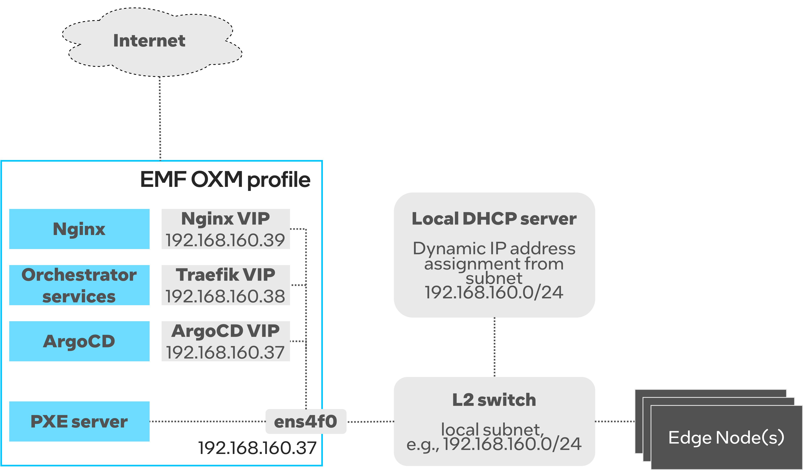

OXM Deployment Profile
======================

The OXM deployment profile is an On-Premises Edge Orchestrator's profile that only deploys
a subset of Edge Orchestrator to support Edge Nodes provisioning at scale in the OXM warehouse
or any site where Edge Nodes are firstly prepared to be sent to target location and operate in the field.

The OXM deployment profile consists of Edge Infrastructure Manager (EIM) and all required platform-level services.

This guide explains how to customize the installation steps to set up the OXM profile of Edge Orchestrator.
The guide is based on the :doc:`/deployment_guide/on_prem_deployment/on_prem_get_started/on_prem_install` guide.

.. _oxm_network_topology:

Network Topology
----------------

The OXM profile is intended to be deployed in environments where Edge Nodes do not have direct Internet access,
as explained in :ref:`on_prem_network_topology_squid_proxy`.

A sample network topology is presented in the diagram below:

#. Both Edge Orchestrator and all Edge Nodes to be provisioned are connected to the same subnet (192.168.160.0/24 in this case).

#. Edge Nodes do not have direct Internet access, while Edge Orchestrator can reach Internet via a separate network interface.

#. Edge Nodes use the Edge Orchestrator as a proxy to access Internet.

#. The local L2 network must provide the DHCP server for dynamic IP address assignment.

#. The Edge Orchestrator deploys another DHCP server (as part of PXE server) that runs in the Proxy-DHCP mode.

#. The Proxy-DHCP mode should be enabled by DHCP guarding/snooping/filtering rules.

#. All Edge Orchestrator services are deployed on top of Kubernetes as microservices.

#. Most of Edge Orchestrator services are accessible via ``TRAEFIK_IP``, a Virtual IP reserved in the local subnet.

#. The Edge Orchestrator must be configured with two more Virtual IPs that are reserved in the local subnet. ``ARGO_IP`` is used to access
   ArgoCD server, while ``NGINX_IP`` exposes installation artifacts that are downloaded by Edge Nodes during OS provisioning.

#. Note that one of ``TRAEFIK_IP``, ``NGINX_IP`` and ``ARGO_IP`` can be same as the physical interface's IP address (``ARGO_IP`` in the example).

#. Only the PXE server is attached to the host networking and binds to the IP address of the physical network interface to listen to DHCP requests.

Prerequisites
-------------

Make sure you familiarize yourself with the following documentation pages:

* :doc:`/deployment_guide/on_prem_deployment/on_prem_get_started/system_requirements_on_prem_orch`
* :doc:`/deployment_guide/on_prem_deployment/on_prem_get_started/index`
* :doc:`/deployment_guide/on_prem_deployment/on_prem_get_started/on_prem_certs`

Installation steps
------------------

First, :ref:`download_on_prem_installation_script`.

Then, you must explicitly define the ``onprem-oxm`` deployment profile and start the installation:

.. note::
   You may also want to set CLUSTER_DOMAIN to a domain name of your choice. By default, it's set to "cluster.onprem".

.. code-block:: shell

   export ORCH_INSTALLER_PROFILE=onprem-oxm
   ./onprem_installer.sh

The above script will start the installation process. You will be prompted for network settings.
Refer to :ref:`oxm_network_topology` and :ref:`on_prem_installer_prompts` for instructions on how to configure IP addresses.

At some point the script will stop waiting for user inputs:

.. code-block:: shell

   Edit config values.yaml files with custom configurations if necessary!!!
   The files are located at:
   [path_to_untarred_repo]/orch-configs/profiles/<profile>.yaml
   [path_to_untarred_repo]/orch-configs/clusters/onprem-oxm.yaml
   Enter 'yes' to confirm that configuration is done in order to progress with installation
   ('no' will exit the script) !!!

   Ready to proceed with installation?

Customize deployment profile
++++++++++++++++++++++++++++

Open a new terminal (do not close the previous one) and navigate ``[path_to_untarred_repo]/orch-configs/profiles/profile-oxm.yaml``.
This file contains main customization settings for OXM profile.

#. If needed, change ``defaultUser``, ``defaultOrganization`` and ``defaultTenant``. By default, they are all set to ``local-admin``.

#. You must properly set network configuration for PXE server. Given :ref:`oxm_network_topology` the PXE server config must be set as follows:

   * ``interface`` must be set to the name of the network interface that is connected to the L2 subnet (``ens4f0`` in the :ref:`oxm_network_topology` example).

   * ``bootServerIP`` must be set to the IP address assigned to the ``interface`` (``192.168.160.37`` in the :ref:`oxm_network_topology` example).

     .. note::
        The ``bootServerIP`` must not be a Virtual IP address. The IP address must be assigned to the physical interface.

   * ``subnetAddress`` must be set to the IP subnet address. For example, the IP subnet address of ``192.168.160.0/24`` is ``192.168.160.0``.

#. Do not change any other parameters defined in the ``profile-oxm.yaml``.

#. Modify proxy settings in ``[path_to_untarred_repo]/orch-configs/profiles/proxy-none.yaml``.

   * If Edge Orchestrator requires a proxy to access the Internet, configure the following proxy settings.

     .. code-block:: shell

        argo:
          proxy:
            httpProxy: [HTTP proxy URL]
            httpsProxy: [HTTPS proxy URL]
            noProxy: [Comma separated list of hosts and domains for which proxy settings should be bypassed]
          git:
            gitProxy: [HTTPS proxy URL]

   * In the OXM profile, Edge Nodes without direct Internet access will use the Edge Orchestrator as a proxy to access Internet.
     You must configure the Edge Node proxy settings as follows:

     .. code-block:: shell

        enHttpProxy: http://<Traefik-IP-endpoint>:8080
        enHttpsProxy: http://< Traefik-IP-endpoint>:8080
        enNoProxy: localhost,127.0.0.1,<Traefik-IP-endpoint-or-subnet-of-Edge-Orchestrator>,.internal,.cluster.local,<domain-of-orchestrator>

Once all modifications are done, type ``yes`` and press the **Enter** key to complete the installation. It will usually take around 15-20 minutes to complete.
In the meantime, you can observe the installation progress, see :ref:`on_prem_view_argocd`.

Post-installation steps
-----------------------

#. Configure DNS settings as described in the :ref:`oxm_network_topology` guide.

   * Make sure you run ``generate_fqdn`` and copy the output to ``/etc/hosts``.

   * For the OXM profile it is enough to add the following DNS records to your local DNS server.

     .. code-block:: shell

        address=/[on.prem.domain.name]/[traefik-external-ip]
        address=/tinkerbell-nginx.[on.prem.domain.name]/[ingress-nginx-external-ip]

#. Retrieve the self-signed Edge Orchestrator certificate and install it to the trust store.

   .. code-block:: shell

      kubectl get secret -n orch-gateway tls-orch -o jsonpath='{.data.ca\.crt}' | base64 --decode > orch.crt
      sudo mv orch.crt /usr/local/share/ca-certificates
      sudo update-ca-certificates

#. Retrieve the default orchestrator password.

   .. code-block:: shell

      ORCH_PASSWORD="$(kubectl -n orch-platform get secret platform-keycloak -o jsonpath='{.data.admin-password}' | base64 -d)"

   Save the password. It will be used for all interactions via API/CLI.
