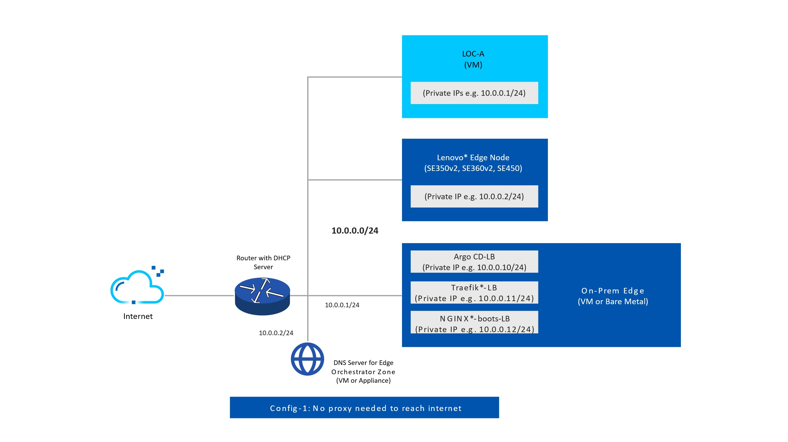

Get Started with Edge Orchestrator
==================================

Set up the following system and hardware configuration before installing
Edge Orchestrator:

System Requirements
-------------------

Domain
------

A domain name is required for Edge Orchestrator installation.

- For typical on-premises deployments, where both EMF and edge nodes are on a local network, an internal private domain is sufficient.
- If EMF is hosted by a third party for multiple tenants, and access between the end customer, EMF, and edge nodes occurs over the internet, an external public domain is required.

The domain name must be unique and not used by any other service in the
network. The domain name must be a fully qualified domain name (FQDN) and not
an IP address.

Edge Orchestrator Network Topology
----------------------------------

.. warning::
   Ensure that there are no incorrect configurations while setting up your DNS server for Edge Orchestrator. Incorrect configurations can lead to deployment failures. Specifically, the RKE2 (the kubernetes distribution used for EMF on-prem cluster) might start using the 8.8.8.8 server for DNS resolution, if no other DNS server is configured correctly.

  1. Avoid configuring `/etc/resolv.conf` and `/run/systemd/resolve/resolv.conf` to point exclusively to loopback or multicast nameservers. This can cause issues during deployment.

  2. Ensure that the `service_cidr` subnet specified in the installation guide does not overlap with any existing subnets in your infrastructure. For example, if the k8s `service_cidr` includes the IP `10.43.0.10`, ensure this IP is not used as a DNS server in the OS or for any critical network communications in your environment.

.. image:: ../images/on-prem-install-topology-config.png
   :alt: The network topology for Edge Orchestrator
   :width: 500px
   :align: center

Edge Orchestrator Network Topology with Corporate Proxy
--------------------------------------------------------

.. image:: ../images/on-prem-install-topology-config-with-corporate-proxy.png
   :alt: The network topology for Edge Orchestrator
   :width: 500px
   :align: center

.. _on_prem_network_topology_squid_proxy:

Edge Orchestrator for Edge Nodes without Direct Internet Access
----------------------------------------------------------------

.. image:: ../images/on-prem-install-topology-config-with-squid-proxy.png
   :alt: The network topology for Edge Orchestrator
   :width: 500px
   :align: center

.. _on_prem_lenovo_network_topology:

Lenovo\* Open Cloud Automation (LOC-A) Network Topology (Optional)
------------------------------------------------------------------

When integrating the Lenovo\* Open Cloud Automation (LOC-A) software, you can use the networking settings of your choice.

In general, Edge Orchestrator and LOC-A can share the same subnet, but this might not be desirable for the Baseboard Management Controller (BMC) of the edge devices (or not entirely possible).
The following figure shows a simple network topology:

In addition to upstream connectivity, Edge Orchestrator requires connectivity to LOC-A; while the edge node requires connectivity to Edge Orchestrator.
LOC-A also has its own network environment requirements to ensure proper communication between the LOC-A Portal and the edge nodes. For details on LOC-A and networking settings, see the `Lenovo ISG Support Plan - LOC-A (Lenovo Open Cloud Automation) <https://support.lenovo.com/us/en/solutions/ht509884-loc-a-lenovo-open-cloud-automation-for-vcf>`_.

This Edge Orchestrator version is compatible with LOC-A version 3.2.

.. note::
   Other configurations are possible, for example, having a separate network for BMC and OS management.

Firewall Configuration
----------------------

The following table lists the network endpoints for Edge Orchestrator and edge nodes, which you can use to configure firewall rules tailored to your network environment.

* ArgoCD Admin UI at ``argo.{domain}``. Intel recommends that you restrict the incoming traffic to a subset of known source IPs because this is an administrator interface.
* BIOS Onboarding accesses ``tinkerbell-nginx.{domain}``.
* You can access all other services from edge nodes agents, UI, and APIs of Edge Orchestrator.

.. list-table:: Network Endpoints for Edge Orchestrator and Edge Nodes
   :header-rows: 1

   * -  Source
     -  Destination
     -  Protocol
     -  Port number
     -  Description
   * -  Edge Orchestrator UI and API
     -  {domain}
     -  TCP
     -  443
     -  Web UI
   * -  Edge Orchestrator UI and API
     -  web-ui.{domain}
     -  TCP
     -  443
     -  Web UI
   * -  Edge Orchestrator API
     -  api.{domain}
     -  TCP
     -  443
     -  Tenancy API
   * -  Edge Orchestrator UI and API
     -  metadata.{domain}
     -  TCP
     -  443
     -  Web UI
   * -  Edge Orchestrator UI and API
     -  app-orch.{domain}
     -  TCP
     -  443
     -  Application orchestration
   * -  Edge Orchestrator UI and API
     -  app-service-proxy.{domain}
     -  TCP
     -  443
     -  Application orchestration
   * -  Edge Orchestrator UI and API
     -  ws-app-service-proxy.{domain}
     -  TCP
     -  443
     -  Application orchestration
   * -  Edge Orchestrator UI and API
     -  gitea.{domain}
     -  TCP
     -  443
     -  Application orchestration
   * -  Edge Orchestrator UI and API
     -  vnc.{domain}
     -  TCP
     -  443
     -  Application orchestration
   * -  Edge Orchestrator UI and API
     -  cluster-orch.{domain}
     -  TCP
     -  443
     -  Cluster orchestration
   * -  Edge Orchestrator UI and API
     -  iaas.{domain}
     -  TCP
     -  443
     -  Edge infrastructure management
   * -  Edge Orchestrator UI and API
     -  infra.{domain}
     -  TCP
     -  443
     -  Edge infrastructure management
   * -  Edge Orchestrator UI and API
     -  onboarding.{domain}
     -  TCP
     -  443
     -  Edge infrastructure management
   * -  Edge Orchestrator UI and API
     -  update.{domain}
     -  TCP
     -  443
     -  Edge infrastructure management
   * -  Edge Orchestrator UI and API
     -  keycloak.{domain}
     -  TCP
     -  443
     -  Identity and Access Management
   * -  Edge Orchestrator UI and API
     -  log-query.{domain}
     -  TCP
     -  443
     -  Observability
   * -  Edge Orchestrator UI and API
     -  observability-admin.{domain}
     -  TCP
     -  443
     -  Observability
   * -  Edge Orchestrator UI and API
     -  observability-ui.{domain}
     -  TCP
     -  443
     -  Observability
   * -  Edge Orchestrator UI and API
     -  telemetry.{domain}
     -  TCP
     -  443
     -  Observability
   * -  Edge Orchestrator UI and API
     -  rancher.{domain}
     -  TCP
     -  443
     -  Rancher's Fleet UI
   * -  Edge Orchestrator UI and API
     -  registry.{domain}
     -  TCP
     -  443
     -  Harbor\* UI
   * -  Edge Orchestrator UI and API
     -  vault.{domain}
     -  TCP
     -  443
     -  Vault\* UI
   * -  Edge node
     -  cluster-orch-node.{domain}
     -  TCP
     -  443
     -  Cluster orchestration
   * -  Edge node
     -  infra-node.{domain}
     -  TCP
     -  443
     -  Edge infrastructure management
   * -  Edge node
     -  onboarding-node.{domain}
     -  TCP
     -  443
     -  Edge infrastructure management
   * -  Edge node
     -  release.{domain}
     -  TCP
     -  443
     -  Release service token
   * -  Edge node
     -  metrics-node.{domain}
     -  TCP
     -  443
     -  Observability
   * -  Edge node
     -  telemetry-node.{domain}
     -  TCP
     -  443
     -  Observability
   * -  Edge node
     -  logs-node.{domain}
     -  TCP
     -  443
     -  Observability
   * -  Edge node
     -  tinkerbell-server.{domain}
     -  TCP
     -  443
     -  Onboarding
   * -  Edge node
     -  update-node.{domain}
     -  TCP
     -  443
     -  Edge infrastructure management
   * -  Edge node
     -  tinkerbell-nginx.{domain}
     -  TCP
     -  443
     -  BIOS onboarding
   * -  Edge Orchestrator admin
     -  argo.{domain}
     -  TCP
     -  443
     -  ArgoCD UI

.. _on_prem_lenovo_firewall_configuration:

To install Edge Orchestrator and Edge Node, the following Egress rules are required:

.. list-table:: Network Egress for Edge Orchestrator and Edge Nodes
  :header-rows: 1

  * -  Source
    -  Destination
    -  Description
  * -  Edge Orchestrator
    -  https://docker.io
    -  Container images
  * -  Edge Orchestrator
    -  https://ghcr.io
    -  Container images
  * -  Edge Orchestrator
    -  https://registry.k8s.io
    -  Container images
  * -  Edge Orchestrator
    -  https://quay.io
    -  Container images
  * -  Edge Orchestrator
    -  https://k8s.gcr.io
    -  Container images
  * -  Edge Orchestrator
    -  https://registry-rs.edgeorchestration.intel.com
    -  Container images
  * -  Edge Orchestrator
    -  https://github.com/
    -  Container images
  * -  Edge Orchestrator
    -  https://kubernetes.github.io/
    -  Helm Chart
  * -  Edge Orchestrator
    -  https://charts.external-secrets.io/
    -  Helm Chart
  * -  Edge Orchestrator
    -  https://rancher.github.io/
    -  Helm Chart
  * -  Edge Orchestrator
    -  https://helm.goharbor.io
    -  Helm Chart
  * -  Edge Orchestrator
    -  https://istio-release.storage.googleapis.com/
    -  Helm Chart
  * -  Edge Orchestrator
    -  https://kiali.org/
    -  Helm Chart
  * -  Edge Orchestrator
    -  https://kyverno.github.io/
    -  Helm Chart
  * -  Edge Orchestrator
    -  https://metallb.github.io/
    -  Helm Chart
  * -  Edge Orchestrator
    -  https://prometheus-community.github.io/
    -  Helm Chart
  * -  Edge Orchestrator
    -  https://charts.bitnami.com/
    -  Helm Chart
  * -  Edge Orchestrator
    -  https://stakater.github.io/
    -  Helm Chart
  * -  Edge Orchestrator
    -  https://helm.traefik.io/
    -  Helm Chart
  * -  Edge Orchestrator
    -  https://helm.releases.hashicorp.com
    -  Helm Chart
  * -  Edge Node
    -  https://\*.github.io
    -  Onboarding
  * -  Edge Node
    -  https://\*.github.com
    -  Onboarding
  * -  Edge Node
    -  https://\*.githubusercontent.com
    -  Onboarding
  * -  Edge Node
    -  https://\*.intel.com
    -  Onboarding
  * -  Edge Node
    -  https://\*.infra-host.com
    -  Onboarding
  * -  Edge Node
    -  https://\*.docker.io
    -  Onboarding
  * -  Edge Node
    -  https://\*.docker.com
    -  Onboarding
  * -  Edge Node
    -  https://\*.quay.io
    -  Onboarding
  * -  Edge Node
    -  https://\*.fluentbit.io
    -  Onboarding
  * -  Edge Node
    -  https://\*.k8s.io
    -  Onboarding
  * -  Edge Node
    -  https://\*.pkg.dev
    -  Onboarding
  * -  Edge Node
    -  https://\*.public.ecr.aws
    -  Onboarding
  * -  Edge Node
    -  https://\*.cloudfront.net
    -  Onboarding
  * -  Edge Node
    -  https://\*.api.snapcraft.io
    -  Onboarding
  * -  Edge Node
    -  https://\*.snapcraftcontent.com
    -  Onboarding
  * -  Edge Node
    -  https://\*.rke2.io
    -  Onboarding
  * -  Edge Node
    -  https://\*.archive.ubuntu.com
    -  Onboarding
  * -  Edge Node
    -  https://ppa.launchpad.net
    -  Onboarding
  * -  Edge Node
    -  https://esm.ubuntu.com
    -  Onboarding
  * -  Edge Node
    -  https://ports.ubuntu.com
    -  Onboarding
  * -  Edge Node
    -  https://security.ubuntu.com
    -  Onboarding
  * -  Edge Node
    -  https://ddebs.ubuntu.com
    -  Onboarding
  * -  Edge Node
    -  https://mirrors.ubuntu.com
    -  Onboarding
  * -  Edge Node
    -  https://\*.archive.canonical.com
    -  Onboarding
  * -  Edge Node
    -  https://\*.extras.ubuntu.com
    -  Onboarding
  * -  Edge Node
    -  https://changelogs.ubuntu.com
    -  Onboarding
  * -  Edge Node
    -  https://cloud-images.ubuntu.com
    -  Onboarding
  * -  Edge Node
    -  https://\*.debian.org
    -  Onboarding
  * -  Edge Node
    -  http://cdn.debian.net
    -  Onboarding
  * -  Edge Node
    -  http://http.debian.net
    -  Onboarding

LOC-A Firewall Configuration (Optional)
---------------------------------------

When integrating the LOC-A and Edge Orchestrator, you will need an additional entry if you deploy LOC-A on the same network that is served by the same DNS.

.. list-table:: Network Endpoints for Lenovo Open Cloud Automation (LOC-A)
   :header-rows: 1

   * -  Source
     -  Destination
     -  Protocol
     -  Port number
     -  Description
   * -  LOC-A Web UI and API
     -  loca.{domain}
     -  TCP
     -  443
     -  Web UI and REST API

Squid Proxy Firewall Configuration (Optional)
---------------------------------------------

When deploying Edge Orchestrator with Squid proxy, you will need an additional firewall entry to allow the edge node to reach the Squid proxy.
Intel recommends that only the edge node subnet is allowed to access the Squid proxy endpoint.

.. list-table:: Network Endpoints for Squid Proxy.
   :header-rows: 1

   * -  Source
     -  Destination
     -  Protocol
     -  Port Number
     -  Description
   * -  Edge node
     -  {IP of Traefik endpoint in Edge Orchestrator}
     -  TCP
     -  8080
     -  Squid proxy

.. toctree::
   :hidden:

   system_requirements_on_prem_orch
   on_prem_certs
   ../../../shared/shared_gs_preinstall
   on_prem_install
   ../../../shared/shared_gs_iam
   ../../../shared/shared_mt_overview
   ../../../shared/shared_next_steps
