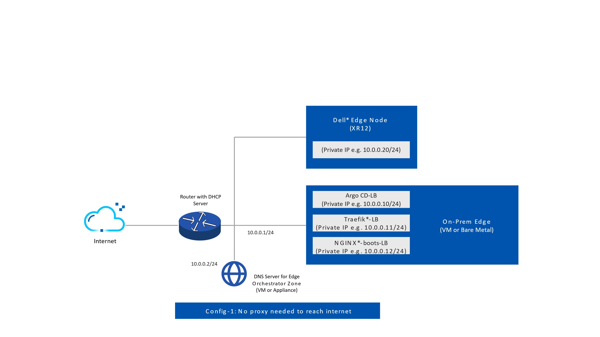
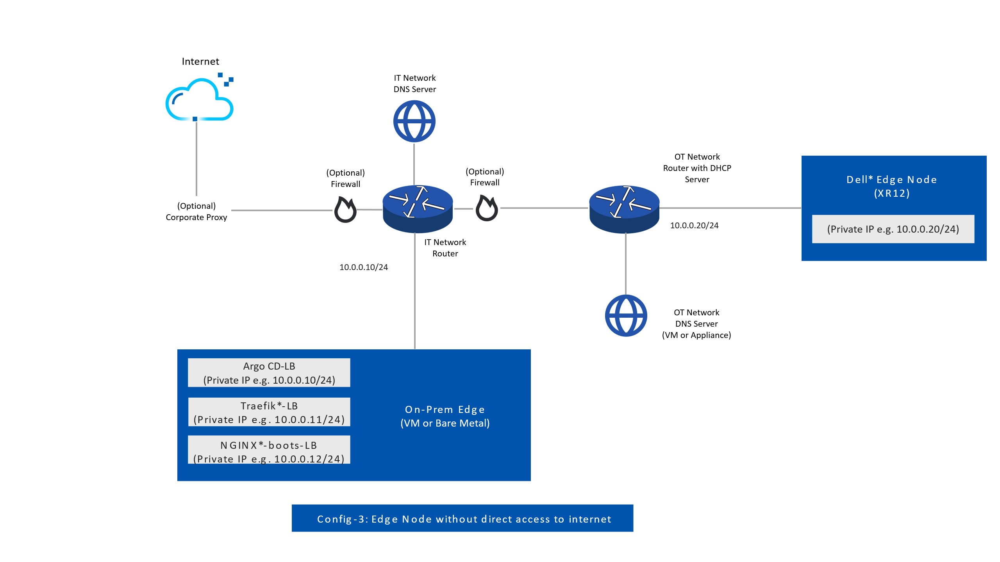
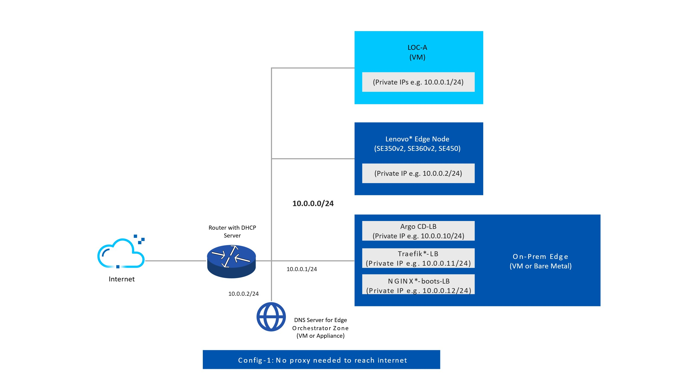

Prerequisites
=================

Set up the following system and hardware configuration before installing
Edge Orchestrator:

System Requirements
-------------------------------

See :doc:`/deployment_guide/on_prem_deployment/on_prem_get_started/system_requirements_on_prem_orch`.

Domain
------

A domain is required for the Edge Orchestrator installation. Purchase a domain name from a domain registrar if you do not have one. The domain must be a valid domain name that is resolvable by public DNS servers and you must be able to create DNS records for the domain name.

The domain name must be unique and not used by any other service in the
network. The domain name must be a fully qualified domain name (FQDN) and not an IP address.

Edge Orchestrator Network Topology
-----------------------------------

.. warning::
   Ensure that there are no incorrect configurations while setting up your DNS server for Edge Orchestrator. Incorrect configurations can lead to deployment failures. Specifically, the RKE2 server might start using the 8.8.8.8 server for DNS resolution, if no other DNS server is properly configured.

  1. Avoid configuring `/etc/resolv.conf` and `/run/systemd/resolve/resolv.conf` to point exclusively to loopback or multicast nameservers. This can cause issues during deployment.

  2. Ensure that the `service_cidr` subnet specified in the installation guide does not overlap with any existing subnets in your infrastructure. For example, if the k8s `service_cidr` includes the IP `10.43.0.10`, ensure this IP is not used as a DNS server in the OS or for any critical network communications in your environment.

Edge Orchestrator Network Topology with Corporate Proxy
--------------------------------------------------------

Edge Orchestrator for Edge Nodes without Direct Internet Access
----------------------------------------------------------------

Lenovo\* Open Cloud Automation (LOC-A) Network Topology (Optional)
------------------------------------------------------------------

When integrating the Lenovo\* Open Cloud Automation (LOC-A) software, you can use networking settings of your choice.

In general, Edge Orchestrator and LOC-A can share the same subnet but this might not be desirable for the Baseboard Management Controller (BMC) of the edge devices (or not entirely possible). The following figure shows a simple network topology:

In addition to upstream connectivity, Edge Orchestrator requires connectivity to LOC-A; while the edge node requires connectivity to Edge Orchestrator. LOC-A also has its own network environment requirements to ensure proper communication between the LOC-A Portal and the edge nodes. For details on LOC-A and networking settings, see the `Lenovo ISG Support Plan - LOC-A (Lenovo Open Cloud Automation) <https://support.lenovo.com/us/en/solutions/ht509884-loc-a-lenovo-open-cloud-automation-for-vcf>`_.

This Edge Orchestrator version is compatible with LOC-A version 3.3.x.

.. note::
   Other configurations are possible, for example, having a separate network for BMC and OS management.

For Firewall configuration, see :doc:`../../../shared/shared_gs_firewall_config`.

LOC-A Firewall Configuration (Optional)
---------------------------------------

When integrating the LOC-A and Edge Orchestrator, you will need an additional entry if you deploy LOC-A on the same network that is served by the same DNS.

.. list-table:: Network Endpoints for Lenovo Open Cloud Automation (LOC-A)
   :header-rows: 1

   * -  Source
     -  Destination
     -  Protocol
     -  Port number
     -  Description
   * -  LOC-A Web UI and API
     -  loca.{domain}
     -  TCP
     -  443
     -  Web UI and REST API

Squid Proxy Firewall Configuration (Optional)
---------------------------------------------

When deploying Edge Orchestrator with Squid proxy, you will need an additional firewall entry to allow the edge node to reach the Squid proxy. Intel recommends that only the edge node subnet is allowed to access the Squid proxy endpoint.

.. list-table:: Network Endpoints for Squid Proxy.
   :header-rows: 1

   * -  Source
     -  Destination
     -  Protocol
     -  Port Number
     -  Description
   * -  Edge node
     -  {IP of Traefik endpoint in Edge Orchestrator}
     -  TCP
     -  8080
     -  Squid proxy
