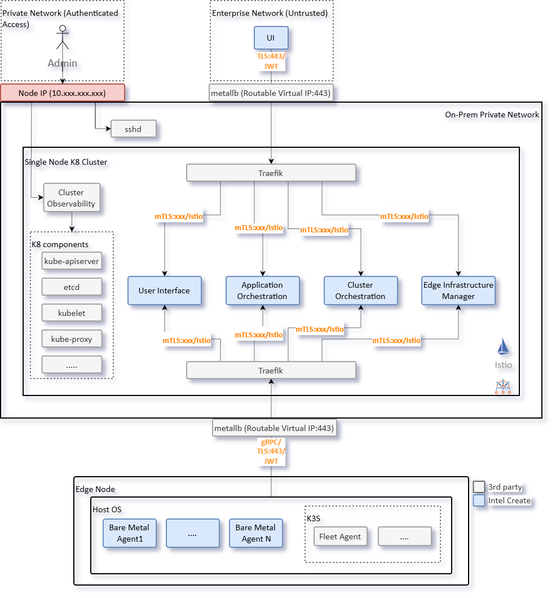

==================
On-prem Open Ports
==================

This document provides an overview of the network ports exposed in the on-premises deployment.
It details each port’s purpose and key security considerations to help users secure their
deployment.

On-prem Network Architecture Overview
--------------------------------------

**Network Exposure in Single-Node Kubernetes Deployments**

In a single-node Kubernetes cluster deployment, the combination of two architectural
elements exposes internal Kubernetes ports to the enterprise network:

1. **RKE2 single-node Kubernetes cluster**: The control plane and worker plane components
   run on the same node, so internal Kubernetes services (like etcd) ports bind directly
   to the host machine's IP address.

2. **MetalLB Load Balancer**: MetalLB announces service IPs to EMF-clients. If MetalLB
   is configured to use the same IP address as the host machine, all Kubernetes internal
   services (like etcd) ports, NodePorts, and service ports on host network become visible
   on the enterprise network.

**The Virtual IP Solution**

To mitigate unnecessary port exposure, it is recommended to use **Virtual IP (VIP)** to
separate the host IP and the load balancer IP.

- **Host Machine IP**: Used for administrative access (SSH, host management, cluster management).
- **Load Balancer Virtual IP**: Used for application and load balancer endpoints.

This separation ensures that:

- Only intended service ports are exposed to the enterprise network.
- Administrative ports remain isolated from application traffic.
- The attack surface is minimized by limiting externally visible ports.

The diagram below illustrates the recommended network topology:

   Figure 1: On-prem Deployment Overview - Network Segmentation

**Implementation Approaches**

The specific implementation depends on the infrastructure:

- **Physical Networks**: Multiple network interfaces (NICs) could be used with different subnets.
- **Virtual Networks**: VLAN tagging or software-defined networking.

**Important**: This document does not prescribe specific networking configurations, as
implementation varies based on the network architecture of the deployment, security policies,
and infrastructure capabilities.

Security Recommendations
^^^^^^^^^^^^^^^^^^^^^^^^

The following security practices should be applied when configuring the on-premises deployment:

- **Virtual IP Deployment**: Implement Virtual IPs to separate administrative access (Host IP)
  from service exposure (Virtual IP) to minimize attack surface.
- **Host Firewall Rules**: Configure host-level firewall rules to restrict access to administrative
  ports (SSH, Kubernetes API, etcd) to authorized networks only.
- **Observability Ports**: All OpenTelemetry collector ports are unencrypted by default.
  Configure TLS encryption and authentication according to: https://opentelemetry.io/docs/security/.
- **Certificate Management**: RKE2 provides secure defaults with TLS encryption.
  Customize certificate management (self-signed, public CA, or enterprise CA) based on
  organizational requirements.

Open Ports Overview
^^^^^^^^^^^^^^^^^^^

Node Management Ports
~~~~~~~~~~~~~~~~~~~~~

Ports for host administration and management.

.. list-table::
   :header-rows: 1
   :widths: 10 35 10 45

   * - **Port**
     - **Purpose**
     - **Network**
     - **Security Consideration**
   * - **22**
     - SSH access for host administration and management
     - Host IP
     - Enforce SSH key authentication and disable password login.

Kubernetes Infrastructure Ports
~~~~~~~~~~~~~~~~~~~~~~~~~~~~~~~~

Core Kubernetes cluster ports for API access, service mesh, and networking.

.. list-table::
   :header-rows: 1
   :widths: 10 35 10 45

   * - **Port**
     - **Purpose**
     - **Network**
     - **Security Consideration**
   * - **6443**
     - Kubernetes API server endpoint for cluster management
     - Host IP
     - TLS encryption and certificate-based authentication are enabled by default in RKE2.
       RBAC is enforced by default. Users can customize certificate management (self-signed,
       public CA, or enterprise CA). See https://docs.rke2.io/security/hardening_guide
       for more details.
   * - **10250**
     - Kubelet API for node management and pod operations
     - Host IP
     - TLS encryption and certificate-based authentication are enabled by default in RKE2.
   * - **2379**
     - etcd client API for cluster state storage
     - Host IP
     - TLS encryption and certificate-based authentication are enabled by default in RKE2.
   * - **2380**
     - etcd peer communication for cluster consensus
     - Host IP
     - TLS encryption and certificate-based authentication are enabled by default in RKE2.
   * - **9345**
     - RKE2 registration server for node join and agent bootstrap
     - Host IP
     - Token-based authentication is enabled by default in RKE2. Bootstrap tokens are used
       for initial node join.
   * - **5473**
     - Calico Typha for network policy management
     - Host IP
     - TLS encryption and certificate-based authentication are enabled by default in Calico.

Application Service Ports
~~~~~~~~~~~~~~~~~~~~~~~~~~

Ports for application services exposed via an ingress controller.

.. list-table::
   :header-rows: 1
   :widths: 10 35 10 45

   * - **Port**
     - **Purpose**
     - **Network**
     - **Security Consideration**
   * - **443**
     - HTTPS ingress for application services (Traefik, ArgoCD, Nginx)
     - Virtual IP
     - TLS encryption enabled by EMF deployment. Traefik and ArgoCD use JWT authentication.
       Nginx is setup primarily as a CDN for Edge Node provisioning without authentication.
   * - **80**
     - HTTP ingress (redirects to HTTPS)
     - Virtual IP
     - Automatic redirect to port 443 configured by default via Traefik ingress controller.

Load Balancer Ports
~~~~~~~~~~~~~~~~~~~

MetalLB and ingress controller ports for service exposure.

.. list-table::
   :header-rows: 1
   :widths: 10 35 10 45

   * - **Port**
     - **Purpose**
     - **Network**
     - **Security Consideration**
   * - **30443**
     - Traefik NodePort for HTTPS traffic
     - Host IP
     - TLS encryption enabled by EMF deployment.
   * - **7472**
     - MetalLB Prometheus metrics endpoint
     - Host IP
     - User to enable TLS encryption.
   * - **7946**
     - MetalLB memberlist for speaker coordination
     - Host IP
     - User to enable encryption for gossip protocol.

Observability Ports
~~~~~~~~~~~~~~~~~~~

OpenTelemetry collector ports for metrics, traces, and logs.

.. warning::
   **Observability Port Security**: All OpenTelemetry collector ports are unencrypted by
   default. See: https://opentelemetry.io/docs/security/

.. list-table::
   :header-rows: 1
   :widths: 10 35 10 45

   * - **Port**
     - **Purpose**
     - **Network**
     - **Security Consideration**
   * - **4317**
     - OpenTelemetry gRPC receiver for traces, metrics, and logs
     - Host IP
     - User to enable TLS encryption and authentication.
   * - **4318**
     - OpenTelemetry HTTP receiver for traces, metrics, and logs.
     - Host IP
     - User to enable TLS encryption and authentication.
   * - **9411**
     - Zipkin trace receiver (OpenTelemetry compatible)
     - Host IP
     - User to enable TLS encryption and authentication.
   * - **14250**
     - Jaeger gRPC receiver for distributed tracing
     - Host IP
     - User to enable TLS encryption and authentication.
   * - **14268**
     - Jaeger HTTP receiver for distributed tracing
     - Host IP
     - User to enable TLS encryption and authentication.
