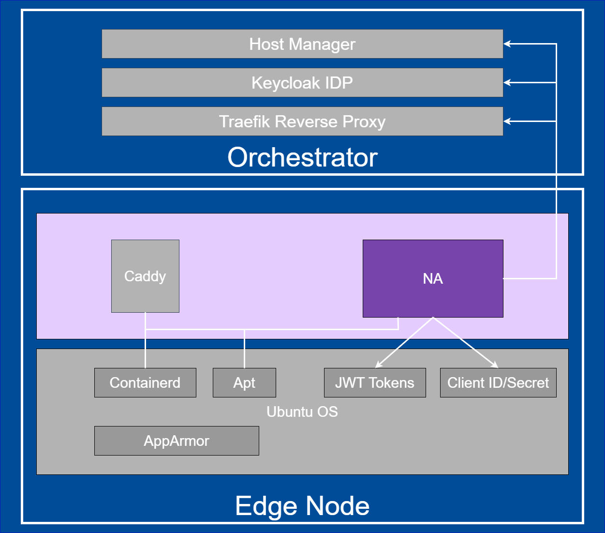

Edge Node Agent
===============

Background
----------

This document provides high level design and implementation guidelines. Refer
to `Node Agent <https://github.com/open-edge-platform/edge-node-agents/tree/main/node-agent>`_ in Edge Node Agents' GitHub repository for implementation
details.

Target Audience
~~~~~~~~~~~~~~~

The target audience for this document is:

- Developers interested in contributing to the implementation of the Node
  Agent.

- Administrators and System Architects interested in the architecture, design
  and functionality of the Node Agent.

Overview
--------

Node Agent is part of the Open Edge Platform's Edge Node Zero Touch
Provisioning.

Node Agent interacts with Host Manager to send heartbeats from the node as it
runs indefinitely.

The second responsibility of the Node Agent is to obtain JWT tokens for all
other agents running on the Edge Node.

For this, the agent uses OAuth 2.0 Client Credential Grant which requires a
pair of credentials on the Edge Node.

The Node Agent makes API calls to Keycloak IDP Service to obtain fresh and
renewed JWT tokens.  It authenticates to the Keycloak IDP Service using the
credentials provisioned on the Edge Node during provisioning.

Node Agent is also responsible for the setting up of Caddy proxy.

Caddy is a third party proxy server being used as a forward proxy on the Edge
Node.  This serves as a forward proxy for containerd and apt client that runs
on Edge Node.  It appends JWT token to requests from either of the clients.
Node Agent installs Caddy as a dependency in the Debian/RPM package.

Architecture Diagram
--------------------

The Node Agents follows the architecture and design principles set out in
:doc:`hl_architecture`

.. figure:: ./images/na-architecture.drawio.svg
   :alt: High-Level Architecture of the Node Agent

   Figure 1: High-Level Architecture of Node Agent

Key Components
--------------

1. The Node Agent is a system daemon packaged as a `.deb` or `.rpm` package
   (depending on target Operating System).

2. `node-agent.yaml` file stores node Agent's configuration.

   3. The Node Agent requires a designated JWT token.

   4. The Node Agent kickstarts deployment of Caddy proxy.

Data Flow
---------

The data flow of the Node Agent can be broken down into multiple concepts
called out in `Workflow Stages` section.

Workflow Stages
~~~~~~~~~~~~~~~

1. **Caddy as forward proxy**: Following diagram illustrates how Caddy is
   installed and configured during provisioning.  It also captures the token
   refresh mechanism which ensures Caddy always uses an updated token in the
   header of the outgoing request.

   .. figure:: ./images/caddy-architecture.png
      :alt: Caddy as a forward proxy

      Figure 2: Caddy as a forward proxy

2. **Secrets Provisioning Sequence Flow**:

   Phase-1 - Fresh token provisioning for Edge Node Agents and access to
   Release Service Phase-2 - Credentials’ lifecycle management on the Edge Node

   .. mermaid::

      sequenceDiagram
         box LightYellow Edge Node
            participant na as Node Agent
            participant ena as Edge Node  Agents
         end
         box rgb(235,255,255) Orchestrator
            participant kc as KeyCloak
            participant trp as Traefik Reverse Proxy
            participant ks as Kubernetes Secret
         end
      autonumber
         loop Create access_token for all configured Agents
            na->>kc: Authenticated[client_id, client_secret] request for fresh token
            kc->>na: Response :: New token [access_token]
            na-->>na: Persist [access_token] at  /etc/intel_edge_node/tokens
            ena-->>ena: Read [access_token] from /etc/intel_edge_node/tokens
         end
         na->>trp: Authenticated[access_token] request for Release Service Token
         trp-->>ks: Read shared secret
         trp->>na: Return Release Service Token[rs_access_token]
         na-->>na: Persist [rs_access_token] at  /etc/intel_edge_node/tokens/release-service

Figure 3: Secrets Provisioning Sequence Flow

3. **Access Token Renewal**:

   Refresh token is no used to renew the access token.

   As per the `RFC 6749 <https://datatracker.ietf.org/doc/html/rfc6749>_,` a
   refresh token is not required to be used for Client Credentials Grant.

   Whenever an access token needs to be refreshed, *client_id/client_secret*
   needs to be sent by the confidential client to the authorization server.

   So, *Node Agent* needs to pull out the *client_id/client_secret* to request
   a new access token.

   .. mermaid::

      sequenceDiagram
         box LightYellow Edge Node
            participant na as Node Agent
         end
         box rgb(235,255,255) Orchestrator
            participant kc as KeyCloak
         end
      autonumber
         loop Monitor all access_tokens
            na-->>na: Read token from /etc/intel_edge_node/tokens & check expiry
            alt access_token about to expire/expired
                  Note over na,kc: Renew access_token
                  na->>kc: Authenticated[client_id, client_secret] request for fresh token
                  kc->>na: Response :: New [access_token]
                  na-->>na: Persist new [access_token] at /etc/intel_edge_node/tokens
            else Valid till next cycle
                  na-->>na: Skip to next token
            end
            na-->>na: Wait for next cycle
         end

Figure 4: Access Token Renewal

4. **Release Service Token Renewal**:

   All agents are expected to read JWT tokens from a configured location. *Node
   Agent* is transparent for them. Same applies to refresh flows.

   .. mermaid::

      sequenceDiagram
         box LightYellow Edge Node
            participant na as Node Agent
         end
         box rgb(235,255,255) Orchestrator
            participant trp as Traefik Reverse Proxy
            participant ks as Kubernetes Secret
         end
      autonumber
         loop Monitor rs_access_token
            na-->>na: Read token from /etc/intel_edge_node/tokens/release-service & check expiry
            alt rs_access_token about to expire/expired
                  Note over na,ks: Renew rs_access_token
                  na->>trp: Authenticated[access_token] request for Release Service Token
                  trp-->>ks: Read shared secret
                  trp->>na: Return Release Service Token[rs_access_token]
                  na-->>na: Persist [rs_access_token] at  /etc/intel_edge_node/tokens/release-service
            else Valid till next cycle
                  na-->>na: Wait for next cycle
            end
         end

Figure 5: Release Service Token Renewal

Extensibility
-------------

The Node Agent functionality can be extended by making source code changes.

Deployment
----------

The Node Agent is deployed as a system daemon via installation of a *.deb*
package during the provisioning or *.rpm* package as part of the Edge Microvisor Toolkit.

The Caddy proxy is deployed as a dependency during installation.

Technology Stack
----------------

Below sections provide an overview of various aspects of the Node Agent's
technology stack.

Implementation
~~~~~~~~~~~~~~

The Node Agent is written in Go programming language.

Node Agent does not persist any data on disk or in database. State is
maintained in memory.

System Diagram
~~~~~~~~~~~~~~

Node Agent is dependent on Keycloak IDP Service and Host Manager in the Edge
Orchestrator.

Caddy Proxy is an external dependency.

   Figure 6: System diagram

Integrations
~~~~~~~~~~~~

Node Agent does not expose an API. It consumes APIs from Host Manager and
Keycloak IDP Service.

Communication with Host Manager is implemented via gRPC protocol. Host Manager
acts as a server for the Node Agent.

Node Agent sends heartbeat messages to Host Manager at a regular interval.

Using heartbeat, the Host Manager is able to deduce connectivity to the Edge
Node.

Communication with Keycloak IDP Service is implemented via REST protocol. All
JWT tokens are sourced from the Keycloak Service.

Security
--------

Security Policies
~~~~~~~~~~~~~~~~~

Node Agent adheres to Edge Node Agents :doc:`hl_architecture` security design
principle.

Auditing
~~~~~~~~

Node Agent adheres to Edge Node Agents :doc:`hl_architecture` observability design
principle.

Upgrades
~~~~~~~~

Node Agent adheres to Edge Node Agents :doc:`hl_architecture` upgrade design
principle.
