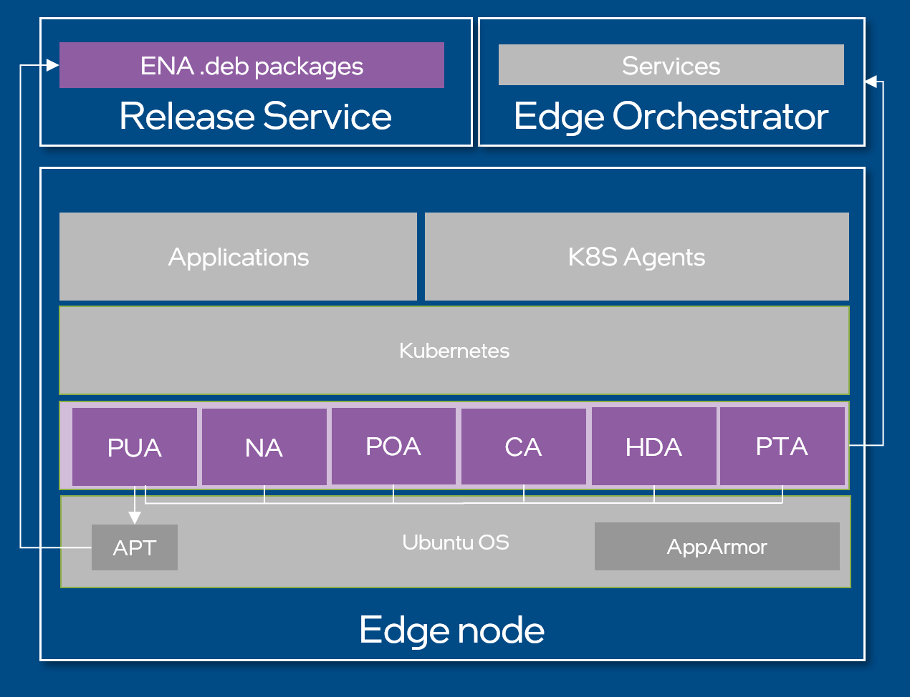

High-Level Architecture
=======================

Background
----------

This document provides high-level overview and reference design principles for
Edge Node Agent development.

Target Audience
~~~~~~~~~~~~~~~

The target audience for this document is Developers and Architects interested
in contributing to the implementation of new or existing Edge Node Agents.

Overview
--------

Edge Node Agents (ENA) are a collection of OS level agents which make up an Edge Node.

Edge Node agents are deployed as system daemons during the provisioning of the
Edge Node.

An Edge Node Agent may be responsible for communication with the Open
Edge Platform's Edge Orchestrator and/or be responsible for performing certain
sets of tasks to enable specific Edge Node functionality.

Each Edge Node Agent is packaged and installed according to the requirements of
the OS it is running on.

Architecture Diagram
--------------------

High-level architecture view of ENA agents on Ubuntu OS.

   Figure 1: High-Level Architecture of ENA

Configuration
-------------

Each ENA's running configuration is stored in yaml format in
`/etc/edge-node/node/config` directory

Communication
-------------

The ENA tolerate intermittent connection losses to the Edge Orchestrator
without any interruption to User Applications uptime.

This implies that the ENA should always initiate communication with the Edge
Orchestrator services and operate on the latest state received.

Observability
-------------

The Agent writes its logs to standard output.

They will be captured by the systemd logging system and stored in the host
filesystem. The Platform Observability Agent will then scrape the logs and push
them to the central log repository in the Edge Orchestrator Observability
stack.

Security
--------

Secure Communication
~~~~~~~~~~~~~~~~~~~~

All network communication to both external and internal services is encrypted
with TLS 1.3 protocol.

Secure Authentication
~~~~~~~~~~~~~~~~~~~~~

All network communication to both external and internal services is
authenticated. Edge Node Agents use JWT tokens to support client
authentication.

Node Agent obtains and manages the lifecycle of JWT tokens on the Edge Node for
all Edge Node Agents. The tokens can be found at
`/etc/intel_edge_node/tokens/`.

The tokens are stored in a file access_token within a directory having the same
name as that of the agent.  For example, the JWT token for Cluster Agent is in
the file `/etc/intel_edge_node/tokens/cluster-agent/access_token`.

Server TLS certificate is always verified by the Agent. The server can choose
to use a publicly signed server TLS certificate or a self-signed one. In the
latter case, the Provisioning Installer is expected to update the required
trust chain in Operating System trust pool

Threats and mitigation
~~~~~~~~~~~~~~~~~~~~~~

The ENA is executed by non-privileged user. If elevated access is strictly
necessary to be able to perform its responsibilities following measures are to
be taken:

- If privileged command needs to be executed, the Agent executes it via sudo
  command; a dedicated sudoers file under /etc/sudoers.d is created to allow
  only specific commands to be executed by that agent.

- If privileged file needs to be accessed, the Agent is given appropriate
  minimum permissions to access it via Linux DAC policy (file permissions)

To reduce attack surface even further custom AppArmour (Ubuntu) and SELinux
(Edge Microvisor Toolkit) profiles are developed for each agent and used to
restrict process privileges to the minimum level required.

Packaging
---------

The ENA is packaged as Debian Package (.deb - Ubuntu) and RPM package (.rpm -
Edge Microvisor Toolkit) which does the following:

- Installs executable binary in the host filesystem.

- Installs default configuration file in the host filesystem.

- Installs systemd service file in the host filesystem.

- Installs custom AppArmour profile or SELinux profile in the host filesystem.

- Creates the-edge-node-agent user

- Adds the-edge-node-agent user to edge-node-agent group

- (optional) creates/updates /etc/sudoers.d/the-agent

- (optional) sets filesystem permissions required by the Agent

Package is stored in Release Service and installed with apt install
edge-node-agent=1.0.0 command by Provisioning Installer (for Ubuntu or
equivalent for Edge Microvisor Toolkit).

Upgrades
--------

Ubuntu
~~~~~~

The agent is going to be upgraded to newer version by Platform Upgrade Agent
with `apt upgrade` command. This implies that, the ENA is:

- Gracefully handling shutdown in code signaled by systemd with SIGTERM (for
  example, close all files and connections, log the fact of being shutdown)

- Handles possible update of Debian package artifacts:
   - /etc/sudoers.d/the-agent
   - Filesystem permissions
   - App Armour profile
   - configuration file

Edge Microvisor Toolkit
~~~~~~~~~~~~~~~~~~~~~~~~

The Edge Microvisor Toolkit is immutable which means ENA agent packages are
not updated by package manager. The update happens via a swap of current A
partition running current Edge Microvisor Toolkit software with update B
partition running new Edge Microvisor Toolkit software.

Unit tests
----------

Unit tests are developed using lightweight testify library which adds helper
assert functions and mocking functionality on top of test package shipped with
standard go toolchain.

Design Flexibility
------------------

Deployment Flexibility
~~~~~~~~~~~~~~~~~~~~~~

Edge Node Agents are a fundamental part of the Edge Infrastructure Management.
However, assuming that all the components will be always deployed is incorrect.

In general, being “resilient” to scenarios where a component might be turned
off or replaced by another component is a nice to have feature as it
demonstrates the modularity and the flexibility of the whole product.

Agent modularity
~~~~~~~~~~~~~~~~

Avoid centralization of several functionalities into a single component or plan
the support for feature flag. For example, Node Agent does status reporting to
Edge Infrastructure management as well as token lifecycle management.

The status reporting can be turned off to change the default behavior. But
there still is a need for turning off the token manager role of Node Agent.
