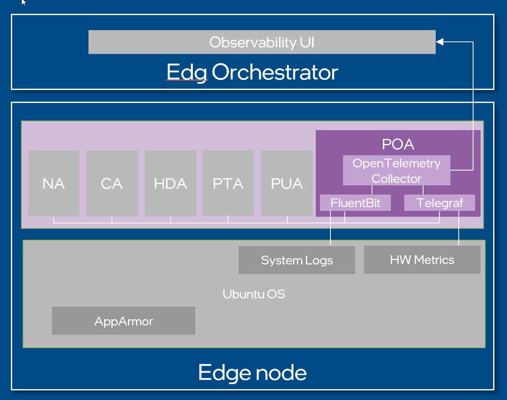

Edge Node Platform Observability Agent
======================================

Background
----------

This document provides high-level design and implementation guidelines. Refer
to `Platform Observability Agent <https://github.com/open-edge-platform/edge-node-agents/tree/main/platform-observability-agent>`_ in Edge Node Agents GitHub repository for
implementation details.

Target Audience
~~~~~~~~~~~~~~~

The target audience for this document is:

- Developers interested in contributing to the implementation of the Platform
  Observability Agent.

- Administrators and System Architects interested in the architecture, design
  and functionality of the Platform Observability Agent.

Overview
--------

Platform Observability Agent is part of the Open Edge Platform's Edge
Node Zero Touch Provisioning. It is installed, configured and automatically
executed at Provisioning time.

The Platform Observability Agent (POA) is a set of four observability agents
deployed as individual systemd services alongside the other Edge Node Agents on
the Edge Node. These services are:

- platform-observability-logging, which is a FluentBit\* service for scraping
  logs from all Edge Node Agents except health check logs.

- platform-observability-health-check, which is a FluentBit service for
  scraping health check logs from Edge Node Agents.

- platform-observability-metrics, which is a Telegraf\* service for scraping
  metrics from the Edge Node Agents as well as from the Edge Node HW.

- platform-observability-collector, which is a OpenTelemetry\* Collector service
  for gathering and forwarding all logs and hardware metrics to the Edge
  Orchestrator.

Architecture Diagram
--------------------

The Platform Observability Agent follows the architecture and design principles
set out in :doc:`hl_architecture`

.. figure:: ./images/poa-architecture.drawio.svg
   :alt: High-Level Architecture of the Platform Observability Agent

   Figure 1: High-Level Architecture of Platform Observability Agent

Key Components
--------------

1. The Platform Observability Agent is a system daemon packaged as a `.deb` or
   `.rpm` package (depending on target Operating System).

2. The Platform Observability Agent requires a designated JWT token

3. FluentBit service with config at ``/etc/fluent-bit/fluent-bit.conf``

4. Health check service with config at ``/etc/health-check/health-check.conf``

5. Telegraf service with config at ``/etc/telegraf/telegraf.d/telegraf.conf``

6. OpenTelemetry service with config at ``/etc/otelcol/otelcol.yaml``

Data Flow
---------

The data flow of the Platform Observability Agent can be broken down into
multiple concepts called out in `Workflow Stages` section.

Workflow Stages
~~~~~~~~~~~~~~~

1. **Log Collection configuration**:

   - FluentBit configuration for platform-observability-logging
      - Inputs
         - `systemd input plugin
           <https://docs.fluentbit.io/manual/pipeline/inputs/systemd>`_
           configured to capture Kubernetes Engine service logs

         - `systemd input plugin
           <https://docs.fluentbit.io/manual/pipeline/inputs/systemd>`_
           configured to capture hardware-discovery-agent service logs

         - `systemd input plugin
           <https://docs.fluentbit.io/manual/pipeline/inputs/systemd>`_
           configured to capture cluster-agent service logs

         - `systemd input plugin
           <https://docs.fluentbit.io/manual/pipeline/inputs/systemd>`_
           configured to capture node-agent service logs

         - `systemd input plugin
           <https://docs.fluentbit.io/manual/pipeline/inputs/systemd>`_
           configured to capture platform-telemetry-agent service logs

         - `systemd input plugin
           <https://docs.fluentbit.io/manual/pipeline/inputs/systemd>`_
           configured to capture platform-update-agent service logs

         - `Tail input plugin
           <https://docs.fluentbit.io/manual/pipeline/inputs/tail>`_ configured
           to capture INBC logs from /var/lib/dispatcher/upload/*

         - `systemd input plugin
           <https://docs.fluentbit.io/manual/pipeline/inputs/systemd>`_
           configured to capture RKE-server service logs

         - `systemd input plugin
           <https://docs.fluentbit.io/manual/pipeline/inputs/systemd>`_
           configured to capture RKE-system-agent service logs

         - `systemd input plugin
           <https://docs.fluentbit.io/manual/pipeline/inputs/systemd>`_
           configured to capture platform-observability-metrics service logs

         - `systemd input plugin
           <https://docs.fluentbit.io/manual/pipeline/inputs/systemd>`_
           configured to capture platform-observability-collector service logs

      - Outputs
         - `Forward output plugin
           <https://docs.fluentbit.io/manual/pipeline/outputs/forward>`_
           configured to send logs to the log socket file provided by the
           OpenTelemetry Collector service.

      - Options
         - `Buffering <https://docs.fluentbit.io/manual/concepts/buffering>`_
           using host file system enabled

   - Fluent Bit configuration for platform-observability-health-check
      - Inputs
         - `Exec input plugin
           <https://docs.fluentbit.io/manual/pipeline/inputs/exec>`_ configured
           to capture Kubernetes Engine service status

         - `Exec input plugin
           <https://docs.fluentbit.io/manual/pipeline/inputs/exec>`_ configured
           to capture hardware-discovery-agent service status

         - `Exec input plugin
           <https://docs.fluentbit.io/manual/pipeline/inputs/exec>`_ configured
           to capture cluster-agent service status

         - `Exec input plugin
           <https://docs.fluentbit.io/manual/pipeline/inputs/exec>`_ configured
           to capture node-agent service status

         - `Exec input plugin
           <https://docs.fluentbit.io/manual/pipeline/inputs/exec>`_ configured
           to capture platform-telemetry-agent service status

         - `Exec input plugin
           <https://docs.fluentbit.io/manual/pipeline/inputs/exec>`_ configured
           to capture platform-update-agent service status

         - `Exec input plugin
           <https://docs.fluentbit.io/manual/pipeline/inputs/exec>`_ configured
           to capture RKE-server service status

         - `Exec input plugin
           <https://docs.fluentbit.io/manual/pipeline/inputs/exec>`_ configured
           to capture RKE-system-agent service status

      - Outputs
         - `Forward output plugin
           <https://docs.fluentbit.io/manual/pipeline/outputs/forward>`_
           configured to send logs to the log socket file provided by the
           OpenTelemetry Collector service.

         - Options
         - `Buffering <https://docs.fluentbit.io/manual/concepts/buffering>`_ using host file system enabled

   - OpenTelemetry Collector configuration
      - Receivers
         - `Fluentforward input plugin
           <https://github.com/open-telemetry/opentelemetry-collector-contrib/blob/main/receiver/fluentforwardreceiver/README.md>`_
           configured to receive logs from the `platform-observability-logging`
           systemd service.

         - `Fluentforward input plugin
           <https://github.com/open-telemetry/opentelemetry-collector-contrib/blob/main/receiver/fluentforwardreceiver/README.md>`_
           configured to receive system logs from the cluster `fluent bit`
           service.

         - `Fluentforward input plugin
           <https://github.com/open-telemetry/opentelemetry-collector-contrib/blob/main/receiver/fluentforwardreceiver/README.md>`_
           configured to receive application logs from the cluster `fluent bit`
           service.

         - `Fluentforward input plugin
           <https://github.com/open-telemetry/opentelemetry-collector-contrib/blob/main/receiver/fluentforwardreceiver/README.md>`_
           configured to receive container logs from the cluster `fluent bit`
           service.

         - Processors - `Memory limiter processor plugin
           <https://github.com/open-telemetry/opentelemetry-collector/blob/main/processor/memorylimiterprocessor/README.md>`_
           configures the maximum memory usage for the collector service.

         - `Batch processor plugin
           <https://github.com/open-telemetry/opentelemetry-collector/blob/main/processor/batchprocessor/README.md>`_
           configures the settings for batching received logs in the collector
           before sending.

         - `Attributes processor plugin
           <https://github.com/open-telemetry/opentelemetry-collector-contrib/blob/main/processor/attributesprocessor/README.md>`_
           applies the edge node UUID as a tag onto the logs before the
           collector sends them to the Edge Orchestrator.

      - Exporters

         - `Otlphttp exporter plugin
           <https://github.com/open-telemetry/opentelemetry-collector/blob/main/exporter/otlphttpexporter/README.md>`_
           configured to send `platform-observability-logging` service logs to
           the Edge Orchestrator log endpoint.

         - `Otlphttp exporter plugin
           <https://github.com/open-telemetry/opentelemetry-collector/blob/main/exporter/otlphttpexporter/README.md>`_
           configured to send system logs from the cluster ``fluentbit``
           service to the Edge Orchestrator log endpoint.

         - `Otlphttp exporter plugin
           <https://github.com/open-telemetry/opentelemetry-collector/blob/main/exporter/otlphttpexporter/README.md>`_
           configured to send application logs from the cluster ``fluentbit``
           service to the Edge Orchestrator log endpoint.

         - `Otlphttp exporter plugin
           <https://github.com/open-telemetry/opentelemetry-collector/blob/main/exporter/otlphttpexporter/README.md>`_
           configured to send container logs from the cluster ``fluentbit``
           service to the Edge Orchestrator log endpoint.

      - Extensions
         - `Bearer token authentication extension plugin
           <https://github.com/open-telemetry/opentelemetry-collector-contrib/blob/main/extension/bearertokenauthextension/README.md>`_
           applies the JWT token as a HTTP header to the collector output to
           Edge Orchestrator.

   .. mermaid::

      flowchart TD
         I1[KE service] -->|logs| Collector
         I2[Hardware Discovery Agent] -->|logs| Collector
         I3[Cluster Agent] -->|logs| Collector
         I4[Node Agent] -->|logs| Collector
         I5[Vault Agent] -->|logs| Collector
         I6[Platform Update Agent] -->|logs| Collector
         I7[INBC] -->|logs| Collector
         I8[RKE System Agent] -->|logs| Collector
         I9[RKE Server] -->|logs| Collector
         I10[Telegraf] -->|logs| Collector
         I11[Otel Collector] -->|logs| Collector
         I12[Telemetry Agent] -->|logs| Collector
         I13[AppArmour] -->|logs| Collector
         I14[Process] -->|logs| Collector
         I15[EN Users] -->|logs| Collector
         I16[Firewall] -->|logs| Collector
         I17[Host] -->|logs| Collector
         I18[OS] -->|logs| Collector
         Collector --> Routing
         Routing --> Orchestrator

Figure 2: Log Collection configuration

2. **Metrics Collection configuration**:

   - Telegraf configuration
      - Inputs
         - `CPU input plugin
           <https://github.com/influxdata/telegraf/blob/master/plugins/inputs/cpu/README.md>`_
           enables gathering of `CPU` related metrics from the HW.

         - `Memory input plugin
           <https://github.com/influxdata/telegraf/blob/master/plugins/inputs/mem/README.md>`_
           enables gathering of `memory` related metrics from the HW.

         - `Disk input plugin
           <https://github.com/influxdata/telegraf/blob/master/plugins/inputs/disk/README.md>`_
           enables gathering of `disk` related metrics from the HW.

         - `Disk IO input plugin
           <https://github.com/influxdata/telegraf/blob/master/plugins/inputs/diskio/README.md>`_
           enables gathering of `diskio` related metrics from the HW.

         - `Net input plugin
           <https://github.com/influxdata/telegraf/blob/master/plugins/inputs/net/README.md>`_
           enables gathering of `network` related metrics from the HW.

         - `Temp input plugin
           <https://github.com/influxdata/telegraf/blob/master/plugins/inputs/temp/README.md>`_
           enables gathering of `temperature` related metrics from the HW.

         - `IPMI sensor input plugin
           <https://github.com/influxdata/telegraf/blob/master/plugins/inputs/ipmi_sensor/README.md>`_
           enables gathering of `IPMI` related metrics from the HW using the
           ``ipmitool``. Disabled by default.

         - `SMART input plugin
           <https://github.com/influxdata/telegraf/blob/master/plugins/inputs/smart/README.md>`_
           enables gathering of `storage device` related metrics from the HW
           using ``smartctl``. Disabled by default.

         - `Intel powerstat input plugin
           <https://github.com/influxdata/telegraf/blob/master/plugins/inputs/intel_powerstat/README.md>`_
           enables gathering of ``power`` related metrics from Intel based
           platforms. Disabled by default.

         - `RAS input plugin
           <https://github.com/influxdata/telegraf/blob/master/plugins/inputs/ras/README.md>`_
           enables gathering of ``error`` metrics from the RASDaemon in the HW.
           Disabled by default.

      - Outputs
         - `OpenTelemetry output plugin
           <https://github.com/influxdata/telegraf/blob/master/plugins/outputs/opentelemetry/README.md>`_
           configured to send metrics to the metrics socket file provided by
           the OpenTelemetry Collector service.

   - OpenTelemetery Collector configuration
      - Receivers
         - `Otlp input plugin
           <https://github.com/open-telemetry/opentelemetry-collector/blob/main/receiver/otlpreceiver/README.md>`_
           configured to receive HW metrics from `Telegraf` as well as metrics
           from the `Edge Node Agents`.

      - Processors
         - `Memory limiter processor plugin
           <https://github.com/open-telemetry/opentelemetry-collector/blob/main/processor/memorylimiterprocessor/README.md>`_
           configures the maximum memory usage for the collector service.

         - `Batch processor plugin
           <https://github.com/open-telemetry/opentelemetry-collector/blob/main/processor/batchprocessor/README.md>`_
           configures the settings for batching received metrics in the
           collector before sending.

         - `Attributes processor plugin
           <https://github.com/open-telemetry/opentelemetry-collector-contrib/blob/main/processor/attributesprocessor/README.md>`_
           applies the edge node UUID as a tag onto the metrics before the
           collector sends them to the Edge Orchestrator.

      - Exporters

         - `Otlphttp exporter plugin
           <https://github.com/open-telemetry/opentelemetry-collector/blob/main/exporter/otlphttpexporter/README.md>`_
           configured to send metrics to the Edge Orchestrator metrics endpoint.

      - Extensions
         - `Bearer token authentication extension plugin
           <https://github.com/open-telemetry/opentelemetry-collector-contrib/blob/main/extension/bearertokenauthextension/README.md>`_
           applies the JWT token as a HTTP header to the collector output to
           Orchestrator.

   .. mermaid::

      flowchart TD
         I1[Telegraf] -->|metrics| Collector
         I2[Node Agent] -->|metrics| Collector
         I3[Cluster Agent] -->|metrics| Collector
         I4[Hardware Agent] -->|metrics| Collector
         I5[Platform Update Agent] -->|metrics| Collector
         Collector --> Routing
         Routing --> Orchestrator

Figure 3: Metrics Collection configuration

Extensibility
-------------

The Platform Observability Agent functionality can be extended by making source
code changes.

Deployment
----------

The Platform Observability Agent is deployed as a set of system daemons via
installation of a *.deb* package during the provisioning or *.rpm* package as
part of the Edge Microvisor Toolkit.

The POA installs four services, platform-observability-logging,
platform-observability-health-check, platform-observability-metrics and
platform-observability-collector, when deployed on to the Edge Node.

Each service file is stored in the /lib/systemd/system/ folder as
<service_name>.service.

The config file for the platform-observability-logging service is stored in
``/etc/fluent-bit/fluent-bit.conf``.

The config file for the platform-observability-health-check service is stored
in ``/etc/health-check/health-check.conf``.

The config file for the platform-observability-metrics service is stored in
``/etc/telegraf/telegraf.conf``.

The config file for the platform-observability-collector service is stored in
``/etc/otelcol/otelcol.yaml``.
Logs for each service can be viewed using the journalctl tool.

Technology Stack
----------------

Below sections provide an overview of various aspects of the Platform
Observability Agent's technology stack.

Implementation
~~~~~~~~~~~~~~

The Platform Observability Agent is implemented as a set of observability
services configured for collection of desired logs and metrics.

System Diagram
~~~~~~~~~~~~~~

Platform Observability Agent depends on Edge Orchestrator endpoints:

- Edge Orchestrator central log collector service endpoint.
- Edge Orchestrator central metrics collector service endpoint.

Platform Observability Agent external telemetry collectors:

- Official `fluent-bit
  <https://docs.fluentbit.io/manual/installation/linux/ubuntu>`_ Debian
  package.

- Official `telegraf <https://docs.influxdata.com/telegraf/v1/install/>`_
  Debian package.

- Official `Otel Collector
  <https://opentelemetry.io/docs/collector/installation/#deb-installation>`_
  Debian package.

   Figure 4: Platform Observability Agent system diagram

Integrations
~~~~~~~~~~~~

Platform Observability Agent does not expose an API, it exposes metrics to the
endpoints of the Edge Orchestrator.

Platform Observability Agent integrates the 3rd party metric collectors -
FluentBit, Telegraf, OpenTelemetry collector.

Security
--------

Security Policies
~~~~~~~~~~~~~~~~~

Platform Observability Agent adheres to Edge Node Agents :doc:`hl_architecture`
security design principle.

Auditing
~~~~~~~~

Platform Observability Agent adheres to Edge Node Agents :doc:`hl_architecture`
observability design principle.

Upgrades
~~~~~~~~

Platform Observability Agent adheres to Edge Node Agents :doc:`hl_architecture`
upgrade design principle.
