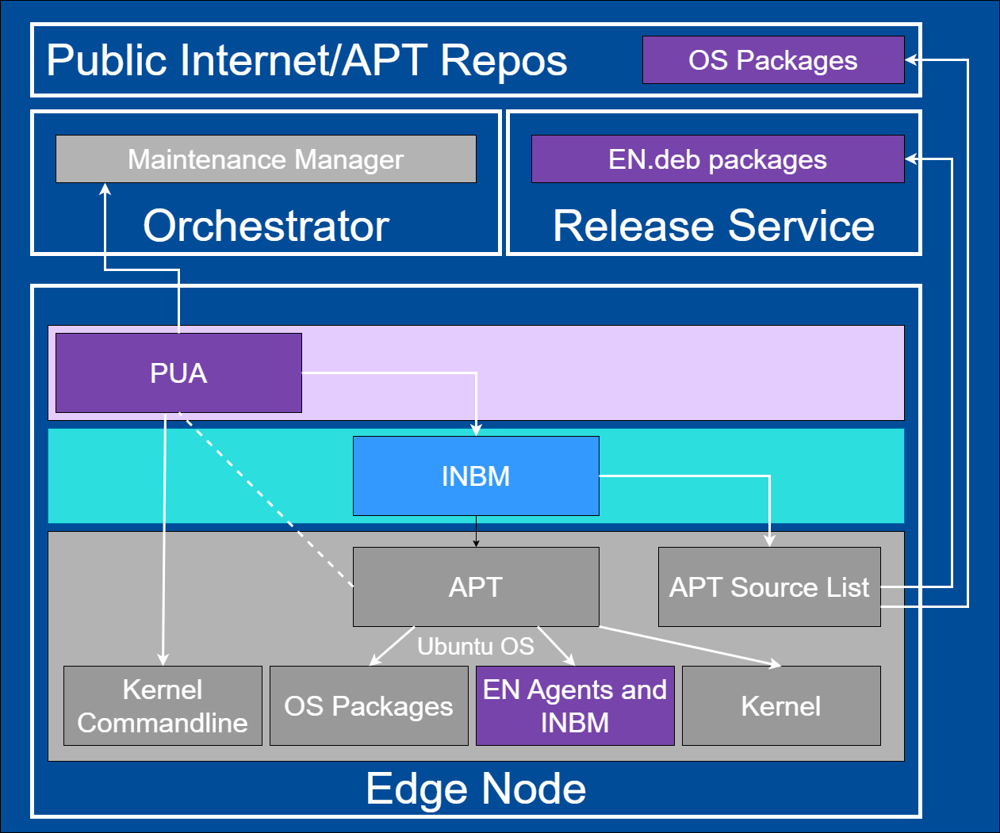

Edge Node Platform Update Agent
===============================

Background
----------

This document provides high-level design and implementation guidelines. Refer
to `Platform Update Agent <https://github.com/open-edge-platform/edge-node-agents/tree/main/platform-update-agent>`_ in the Edge Node Agents GitHub\* repository for
implementation details.

Target Audience
~~~~~~~~~~~~~~~

The target audience for this document is:

- Developers interested in contributing to the implementation of the Platform
  Update Agent.

- Administrators and System Architects interested in the architecture, design
  and functionality of the Platform Update Agent.

Overview
--------

Platform Update Agent is part of the Open Edge Platform's Edge Node
Zero Touch Provisioning. It is installed, configured and automatically executed
at Provisioning time.

The main responsibility of the agent is to provide system-level (Operating
System packages, Edge Node Agents, Kernel Command-line) update capabilities and
installation of new packages during Day 2 operation of the Edge Node.

Platform Update Agent reports its status and makes requests for Update Source
list and Update Schedule to Maintenance Manager in Edge Infrastructure Manager. It will perform updates based on the received schedule.

Platform Update Agent leverages `Intel® In-Band Manageability software <https://www.intel.com/content/www/us/en/developer/tools/in-band-manageability/overview.html>`__ to update OSes and install
new packages.

Architecture Diagram
--------------------

The Platform Update Agent follows the architecture and design principles set
out in :doc:`hl_architecture`

.. figure:: ./images/pua-architecture.drawio.svg
   :alt: High-Level Architecture of the Platform Update Agent

   Figure 1: High-Level Architecture of Platform Update Agent

Key Components
--------------

1. The Platform Update Agent is a system daemon packaged as a ``.deb`` or
   ``.rpm`` package (depending on target Operating System).

2. ``platform-update-agent.yaml`` file stores Platform Update Agent's
   configuration.

3. ``platform-update-agent-metadata`` file stores Platform Update Agent's
   metadata.

4. The Platform Update Agent requires a designated JSON Web Token (JWT).

5. `Intel® In-Band Manageability framework
   <https://www.intel.com/content/www/us/en/developer/tools/in-band-manageability/overview.html>`_
   is leveraged by Platform Update Agent to perform updates.

Data Flow
---------

The data flow of the Platform Update Agent can be broken down into multiple
concepts called out in ``Workflow Stages`` section.

Workflow Stages
~~~~~~~~~~~~~~~

1. **Update Sequence Diagram - Ubuntu\* OS detailed view**:

   Sequence diagram showcasing the communication between the Maintenance
   Manager in |software_prod_name| and Platform Update Agent on the Edge Node.

   Ubuntu OS update as an example with focus on the internal components of the
   Platform Update Agent.

   .. mermaid::

      sequenceDiagram
      %%{wrap}%%
      autonumber
      participant mm as "Maintenance Manager"
      box Edge Node
      participant pua as Platform Update Agent
      participant inbc as INBC
      participant grub as GRUB (Kernel Commandline)
      participant apt as APT (Tool and filesystem)
      participant ur as Upstream APT Repo (OS)
      participant pr as Private APT Repo (Open Edge Platform)
      end

      pua->>pua: read configuration file
      note over pua: metadata will indicate if PUA was restarted during/due to update, it will indicate if certain steps will be skipped because they were already performed as part of updating
      pua->>pua: read/init metadata

      note over pua: if INBM has not been provision
      pua->>pua: provision INBM

      loop periodically
         pua->>mm: PlatformUpdateStatusRequest(guid, UP_TO_DATE)
         mm->>pua: PlatformUpdateStatusInd (update_source, update_schedule)
         pua->>pua: update/watch the schedule on EN
         pua->>pua: update metadata
      end

      note over  pua, mm: reach maintenance schedule start time
         pua-->>mm: PlatformUpdateStatusRequest(guid, STARTED)
      mm->>pua: PlatformUpdateStatusInd (update_source, update_schedule)
         pua->>pua: update metadata

      note over  pua, mm: UPDATE APT SOURCES
      pua->>inbc: update Ubuntu sources through INBM config (ConfigureOsAptRepo(osRepoURL))
      inbc->>apt: inbc source os update (--sources osRepoURL)
      inbc->>pua: success
      pua->>inbc: update Open Edge Platform sources through INBM config (ConfigureCustomAptRepos(CustomRepos))
      inbc->>apt: inbc source application add (--sources CustomRepos)
      inbc->>pua: success

      note over  pua, mm: SELF PUA UPDATE
      pua->>apt: SelfUpdate() - apt "NEEDRESTART_MODE=a" install --only-upgrade platfrom-update-agent
      apt->>pr: get latest package
      pr->>apt: return and install latest package
      apt->>pua: if package available = success, PUA restarts, if no package available =success, continue

      note over  pua, mm: UPDATE INBM
      pua->>apt: updateINBM() - apt install --only-upgrade inbm***
      apt->>pr: get latest packages
      pr->>apt: return and install latest packages
      apt->>pua: success

      note over pua, mm: UPDATE GRUB CONFIG
      pua->>pua: get new GRUB config version
      pua->>grub: Update Kernel Commandline boot parameters /etc/default/grub
      pua->>grub: update-grub
      grub->>grub: updating grub config

      note over  pua, mm: INSTALL NEW OS PACKAGES AND AGENTS
      pua->>inbc: inbc sota --packa_list package_1 -m download-only --reboot no
      inbc->>apt: apt-get install package1 --download-only
      apt->>pr: get latest packages
      pr->>apt: return and download latest packages
      apt->>inbc: success
      inbc->>pua: success
      pua->>inbc: inbc sota --packa_list package_1 -m no-download --reboot no
      inbc->>apt: apt-get install packages -n no-download -no-reboot
      apt->>inbc: success
      inbc->>pua: success

      note over pua, mm: UPDATE OS PACKAGES AND AGENTS
      pua->>inbc: download packages - inbc sota -m download-only -no-reboot
      inbc->>apt: apt update && apt-upgrade --download-only
      apt->>pr: get latest packages
      pr->>apt: return and download latest packages
      inbc->>pua: success
      pua->>inbc: inbc sota -m no-download --reboot yes
      pua->>apt: update OS and Agents: apt-upgrade --no-download --reboot yes
      apt->>inbc: success
      inbc->>pua: success

      note over pua: INBM REBOOTS THE NODE
      pua->>pua: verify OS/Agents update
      Note over mm, pua: update done/failed
      pua->>pua: change status to 'UPDATED'/'FAILED' and update metadata
      pua->> mm: PlatformUpdateStatusRequest(guid, UPDATED/FAILED)
         mm->>pua: PlatformUpdateStatusInd (update_source, update_schedule)
         pua->>pua: change status to 'UP-TO-DATE' (if update is not FAILED) and update metadata

Figure 2: Platform Update Agent - Ubuntu OS detailed view

2. **Platform Update Agent sequence - interaction with Edge Infrastructure Manager - Edge Microvisor Toolkit detailed view**:

   Sequence diagram showcasing the communication between the Platform Update
   Agent and |software_prod_name|.

   Edge Microvisor Toolkit update as an example with focus on the
   communication between Edge Infrastructure Manager and Platform Update Agent.

   .. mermaid::

      sequenceDiagram
      %%{wrap}%%
      autonumber

      actor a as Admin
      participant reg as Release Service
      participant ui as User Interface
      participant inv as Inventory
      participant hm as Host Manager
      participant nm as New OS Resource Manager
      participant mm as Maintenance Manager
      box LightCyan Edge Node
      participant pua as Platform Update Agent / INBC
      participant na as Node Agent
      end

      note over pua, na: EN OS is installed on partition A and all EN components are up

      par
         loop periodically
            na->>hm: Send EN heartbeat
            opt Host status change
               hm->>inv: Update host status
            end
         end
         loop daily
            nm->>reg: download new Curated Profile manifests
            reg-->>nm: return
            nm->>nm: parse the manifests
            nm->>inv: create new OS Resources for new Curated Profiles
            opt manualOSImageUpdate=false
               nm->>inv: update desired_os of all instances with latest OS where instance.desired_os.profile_name=manifest.profile_name
            end
         end
         loop periodically
            pua->>mm: PlatformUpdateStatusRequest(guid, UP_TO_DATE)
            mm->>inv: Set Instance UpdateStatus(UP_TO_DATE)
            mm->>pua: PlatformUpdateStatusResponce (os_type, os_image_source, update_source, update_schedule)
            pua->>pua: update metadata
         end
         opt manualOSImageUpdate=true
            a->>inv: update desired_os to a selected OS Resource in chosen Instances
         end
         ui->>inv: per instance, get the ResourceID of current_os and desired_os if the current_os's osType == immutable
         inv-->>ui: return
         ui->>ui: display 'Update available' in host details if osType == immutable and current_os.resourceId != desired_os.resourceId
      end
      note over  pua, mm: OS image update start time reached
      pua->>mm: PlatformUpdateStatusRequest(guid, STARTED)
      mm->>inv: Update Instance UpdateStatus (inst_id, UPDATE_IN_PROGRESS)
      pua->>pua: read metadata
      note over  pua, mm: UPDATE OF IMMUTABLE OS IMAGE
      pua->>pua: read metadata
      pua->>pua: compare sha and version of the installed image to the sha and version in the metadata
      alt versions are the same
         pua->>mm: UpdateStatus=UP_TO_DATE
         mm->>inv: UpdateStatus=UP_TO_DATE
      else versions are different
         pua->>reg: download image on partition B using os_image_url
         reg-->>pua: return
         alt download fail
            pua->>mm: UpdateStatus=FAILED FailureReason="DownloadFail"
            mm->>inv: UpdateStatus=FAIL
         else download success
            pua->>mm: UpdateStatus=STARTED
            pua->>pua: install OS on partition B
            pua->>pua: verify installation before reboot
            alt installation fail
               pua->>mm: UpdateStatus=FAILED StatusDetail.Status=Failed FailureReason=InstallationFail
               mm->>inv: UpdateStatus=FAIL
            else installation success
               pua->>mm: UpdateStatus=STARTED
               pua->>pua: set partition B as one-time bootable
               pua->>pua: reboot node
               alt node fails to boot up from partition B, successful boot up from partition A (rollback success)
                  pua->>mm:  UpdateStatus=FAILED StatusDetail.Status=Rolledback FailureReason=BootloaderFail
                  mm->>inv: UpdateStatus=FAIL
               else node fails to boot up from partition B and partition A (rollback failure)
                  hm->>inv: HostStatus=CONNECTION_LOST
               else node boots up from partition B
                  note over pua: PUA and INBM start
                  pua->>pua: verify update completion and set partition B as bootable
                  alt update fail
                     pua->>mm: UpdateStatus=FAILED StatusDetail.Status=Failed e.g. FailureReason=OSCommitFail
                     mm->>inv: UpdateStatus=FAIL
                     pua->>pua: reboot (rollback to partition A)
                     pua->>mm: UpdateStatus=FAILED StatusDetail.Status=Rolledback e.g. FailureReason=OSCommitFail
                     mm->>inv: UpdateStatus=FAIL
                  else update success
                     pua->>mm: UpdateStatus=UPDATED StatusDetail.Status=SUCCESS FailureReason=NoFailure, sends installed profile_name, profile_version
                     mm->>inv: Filter OSResources by profile_name and profile_version=x, get one (A)
                     inv-->>mm: return
                     mm->>inv: Set Instance UpdateStatus=DONE, current_os=A
                     pua->>mm: UpdateStatus=UP_TO_DATE
                     mm->>inv: UpdateStatus=RUNNING
                  end
               end
            end
         end
      end

Figure 3: Platform Update Agent sequence - interaction with Edge Infrastructure Manager - Edge Microvisor Toolkit detailed view

3. **Platform Update Agent integration with JWT**:

   Since APT does not nativity support JWT for authentication, it is necessary
   to introduce forward proxy that will act as an intermediary between APT and
   Release Service file server.

   Caddy\* server is a third party proxy server being used as a forward proxy on the
   Edge Node.

   It appends JWT to requests from APT client.

   .. figure:: ./images/pua-jwt.png
      :alt: Platform Update Agent integration with JWT

   Figure 4: Platform Update Agent integration with JWT

Extensibility
-------------

The Platform Update Agent supports installation of new Ubuntu OS packages. To
install new packages, follow Edge Node update instructions.

Deployment
----------

The Platform Update Agent is deployed as a system daemon via installation of a
*.deb* package during the provisioning or *.rpm* package as part of the Edge Microvisor Toolkit.

Technology Stack
----------------

Below sections provide an overview of various aspects of the Platform Update
Agent's technology stack.

Implementation
~~~~~~~~~~~~~~

The Platform Update Agent is written in the Go\* programming language. Platform
Update Agent persists metadata file across updates/reboots to keep track of
update stages.

Platform Update Agent pulls a Platform Update Schedule from the Maintenance
Manager residing in the Edge Infrastructure Manager.

The schedule comes as part of the API call response from Maintenance Manager.
It contains update_schedule (time to perform update), update_source (the
sources information) and installed_packages (new packages to be installed)
fields.

Internally, PUA call INBM software to initiate the download and installation of
new or updated OS-level packages.

System Diagram
~~~~~~~~~~~~~~

Platform Update Agent depends on Edge Node's Maintenance Manager. It is also
depends on the Intel In-Band Manageability framework
(<https://github.com/intel/intel-inb-manageability>) to perform update flow
inside the code.

Update artifacts are published on APT server as part of a Release Service.

   Figure 5: Platform Update Agent system diagram

Integrations
~~~~~~~~~~~~

Platform Update Agent does not expose an API, rather it is consuming APIs from
both Edge Cluster Manager.

Platform Update Agent polls (over gRPC) the Maintenance Manager in Edge Infrastructure Manager
periodically to:

- Obtain schedules for Edge Node updates.

- Obtain the list/source URL of apt mirrors in which the potential updates
  reside.

- Platform Update Agent keeps track of internal Edge Node status in relation
  to system updates and saves it in the metadata file.

Platform Update Agent statuses (communicated to Maintenance Manager):

- STATUS_TYPE_DOWNLOADED 6 - Status when the Edge Node completes downloading update
  artifacts

- STATUS_TYPE_DOWNLOADING 5 - Status when the Edge Node is downloading update
  artifacts

- STATUS_TYPE_FAILED 4 - Status when the Edge Node update fails; a detailed log is
  also sent

- STATUS_TYPE_UPDATED 3 - Status when the Edge Node update is completed successfully

- STATUS_TYPE_STARTED 2 - Status when the update process of Edge Node has started

- STATUS_TYPE_UP_TO_DATE 1 - Status when Edge Node is not performing any update
  related actions

- STATUS_TYPE_UNSPECIFIED 0 - Default value, status not specified

Platform Update Agent call to Maintenance Manager:

- PlatformUpdateStatusRequest - Periodic request that sends Edge Node UUID and
  its update status, and receives update schedules and update source list.

   .. mermaid::

      stateDiagram
         [*] --> UP_TO_DATE

         UP_TO_DATE --> DOWNLOADING: Download starts
         DOWNLOADING --> DOWNLOADED : Download succeeds
         DOWNLOADED --> DOWNLOADING: New version available
         DOWNLOADING --> FAILED: Download fails, maint window is over
         DOWNLOADING --> UP_TO_DATE: Download canceled

         DOWNLOADED --> STARTED: Update started
         STARTED --> UPDATED: Update succeeds
         STARTED --> FAILED: Update fails

         FAILED --> DOWNLOADING: Retry download with new maint window

         UPDATED --> UP_TO_DATE

Figure 6: Platform Update Agent integration

Security
--------

Security Policies
~~~~~~~~~~~~~~~~~

Platform Update Agent adheres to Edge Node Agents :doc:`hl_architecture` security
design principle.

Auditing
~~~~~~~~

Platform Update Agent adheres to Edge Node Agents :doc:`hl_architecture`
observability design principle.

Upgrades
~~~~~~~~

Platform Update Agent adheres to Edge Node Agents :doc:`hl_architecture` upgrade
design principle.
