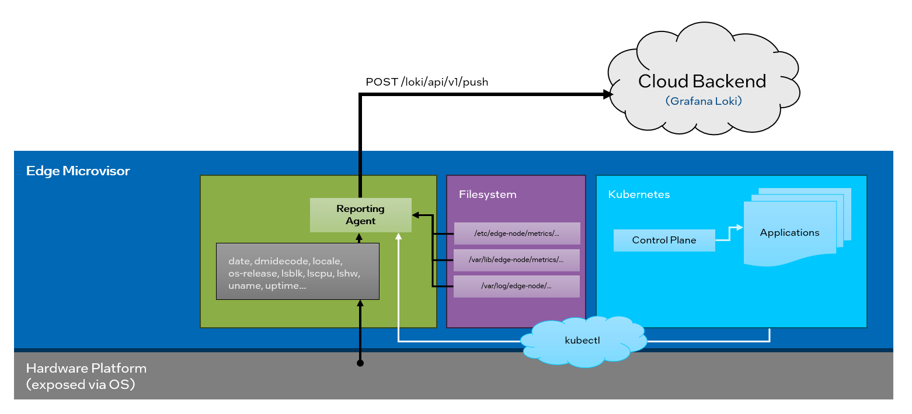

Edge Node Reporting Agent
=========================

Background
----------

This document provides high-level design and implementation guidelines. Refer
to `Reporting Agent <https://github.com/open-edge-platform/edge-node-agents/tree/main/reporting-agent>`_
in the Edge Node Agents' GitHub\* repository for implementation details.

Target Audience
~~~~~~~~~~~~~~~

The target audience for this document is:

- Developers interested in contributing to the implementation of the Reporting Agent.

- Administrators and System Architects interested in the architecture, design,
  and functionality of the Reporting Agent.

Overview
--------

The Reporting Agent is responsible for collecting a comprehensive set of metrics and system
information from Open Edge Platform installations. It gathers data from a variety of sources
to provide a detailed snapshot of the system's hardware, software, and runtime environment.

While it resembles the Hardware Discovery Agent, the Reporting Agent is a separate
CLI application that is independent of the Edge Orchestrator's Edge Infrastructure Manager (EIM).

Architecture Diagram
--------------------

The Reporting Agent is a small footprint binary deployed on the Edge Nodes that collects
and sends the data about underlying hardware, operating system, and about applications
running on kubernetes cluster.

   Figure 1:  High-Level Architecture of the Reporting Agent

Key Assumptions
---------------

The Reporting Agent follows the general principles of Open Edge Platform's `Edge Node Agents <https://github.com/open-edge-platform/edge-node-agents/>`_
but introduces few unique features.

#. Requires configuration settings to be provided during Edge Node installation. Absence of any of the following will prevent Agent from sending any data:
    - `/etc/edge-node/metrics/endpoint` - shall contain target endpoint to send data to
    - `/etc/edge-node/metrics/token` - shall contain access token to authenticate with the target endpoint
    - `/etc/edge-node/metrics/group_id` - shall contain group identifier to which the Edge Node belongs
#. Pushes data to Cloud Backend:
    - Invokes HTTP POST with ``ContentType: application/json`` using `Grafana Loki* Data Format <https://grafana.com/docs/loki/latest/reference/loki-http-api/#ingest-logs>`_
    - Target tenant in Grafana Loki* is set using ``X-Scope-OrgID=reporting-v1``
    - Upon failure the request is retried ``20`` times with exponential backoff
#. Stores its logs on the Edge Node with time-based data retention:
    - Agent's logs are rotated with default ``90d`` retention
    - Logs location: ``/var/log/edge-node/reporting.log``
#. Captures and stores Audit logs on the Edge Node with time-based data retention:
    - Every JSON payload that is shipped to the cloud backend is logged
    - Audit logs are rotated with default ``90d`` retention
    - Located in ``/var/log/edge-node/reporting-audit.log``

Extensibility
-------------

The Reporting Agent functionality can be extended by making source code changes.

Deployment
----------

Reporting Agent is a CLI application that can be executed manually or automatically,
via ``cron`` job defined as part of Edge Microvisor:

- ``crontab`` entries location: ``/etc/cron.d/edge-node-metrics``
- is executed only if ``/etc/edge-node/metrics/disabled`` is not set
- if enabled the Reporting Agent is invoked:

    - on every reboot (`@reboot`) with full system information
    - periodically (every `1h`) with data set reduced to application data

Default ``cron`` configuration is stored in `SPEC definition for Reporting Agent <https://github.com/open-edge-platform/edge-microvisor-toolkit/tree/3.0/SPECS/reporting-agent>`_.

Data Collected
--------------

System Data
~~~~~~~~~~~

Reporting Agent queries system data grouped in following sets:

#. ``Identity`` - for identification of a given Edge Node a combination of multiple identifiers is used to maximize uniqueness.
    #. ``MachineId`` is a ``sha256`` hash generated with each data collection from concatenated string values of:
        - System UUID ``sudo dmidecode -s system-uuid``
        - System Serial ``sudo dmidecode -s system-serial-number``
        - Network Cards MAC addresses ``sudo lshw -class network | grep -i "serial:"`` (sorted ascending)
    #. ``InitialMachineId`` - provides means to detect hardware changes during Edge Node lifetime and allow more precise querying. It contains a copy of the first ``MachineId`` calculation stored in ``/etc/edge-node/metrics/machine_id``.
    #. ``GroupId`` - contains ``/etc/edge-node/metrics/group_id`` value supplied during installation of the Edge Node.
#. ``OperatingSystem`` - contains details of the currently running OS:
    #. Timezone ``date +%Z``
    #. Locale ``locale -k LC_ADDRESS`` (country_name, country_ab2, lang_name, lang_ab)
    #. uptime seconds ``/proc/uptime`` (first value)
    #. Kernel data
        - machine (``uname -m``),
        - name (``uname -s``),
        - release (``uname -r``),
        - version (``uname -v``),
        - system (``uname -o``)
    #. OS Release data (from ``/etc/os-release``)
        - ID,
        - VERSION_ID,
        - VERSION,
        - VERSION_CODENAME,
        - ID_LIKE,
        - BUILD_ID,
        - IMAGE_ID,
        - IMAGE_VERSION
#. ``ComputerSystem`` - contains hardware information
    #. CPU data from following fields from ``lscpu`` output:
        - Architecture,
        - Vendor,
        - Family,
        - ModelName,
        - Model,
        - Stepping,
        - SocketCount,
        - CoreCount,
        - ThreadCount,
        - VirtualizationType,
        - Hypervisor
    #. Memory data from ``dmidecode --type memory`` (or ``dmidecode --type 17``)
        #. Summary (aggregated values)
            - total size of all devices (in MB)
            - common type (only if equal for all devices) e.g.: ``DDR5``
            - common form factor (only if equal for all devices) e.g.: ``DIMM``
        #. Individual devices (for populated banks only)
            - FormFactor,
            - Type,
            - Size,
            - Speed,
            - Manufacturer
    #. Disk data from ``lsblk -o KNAME,VENDOR,MODEL,SIZE,TYPE -J -b --tree``
        - filtered, only `"type": "disk"`

Kubernetes applications
~~~~~~~~~~~~~~~~~~~~~~~

If the Edge Node has a Kubernetes Cluster populated, the Agent collects information about running applications via ``kubectl`` command.
Supported kubernetes clusters include ``k3s`` and ``RKE`` installations.

#. Default ``RKE2`` cluster configuration and binary locations:
    .. code-block:: bash

       > export KUBECONFIG=/etc/rancher/rke2/rke2.yaml
       > /var/lib/rancher/rke2/bin/kubectl get nodes

#. Default ``k3s`` cluster configuration and binary locations::
    .. code-block:: bash

       > export KUBECONFIG=/etc/rancher/k3s/k3s.yaml
       > /var/lib/rancher/k3s/bin/kubectl get nodes

Applications running on the cluster are identified by reading the following labels:

#. Intel specific labels populated by applications fully supporting Open Edge Platform:

    - ``com.intel.edgeplatform.application.name``
    - ``com.intel.edgeplatform.application.version``

2. Default well-known kubernetes labels:

    - `app.kubernetes.io/name`
    - `app.kubernetes.io/version`
    - `app.kubernetes.io/part-of`

.. note::
   Only a set of unique values representing detected applications is exported. For applications containing Intel specific labels the default well-known kubernetes labels are also sent.

Reporting Agent queries kubernetes application data grouped in following sets:

#. ``Kubernetes`` data from ``kubectl``
    - server vendor
    - server version
    - running applications (as unique label sets)

Security
--------

The endpoint specified in the ``/etc/edge-node/metrics/endpoint`` file must use the ``https`` protocol.

To authenticate with the backend, the application requires a ``HTTP BasicAuth`` user and password,
which must be provided in the ``/etc/edge-node/metrics/token`` file in the format ``username:password``.

TLS version 1.3 is used for backend communication if supported by the server; otherwise, TLS 1.2 is used.

The user running the application should be added to the `sudoers file <https://github.com/open-edge-platform/edge-node-agents/blob/main/config/sudoers.d/reporting-agent>`_,
as the ``dmidecode`` and ``lshw`` applications require such privileges.

The same user must also have execute access to the ``kubectl`` binary and read access to the ``kubeconfig`` file.
The paths to these files are specified in the ``reporting-agent.yaml`` `configuration file <https://github.com/open-edge-platform/edge-node-agents/blob/main/config/reporting-agent.yaml>`_.

Auditing
~~~~~~~~

Reporting Agent provides auditing capabilities by logging every JSON payload that is sent to the cloud backend in addition to its regular logs.
Both are rotated with a default retention of 90 days.

- Regular logs location: ``/var/log/edge-node/reporting.log``
- Audit logs location: ``/var/log/edge-node/reporting-audit.log``
