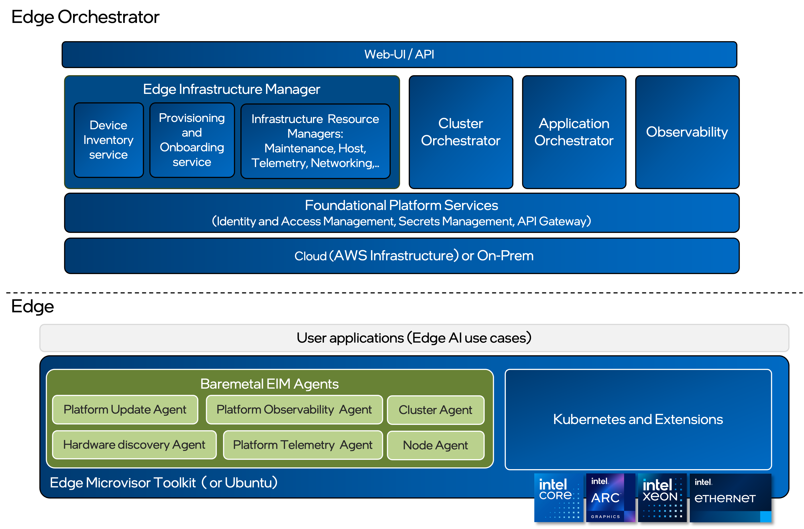

Edge Node Agents
================

`Edge Node Agents <https://github.com/open-edge-platform/edge-node-agents>`_ are a collection of OS-level agents that make up an Edge Node.

Edge Node Agents are deployed as system daemons during the provisioning of the
Edge Node.

Each Edge Node Agent is packaged and installed according to the requirements of
the OS it is running on. In the case of mutable OSes, they are dynamically downloaded and
installed as `.deb` packages. In the case of immutable OSes, they are already part of
the OS distribution.

In addition to BareMetal EIM Agents running as system daemons, the :doc:`/developer_guide/agents/arch/reporting`
is available as a CLI application that is also a part of the immutable OS distribution.

.. toctree::
   :hidden:
   :maxdepth: 1

   arch/index
   tutorials/index
