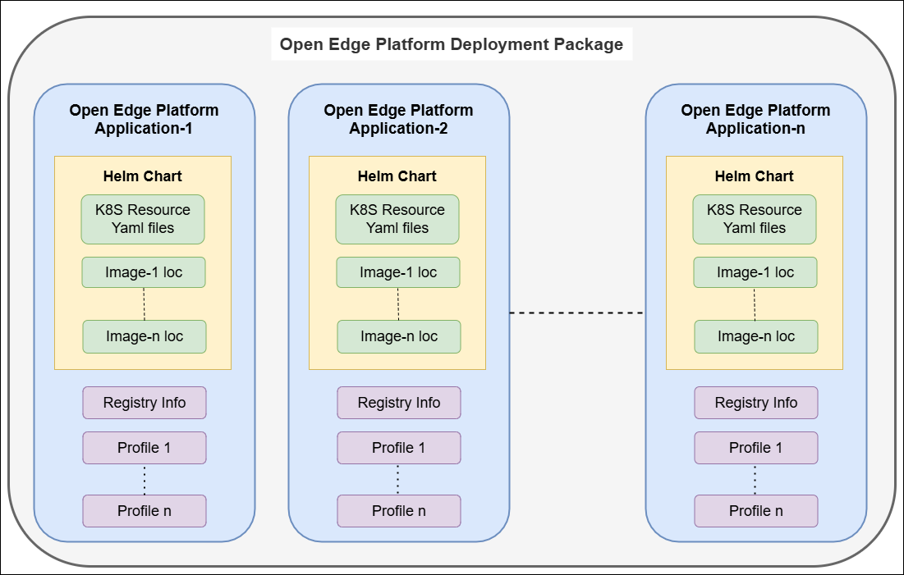

Data Model
==========

The Application Orchestration data model is composed of the following parts:

Applications
------------

Applications are individually deployable and based on Helm\* Charts and Container
(Docker\*) Images. They may be either container-based, or virtual machine based.
The customer may leverage Application Orchestration’s internal registry to
house these Helm Charts and Images, or they may leverage an external registry,
such as a public registry or a private enterprise registry. Applications
include named Profiles that allow the applications to be configured in
different ways at deployment time.

Additionally, the profile can have a set of parameter templates that can be
used to override the values in the Helm Chart at deploy time.

The purpose of the application abstraction is to be able to hide the complexity
of the Helm Chart and its configuration values from the persona that will be
performing the deployment, while still permitting the flexibility of
configuring the application.

Extensions are a set of pre-curated applications that are provided by the
|software_prod_name| team. They are loaded on creation of a Multi-Tenancy
project. Some are installed automatically on the Edge Node 
(those in the :ref:`cluster_base_extension`), and others are part of 
the :ref:`application_extension` that can be installed by end users on demand. 
They usually include utility packages such as cert-manager, observability etc.

Other end-user Applications will be designed and added by end users.

Deployment Packages
-------------------

Deployment Packages are collections of Applications that may be deployed as an
aggregate to an edge site. As such, a Deployment reflects a set of related Helm
Charts. A Deployment Package that contains only a single Application (and
therefore only reflects a single Helm Chart) is allowed. Deployment Packages
extend the profile abstraction, allowing the entire collection of applications
to be configured by a single profile, further simplifying the deployment
process.

Deployment Package Extensions are a special case of Deployment Packages that
are pre-curated and provided by the |software_prod_name| team. In general, only
one instance of an extension is deployed to an edge node cluster. They are
divided into two sets - Cluster Extensions and Application Extensions.

.. _cluster_base_extension:

Cluster Base Extensions Deployment Package
"""""""""""""""""""""""""""""""""""""""""""
- Cluster Base Extensions Deployment Package are a set of pre-curated Extension
  Applications that extend the basic Kubernetes deployment on the Edge Node
  cluster to provide enhanced operational capabilities like Gatekeeper,
  Prometheus, Fluent Bit, OpenEBS, and others. These Deployment Packages are
  deployed by default on every Edge Node cluster.

.. _application_extension:

Application Extensions Deployment Packages
"""""""""""""""""""""""""""""""""""""""""""
- Application Extensions Deployment Packages are a set of pre-curated
  Deployment Packages loaded onto |software_prod_name| by default that group
  Application Extensions. These are deployed on demand by the user to provide
  access to commonly used utility services like Loadbalancer, GPU support,
  SRIOV support.

   Figure 1: Data Model of Application Orchestration in Open Edge Platform |software_prod_name|

Registries
----------

Registries are links to external or internal OCI Registries that contain the
Helm Charts and Container Images that are to be deployed. Applications are
associated with a Registry, and at deployment time the Root URL and optionally
the credentials and certificate information for the Registry are used to pull
the Helm Charts and Container Images.

Deployments
------------

Deployments are used to take a Deployment Package and schedule it for
deployment to a set of edges, according to a policy. Deployments are lifecycle
managed, and can be created, deleted, or upgraded. Deployments are runtime
instances of Deployment Packages (and therefore Applications) with a chosen
Profile and optionally value overrides (parameter templates).

Networks
---------

Network objects are a CRD that can be used to drive the
:doc:`Interconnect service <key_components>` to connect
services in deployed Applications across Edge Node Clusters.

Multi-Tenant Projects
----------------------------

The multi-tenancy data model of the |software_prod_name| is based on a two-tier
model of Organizations and Projects. All of the above Data Model entities are
associated with a Project, which is associated with an Organization. The
individual microservices of Application Orchestration are multi-tenant capable,
with the ability to isolate data and operations.
