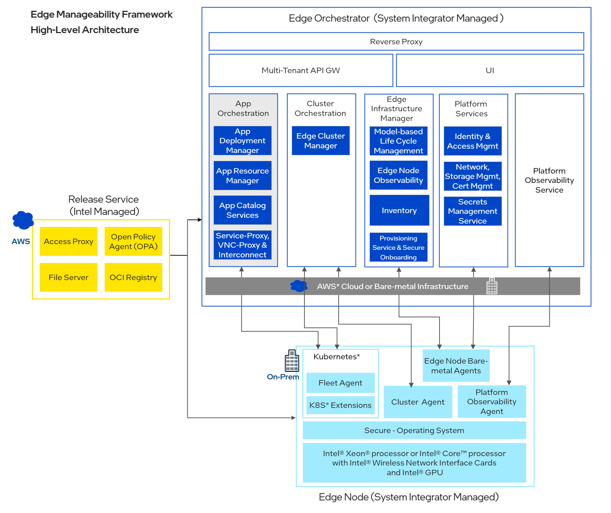

Architecture
============

Background
----------

|software_prod_name| Application Orchestration addresses the complexities of
deploying and managing applications at the edge. While Helm\* chart and Docker\* platform are
industry standards for deploying applications, they can be complex to use at
scale. The Application Orchestration layer simplifies the deployment process,
while still providing the flexibility to deploy complex groups of applications
across many edges.

   Figure 1: High-Level Architecture of Open Edge Platform
   |software_prod_name|

Target Audience
~~~~~~~~~~~~~~~

The target audience for this guide includes developers, architects, and system
administrators who are interested in understanding, modifying, extending, or
contributing to the Application Orchestration layer of |software_prod_name|.

End users who want to deploy, manage, and monitor applications on the edge
using |software_prod_name| will also find the
:doc:`/developer_guide/application_developer_workflow/index`,
:doc:`User Guide </user_guide/index>` and :doc:`API Guide </api/index>` useful.

Overview
--------

Application Orchestration is designed to offer customers the ability to easily
package, deploy and monitor cloud-native applications across distributed edges
at a large scale by delivering the following essential functions:

Simplified Application Management
~~~~~~~~~~~~~~~~~~~~~~~~~~~~~~~~~

Capabilities to register Applications and dynamically create collections of
Applications known as Deployment Packages, along with various configurations
known as Deployment Profiles, streamlining the process of deploying the complex
solutions to different Edge Node configurations.

Centralized Deployment Management
~~~~~~~~~~~~~~~~~~~~~~~~~~~~~~~~~

Single point of control to manage and monitor the lifecycle of application
deployments at scale. Deployment policies allow users to select the target
edges either manually or automatically, depending on their unique business
needs. When more than one edge is targeted, Application Orchestration handles
them as a logical group and ensures deployment status and configuration are
consistent across all targets.

Consistent Workload Management and Access
~~~~~~~~~~~~~~~~~~~~~~~~~~~~~~~~~~~~~~~~~

Containers and Virtual Machines packaged and deployed in a consistent way and
run side by side. Capabilities to view, access and control workloads.

Multi-Tenant Capabilities
~~~~~~~~~~~~~~~~~~~~~~~~~

All components of Application Orchestration are multi-tenant aware, allowing
for secure and isolated deployments for individual |software_prod_name|
multi-tenant Projects.

.. toctree::
   :hidden:
   :maxdepth: 3

   key_components
   data_model
   persona_interaction
   data_flow
   extensibility
   deployment
   technology_stack
   security
   scalability
   performance
