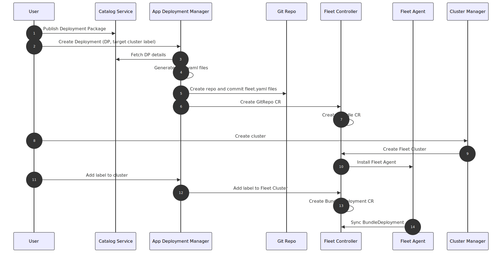

Key Components
==============

Application Orchestration is a modular implementation based on a cloud-native
microservices architecture where the major components have well-known interfaces
between them. The major components are:

Application Catalog Service
---------------------------

The Application Catalog Service stores and manages information about Deployment
Packages, Applications, Registries and Profiles. It is implemented in Go\* programming language, and
leverages gRPC framework, gRPC-Gateway framework, `ent framework <https://github.com/ent/ent>`_, and Postgres\* database server. The database is decoupled from
the catalog service and can scale independently. In cloud-based deployments, a
managed service such as Amazon Aurora\* relational database engine may be used. In on-prem deployments, a local
Postgres database server may be used.

The Application Catalog Service includes a Malware Scanner that scans the
Deployment Packages for malware content.

Application Deployment Manager
------------------------------

The Application Deployment Manager aims to be a user-friendly, high-level
interface for deploying, uninstalling, and upgrading Deployment Packages to one
or more edges. It also provides deployment status at multiple levels: summary,
per-cluster, and per-application. It is written in Go and leverages gRPC,
gRPC-Gateway, and its core follows Kubernetes\* operator pattern with its own CRDs.

Internally, it leverages the `Kubernetes Cluster API (CAPI)
<https://github.com/kubernetes-sigs/cluster-api/tree/main>`_ provided by Cluster
Orchestration to be aware of cluster state and to deploy to Edge Node Clusters.

To manage applications it utilizes Rancher\* Fleet, a powerful container deployment
and management engine designed to handle large-scale Kubernetes clusters with constant
monitoring capabilities through GitOps methodologies. Application Deployment
Manager translates deployment policies into Fleet configurations, and the Fleet
agent, which runs in the edge-node, ensures applications are deployed in the node
by reconciling the Fleet configurations with the central Application
Orchestration cluster. Git capability is provided by an |software_prod_name|
deployed `Gitea <https://docs.gitea.com/>`_.

.. .. mermaid::
..    :hidden:

..    sequenceDiagram
..       autonumber
..       participant User
..       participant Catalog Service
..       participant App Deployment Manager
..       participant Git Repo
..       participant Fleet Controller
..       participant Fleet Agent
..       participant Cluster Manager

..       User->>Catalog Service: Publish Deployment Package
..       User->>App Deployment Manager: Create Deployment (DP, target cluster label)
..       App Deployment Manager->>Catalog Service: Fetch DP details
..       App Deployment Manager->>App Deployment Manager: Generate fleet.yaml files
..       App Deployment Manager->>Git Repo: Create repo and commit fleet.yaml files
..       App Deployment Manager->>Fleet Controller: Create GitRepo CR
..       Fleet Controller->>Fleet Controller: Create Bundle CR
..       User->>Cluster Manager: Create cluster
..       Cluster Manager->>Fleet Controller: Create Fleet Cluster
..       Fleet Controller->>Fleet Agent: Install Fleet Agent
..       User->>App Deployment Manager: Add label to cluster
..       App Deployment Manager->>Fleet Controller: Add label to Fleet Cluster
..       Fleet Controller->>Fleet Controller: Create BundleDeployment CR
..       Fleet Agent->>Fleet Controller: Sync BundleDeployment

Figure 1: Application Deployment Workflow

Application Resource Manager
----------------------------

Application Resource Manager provides status, remote access and control of
application resources deployed at the edge. The actions that can be performed on
a resource depend on the type of the resource. For example, stop, start, restart,
and console access are examples of supported operations for virtual machine type
resources.

Application Service Proxy
-------------------------

Application Service Proxy is a reverse proxy that provides a single point of
access to the services running on the edge. When integrated into the
|software_prod_name| UI it will provide a seamless experience for the user to
access the Web UI or API of an end application deployed on the Edge Node cluster.

Interconnect
------------

Interconnect is a service that allows multiple applications deployed on separate
Edge Node clusters to communicate with each other in a secure and controlled
configuration. It is implemented as a set of Kubernetes\* controllers managing CRDs
that ultimately configure Skupper open source system.

OCI Registry
------------

OCI Registry is a service that provides a secure and scalable registry for
storing and distributing Docker\* images, Helm\* Charts and other artifacts. It is
based on the Harbor open source project and is integrated with
|software_prod_name|.

Tenant Provisioner
------------------

Tenant Provisioner is a service that provisions resources in response to the
lifecycle of tenants in the system. It is responsible for creating and deleting
resources in the Application Orchestration (e.g., Extensions) and Cluster
Orchestration components in response to the creation and deletion of multi-tenant Projects.

Interfaces
----------

API
~~~
Application Orchestration components above expose REST APIs for access by other
components and external systems. When accessed by external systems all API calls
will first go through the Multi-Tenancy API Gateway, which verifies the call has
the necessary Authentication and Authorization and then forwards the call to the
appropriate component.

Web UI
~~~~~~
The Application Orchestration components do not include a Web UI directly. The
overall |software_prod_name| Web UI has pages that call on the components APIs
through the Multitenancy Gateway to provide a seamless user experience.

The specific Web UI tasks include:
* Application Catalog Service: Upload, download, and manage Deployment Packages, Applications and Registries.
* Application Deployment Manager: Deploy, uninstall, and upgrade applications, and monitor deployment status.

Some tasks do not yet have a Web UI interface and must be done through the APIs. For example, the addition and deletion of Network Objects to drive the Interconnect service.
