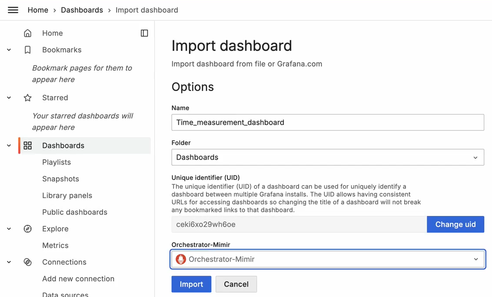
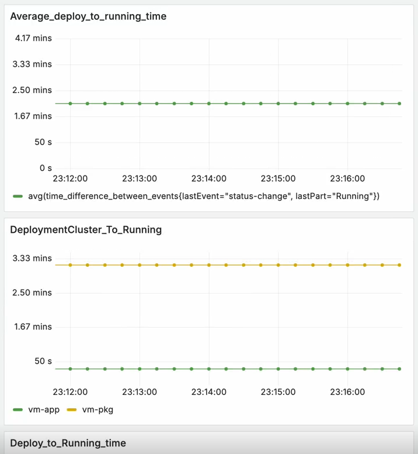

Performance
=================

In general, the performance of the |software_prod_name| and all of it's microservices
can be monitored using the Prometheus\* and Grafana\* stack in the Observability
user interface :doc:`/user_guide/monitor_deployments/orchestrator_observability`.

For more specific metrics on the Application Deployment manager, a dashboard is
available in Github at `<https://github.com/open-edge-platform/app-orch-deployment/blob/main/app-deployment-manager/grafana/Time_measurement_dashboard.json>`_
that can be imported into Grafana\* to monitor the performance of the Application Deployment Manager.

The usual Grafana controls apply to this dashboard, allowing you to filter by time
range, and monitoring the performance while applications are actively deployed.

A further explaination of the metrics are available in
`<https://github.com/open-edge-platform/orch-library/tree/main/go/pkg/metrics>`_.
