Technology Stack
================

Implementation
--------------

The `Go\* programming language <https://go.dev/>`_ is the primary development language for the
Application Orchestration components.

Each API that a component exposes is implemented using `gRPC <https://grpc.io/>`_ ,
which is a high-performance, open-source universal RPC, with interface definitions
in the `Protobuf <https://protobuf.dev/>`_ language.

Where the API is exposed through the Multi-Tenancy Gateway, it is done using
`gRPC-Gateway <https://grpc-ecosystem.github.io/grpc-gateway/>`_, which converts
the gRPC definition to an `OpenAPI* <https://www.openapis.org/>`_ specification and
exposes a REST interface using `Gin <https://gin-gonic.com/>`_ (a Go-based web server).

Where the component has a backing database (e.g., Application Catalog) it is implemented
using `ENT <https://entgo.io/>`_, which is a Go library for Entity Resource Mapping (ERM).
It is used to define the schema of the database and the queries that are used.

ENT is used with the `PostgreSQL\* database <https://www.postgresql.org/>`_. In cloud-based
deployments, a managed service such as `AWS\* Aurora <https://aws.amazon.com/rds/aurora/>`_
may be used.

`Skupper <https://skupper.io/index.html>`_ is used to provide the secure network used by
the Interconnect system.

The Tenant Provisioner component is built in Go and uses a plugin approach for extending
the actions it takes during the creation and deletion of Multi-Tenant Projects.

`Keycloak\* solution <https://www.keycloak.org/>`_ is the Identity and Access Management (IAM) system
used by |software_prod_name|. The Application Orchestration components handle JWT
bearer tokens from it that are attached to API requests to validate that the call is
authenticated and to drive any authorization checks.

`Open Policy Agent <https://www.openpolicyagent.org/>`_ is used by some of the Application
Orchestration components to enforce RBAC authorization policies (checked against a set of
REGO rules) on the data presented in an API call.

`Harbor\* OCI Registry <https://goharbor.io/>`_ is used to store and distribute Docker\* images
and Helm\* charts.

`Argo\* CD tool <https://argo-cd.readthedocs.io/en/stable/>`_ is used to deploy the initial
components of the application.

`Vault\* system <https://www.vaultproject.io/>`_ is used to store secrets and configuration data.

System Diagram
--------------
.. .. mermaid::
..    :hidden:

..    graph TD
..       subgraph Core_Components
..          A[Application Orchestration]
..          B[Application Catalog]
..          C[Multi-Tenancy Gateway]
..          D[Tenant Provisioner]
..          E["Keycloak IAM"]
..          F["Open Policy Agent (OPA)"]
..          G["Vault (Secrets Management)"]
..       end

..       subgraph External_Integrations
..          H["OCI Registries (Harbor)"]
..          I["Argo CD"]
..          J["Cluster Orchestration"]
..       end

..       subgraph Databases
..          K["Postgres Database"]
..       end

..       %% Relationships
..       A --> C
..       C --> E
..       C --> F
..       B --> K
..       B --> H
..       A --> I
..       A --> J
..       G --> A
..       D --> A

Figure 1: Technology Stack of Application Orchestration

Integrations
------------

The principal points of integration between Application Orchestration and other
|software_prod_name| components are:

- Cluster Orchestration for the deployment of the applications to the Edge Node
  Clusters
- PostgreSQL\* Database for the Application Catalog
- Keycloak solution for Identity and Access Management (IAM)
- Argo CD tool for the initial deployment of the components
- Tenant Manager for the creation and deletion of Multi-Tenant Projects

The principal points of integration between Application Orchestration and external
systems are:

- OCI Registries for the storage and distribution of Docker images and Helm charts.
  The registry definition can be configured in the Application Catalog and can be shared
  across many applications.
