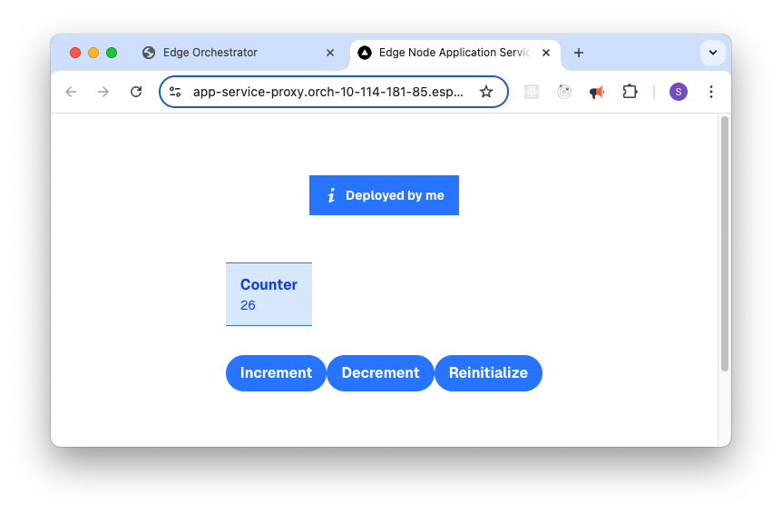

Access Applications
===================

After the application is deployed with the **default** Deployment Profile, you can access it from the Web UI.

In the `Deployments` page you can view the details of the deployed application.
With this you can see the status of the application, the profile used for deployment,
and in the details the values used for the parameters in the profile.

Clicking on the cluster link you can see how the application is deployed to an
Edge Node cluster.

Here, you can see both the **tutorial-server** and **tutorial-web-ui** applications
in this single deployment on this cluster. The `tutorial-web-ui` is expanded, and
you can see the Service Link that was created earlier by annotation of the service.

Select the link to open a new browser window that will redirect to the Tutorial Web UI page.

From the UI, you can infer the following:

- The web ui is deployed and running properly
- The tutorial server is deployed and running properly
- The tutorial server is getting the initial variables from the parameter in the
  Profile
- The counter is getting initialized at 26 (from the parameter in the profile)
- The tutorial server is reachable from the web ui through the NGINX\* proxy

You can also change the counter value in the **alternate** profile and deploy it to see how the web ui
changes.

Similarly, see the **alternate-pt** profile to see how the parameter templates work during deployment.

Understand the Deployment
-------------------------

You can download the **KubeConfig** from the edge node to explore it further. See
:doc:`/user_guide/set_up_edge_infra/clusters_main` for more information on how to do this.

Once established, you can see all the resources that have been created by the Application Orchestrator.

.. code:: bash

    kubectl -n tutorial get all

This should give an output like:

.. code:: bash

    NAME                                   READY   STATUS    RESTARTS   AGE
    pod/tutorial-server-78585ff665-sxlq6   1/1     Running   0          21m
    pod/tutorial-web-ui-76b8dccfcf-6b5rg   1/1     Running   0          21m

    NAME                      TYPE        CLUSTER-IP      EXTERNAL-IP   PORT(S)    AGE
    service/tutorial-server   ClusterIP   10.43.1.115     <none>        8000/TCP   21m
    service/tutorial-web-ui   ClusterIP   10.43.139.158   <none>        8080/TCP     21m

    NAME                              READY   UP-TO-DATE   AVAILABLE   AGE
    deployment.apps/tutorial-server   1/1     1            1           21m
    deployment.apps/tutorial-web-ui   1/1     1            1           21m

    NAME                                         DESIRED   CURRENT   READY   AGE
    replicaset.apps/tutorial-server-78585ff665   1         1         1       21m

You can see how the Helm\* chart has been deployed as a Deployment and Service. The Application Orchestrator has also
created supporting items:

.. code:: bash

    kubectl -n tutorial get secret
    NAME                                                           TYPE                             DATA   AGE
    b-d79db76a-5a73-5f1a-befa-39568c4d2c10                         kubernetes.io/dockerconfigjson   3      4m12s
    b-ec7b9684-61c5-5c98-b7c2-9ecace3aefa6                         kubernetes.io/dockerconfigjson   3      4m13s
    sh.helm.release.v1.b-d79db76a-5a73-5f1a-befa-39568c4d2c10.v1   helm.sh/release.v1               1      4m12s
    sh.helm.release.v1.b-ec7b9684-61c5-5c98-b7c2-9ecace3aefa6.v1   helm.sh/release.v1               1      4m13s

The first two secrets are the Docker\* credentials for the Application Orchestrator to pull the images from the registry.
The others are the Helm release secrets that are used to track the deployment of the Helm chart.

.. code:: bash

    kubectl -n tutorial get networkpolicy
    NAME                                  POD-SELECTOR   AGE
    tutorial-server-0.1.0-w8jg6-egress    <none>         5m39s
    tutorial-server-0.1.0-w8jg6-ingress   <none>         5m39s
    tutorial-web-ui-0.1.0-w8jg6-egress    <none>         5m40s
    tutorial-web-ui-0.1.0-w8jg6-ingress   <none>         5m40s

The Application Orchestrator has created Network Policies to allow the applications to communicate with each other.

Monitor the Deployment
----------------------

To monitor the Tutorial application and view its logs, refer to
:doc:`/user_guide/monitor_deployments/grafana_content` in the User Guide.
