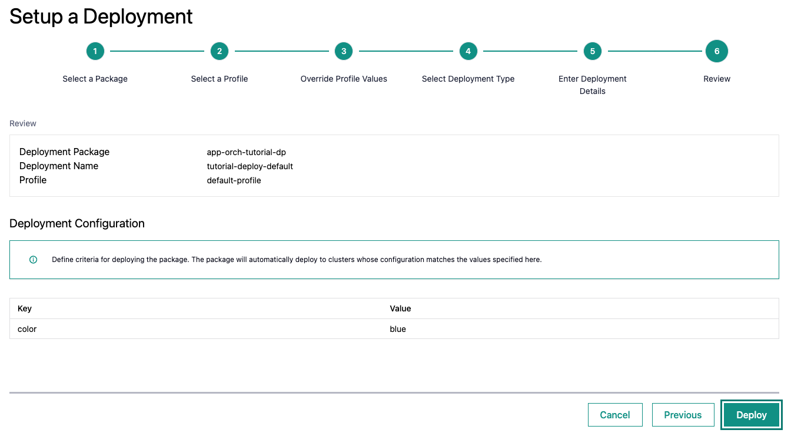

Deploy the Tutorial
----------------------

You can deploy the Tutorial Server and the Tutorial Web UI on the Deployments page. The process is described
in detail in the User Guide in :doc:`/user_guide/package_software/deployments`.

Note that you can deploy and undeploy in less than a minute. Therefore, you can try out the different profiles.

.. note:::
    The first time you deploy the Tutorial Server, it will take a few minutes to pull the tutorial server image and
    because of its size. The tutorial-web-ui may restart multiple time in this period because it depends on the
    tutorial-server service to be available. This is normal behavior.

Inspecting the deployment is covered in the next section.
