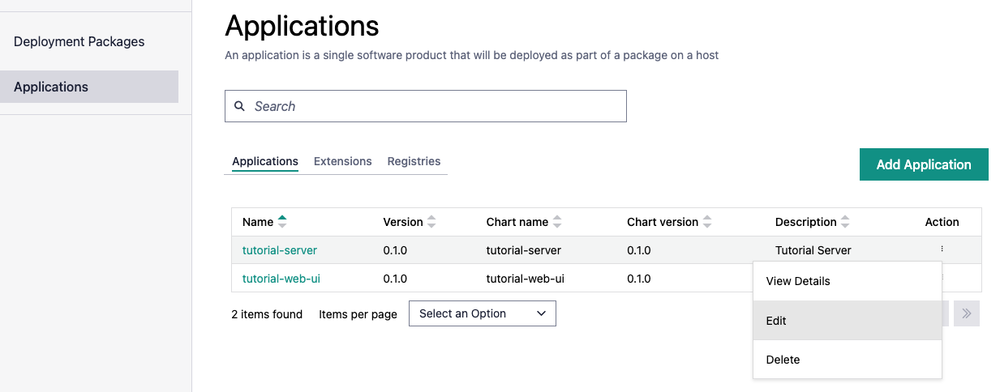
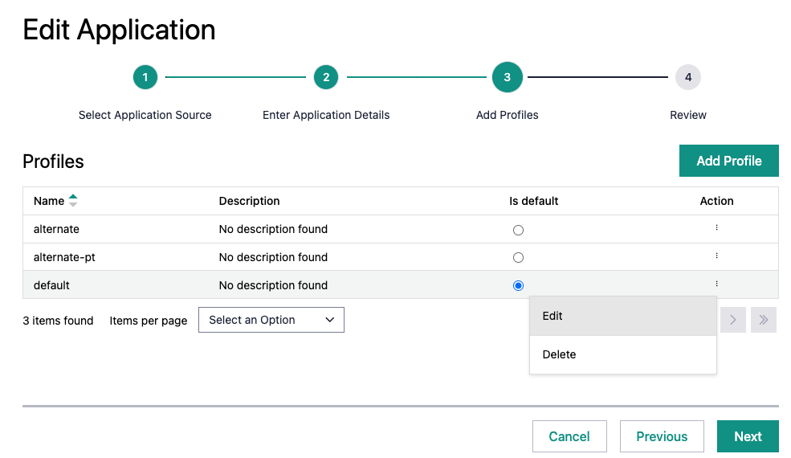
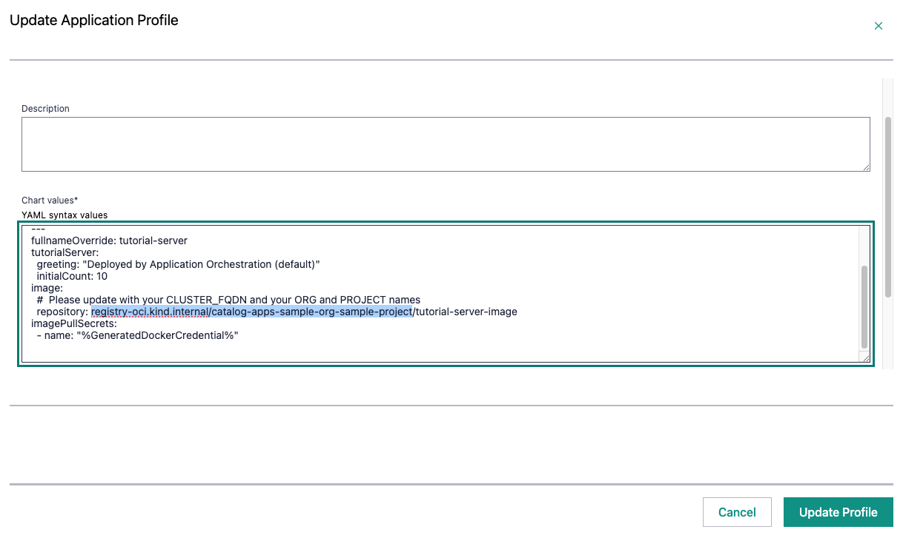

Edit Image Location
-------------------

Earlier when you created the values files in :doc:`../deployment-packages/index`, you did not fully specify the
location of the Container images in the `values*.yaml` files.

.. note::
   This complexity is peculiar to this tutorial application, as most users would publish their application
   to a public registry such as Docker\* Hub or a private registry that is external to |software_prod_name|.

   In this case, the FQDN, the ORG and PROJECT are variable values that will vary depending on the
   installation of |software_prod_name|. This may not apply to your environment, and so you could fix these
   values in the `values*.yaml` files.

Use the placeholder like this:

.. code:: yaml

    image:
      repository: registry-oci.<CLUSTER_FQDN>/catalog-apps-<ORG>-<PROJECT>/tutorial-server-image`

When it comes to deploying the application, you need to specify the location of
the image. It should match the `docker tag` that was calculated during the push to
the registry in the previous page. For example:

.. code:: yaml

    image:
      repository: registry-oci.kind.internal/catalog-apps-sample-org-sample-project/tutorial-server-image

Find the Application on the Deployments page and click on the **Edit** icon:

Click on **Next** twice until you reach the Profiles page. You can see there
is one profile for each of the `values-*.yaml` files created earlier. Click on
the **Edit** icon for the `default` profile.

This opens the Update Profile page, where you can edit the repository value for the profile.

When finished, click `Update Profiles` and do a similar update on the other Profiles.

The same change will need to be made to `tutorial-web-ui`'s single profile. (Be careful not to change the image name
at the end of the repository name - it should be `tutorial-web-ui-image`.)
