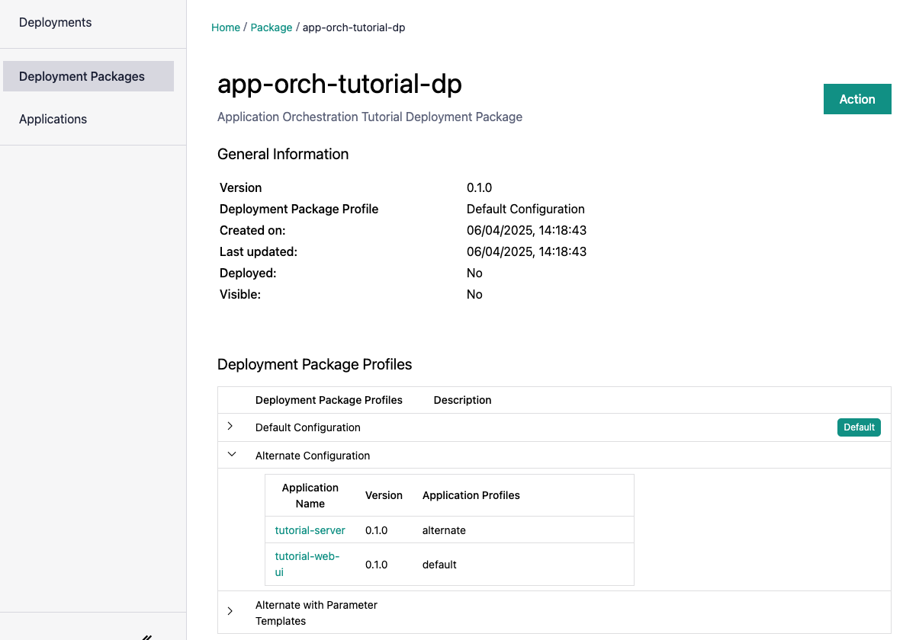
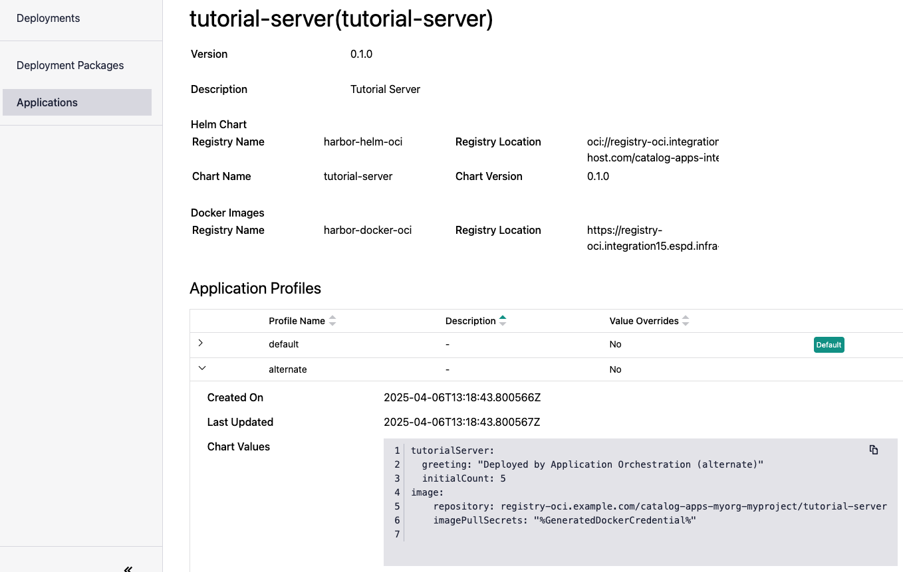

Import Deployment Package
-------------------------

To deploy the applications, log in to the |software_prod_name| Web UI as a user with
Edge Cluster Manager permissions. This is the same user you used to create the cluster.

Within the Web UI, browse to the Deployments page for access to where you can import the
Deployment Package for the Tutorial.

The process is described in full detail in the User Guide in :doc:`/user_guide/package_software/deploy_packages`.

Inspect the Deployment Package
------------------------------

After importing the Deployment Package, inspect it to see the contents.

Here you can see the Deployment Profiles you created and how they point to the Application Profiles.

Drilling in to the Applications reveals more details, including the Helm\* charts and the values in each Application Profile.

The reference to Helm chart and the OCI image that you created earlier are shown here, adjusted to point at the local
oci-registry running on the |software_prod_name|, and the multi-tenancy project you are in.
