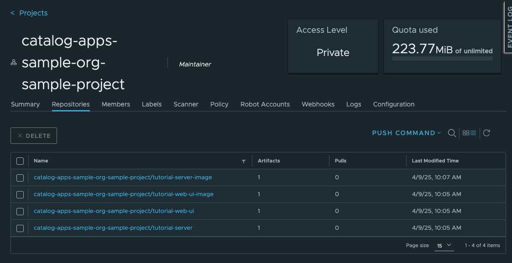

Load the Helm* Charts and Images in to the OCI Local Registry
===============================================================

The Helm\* charts that was created earlier for the Tutorial Server and the Tutorial Web UI are only present locally in the
file system. They must be bundled and pushed to an OCI registry so that they will be available for deployment to
the Edge Node. You must push them to the local OCI registry that is running in the |software_prod_name|.

.. note::
    The OCI registry running on the |software_prod_name| is a private registry that is only accessible from the
    |software_prod_name| and the Edge Node. There are many public registries available, such as Docker\* Hub, but
    for simplicity, use the local registry. It is available at https://registry-oci.<CLUSTER_FQDN>. The
    <CLUSTER_FQDN> is the Fully Qualified Domain Name of the |software_prod_name| Orchestrator without the hostname.

.. code:: bash

    # Change back to where you created the Tutorial Helm charts
    cd tutorial-chart
    helm package tutorial-server
    helm package tutorial-web-ui

This creates two Archive files that we can push to the OCI registry. To get the password for the Registry, follow the
instructions in the User Guide in :doc:`/user_guide/package_software/push_registry`.

.. note::
    It is not possible to say what the CLUSTER_FQDN is in advance as every deployment will be different. It's better for
    the user to set it as a variable and then we refer to the variable below. Same for USER_NAME, ORG and PROJECT. You should
    never put a password in to a variable. The user should be part of the Edge Manager Group - see
    :doc:`/user_guide/concepts/cluster_usergroups` for more information.

Then, you can push the images to the registry like:

.. code:: bash

    export CLUSTER_FQDN=<CLUSTER_FQDN>
    export ORG=<ORG>
    export PROJECT=<PROJECT>
    export USER_NAME=<USER_NAME>

.. code:: bash

    helm registry login registry-oci.$CLUSTER_FQDN -u $USER_NAME
    # Will prompt for password. Remember to use the CLI Secret from the OCI registry

    helm push tutorial-server-0.1.0.tgz oci://registry-oci.$CLUSTER_FQDN/catalog-apps-$ORG-$PROJECT
    helm push tutorial-web-ui-0.1.0.tgz oci://registry-oci.$CLUSTER_FQDN/catalog-apps-$ORG-$PROJECT

Load the Container images in to the local OCI registry
------------------------------------------------------

Likewise the Container images that was created earlier for the Tutorial Server and the Tutorial Web UI are only present
in the local computer. You must push them to the same OCI registry, so that they will be available for deployment to the
Edge Node.

You can use the **docker** command to push the images to the OCI registry. First, you must tag the images so that
docker knows which registry to push them to.

.. code:: bash

    docker tag tutorial-server-image:latest registry-oci.$CLUSTER_FQDN/catalog-apps-$ORG-$PROJECT/tutorial-server-image:0.1.0
    docker tag tutorial-web-ui-image:latest registry-oci.$CLUSTER_FQDN/catalog-apps-$ORG-$PROJECT/tutorial-web-ui-image:0.1.0

.. note::
    Here we have given the images a version number of 0.1.0. This is not required (it will use `latest` by default), but
    it is a good idea to give the images a semantic version number so that we can track the versions of the images that
    are deployed. The value used here must match the version in the values files in the Deployment Package from the previous
    steps.

Then, you can push the images to the OCI registry:

.. code:: bash

    docker login registry-oci.$CLUSTER_FQDN -u $USER_NAME
    # Will prompt for password. Remember to use the CLI Secret from the OCI registry

    docker push registry-oci.$CLUSTER_FQDN/catalog-apps-$ORG-$PROJECT/tutorial-server-image:0.1.0
    docker push registry-oci.$CLUSTER_FQDN/catalog-apps-$ORG-$PROJECT/tutorial-web-ui-image:0.1.0

After these pushes, the images and the charts can be seen side by side in the OCI registry.

