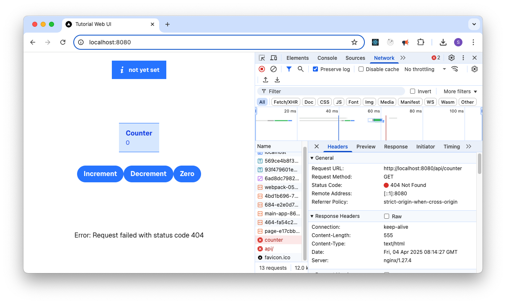

Helm* Chart for Tutorial Web UI
===============================

In this step, you will add the Tutorial Web UI Deployment and Service to the
Helm\* chart.

Remove Unwanted Files
---------------------

To simplify the deployment, you must remove the following files from the
**templates** directory:

.. code:: shell

    cd tutorial-web-ui
    rm templates/hpa.yaml
    rm templates/ingress.yaml

Modify the Deployment
---------------------

values.yaml
~~~~~~~~~~~

#. Add values: You can add some variables to the ``values.yaml`` file that will
   be useful later:

   .. code:: yaml

        # Add this to the values.yaml file at the top before "replicaCount:"
        tutorialServer:
          proto: http
          host: tutorial-server
          port: 8000
          streamTimeout: 60s

#. Change Port: Change the ``service.port`` in the ``values.yaml`` file to
   match the port used in the Dockerfile.

   .. code:: yaml

        # Change this to the values.yaml file under "service:"
        service:
          type: ClusterIP
          port: 8080

#. Update repository: In the same file, change the ``image.repository`` to match
   the container image:

   .. code:: yaml

        # Change this to the values.yaml file under "image:"
        image:
          repository: tutorial-web-ui-image
          pullPolicy: IfNotPresent

#. SecurityContext: Update the ``securityContext`` to make the deployment
   secure:

   .. code:: yaml

       securityContext:
         capabilities:
           drop:
             - ALL
         readOnlyRootFilesystem: true
         runAsNonRoot: true
         runAsUser: 101 # nginx

templates/service.yaml
~~~~~~~~~~~~~~~~~~~~~~

You can use a special feature of the Application Orchestration -
the Application Server Proxy (Service Link), which allows proxy directly
to a service run on an Edge Node. See the Service Link documentation in the
User Guide :doc:`/user_guide/package_software/package_create_helm`.

#. Add annotations: To prepare for this, add the following to the
   **templates/service.yaml** file under "metadata," so that we can add
   annotations at a later date:

   .. code:: yaml

        # Add this to the service.yaml file under "metadata:" indented 2 spaces
        {{- if .Values.service.annotations }}
        annotations: {{- .Values.service.annotations | toYaml | nindent 4 }}
        {{- end }}

Chart.yaml
~~~~~~~~~~

#. App Version: Modify the **Chart.yaml** file changing the ``appVersion`` to
   match the tag ``0.1.0`` you will give the Docker\* image in
   :doc:`../deploying-applications/pushing_charts_and_images` :

   .. code:: yaml

        # Change this to the Chart.yaml file under "appVersion:"
        appVersion: "0.1.0"

templates/deployment.yaml
~~~~~~~~~~~~~~~~~~~~~~~~~

Because NGINX\* has a highly secure configuration, it cannot create
temporary files in the ``/tmp`` folder of the read-only file system.

#. Add Volume: Modify the **templates/deployment.yaml** file to add a volume
   mount for the ``/tmp`` directory.

   .. code:: yaml

       # Add to the end of the file under "spec.template.spec: indented by 6 spaces"
       volumes:
       - name: tmp
         emptyDir: { }

#. Add VolumeMount: Add the following to the **spec.template.spec.containers**
   section of the Deployment:

   .. code:: yaml

      # Add to the end of the nginx container definition under "spec.template.spec.containers:" after "resources", indented by 10 spaces
      volumeMounts:
        - name: tmp
          mountPath: /tmp

Checking the Helm Chart
-----------------------

To check for errors, run ``helm lint`` at the tutorial-charts directory on the chart.

.. code:: shell

    helm lint ./tutorial-web-ui

Then run helm template to check the output of the chart.

.. code:: shell

    helm -n tutorial template --release-name foobar ./tutorial-web-ui --set image.tag=latest

Test the Helm Chart
-------------------

You can deploy this Helm chart alongside the Tutorial Server chart into the
same namespace.

First load the container image into KinD:

.. code:: shell

    kind load docker-image tutorial-web-ui-image:latest

Then you can install the Helm chart on the KinD cluster:

.. code:: shell

    helm -n tutorial install --create-namespace tutorial-web-ui ./tutorial-web-ui --set image.tag=latest

At this stage it is possible to test the application using curl or a web
browser through a ``port-forward``:

.. code:: shell

    kubectl -n tutorial port-forward service/tutorial-web-ui 8080:80

In a web browser, open ``http://localhost:8080``. You should see the UI.

It is unable to connect to the Tutorial Server. It
is performing a ``GET`` against ``http://localhost:8000/api/counter``.

We set this ``/api`` in the **app/page.tsx** file in
:doc:`../developing-applications/developing-tutorial-web-ui`. This is the base
of all Axios calls to the Tutorial Server, but as you can see from the
following snippet, the behavior is dependent on being in development mode or
not.

.. code:: typescript

    const AxiosInstance = axios.create({
        baseURL: process.env.NODE_ENV === 'development' ? 'http://localhost:8000' : '/api'
    });

.. note::
    In non-development mode, you are not giving this ``baseURL`` a hostname, and
    so it will take the hostname of the web page, which is
    ``http://localhost:8080`` and adds on ``/api``.

    Hardcoding a value for hostname is not a good idea at this stage, as it
    would leave a brittle solution that would become high maintenance
    as it moves to production. During development it was fine, as you
    were able to control the environment.

The next step explains this in more detail.
