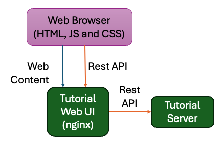
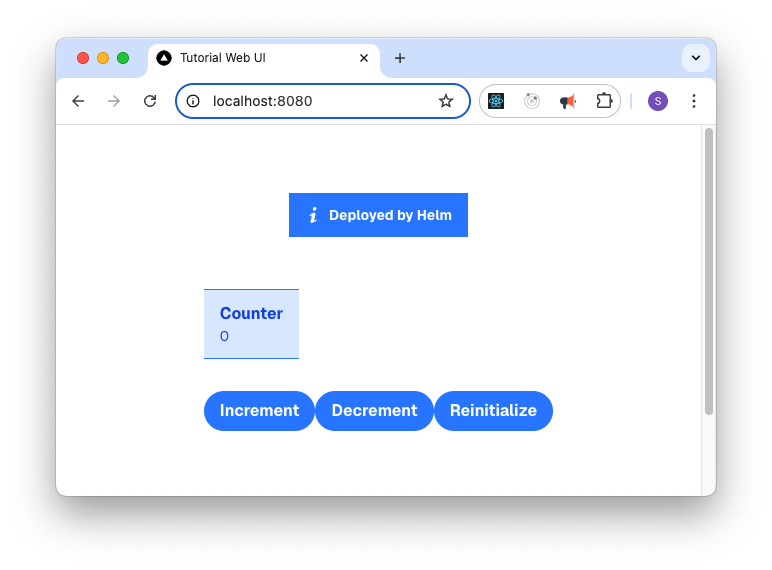

Route API through NGINX* Web Server
--------------------------------------

In the Tutorial Web UI, you can make calls using Axios to the Tutorial Server
API at ``/api``. While there are many alternative approaches that could be
used, it is a common pattern in web applications, where the web server (NGINX\*
web server) also acts as a reverse proxy to route traffic to the appropriate
backend service (Tutorial Server).

Override the NGINX Configuration
~~~~~~~~~~~~~~~~~~~~~~~~~~~~~~~~

To add this reverse proxy functionality add a new **nginx.conf** file to the
Tutorial Web UI project. This file overwrites the existing
``/etc/nginx.conf.d/default.conf`` that came with our base image. To do this,
create a ConfigMap in the Helm\* chart and mount it to the container.

#. Create a file **configmap.yaml** in the **tutorial-web-ui/templates** folder

#. Copy the following in to it:

   .. code:: yaml

    apiVersion: v1
    kind: ConfigMap
    metadata:
      name: {{ include "tutorial-web-ui.fullname" . }}
      labels:
        {{- include "tutorial-web-ui.labels" . | nindent 4 }}
    data:
      default.conf: |
        server {
            listen       8080;
            listen  [::]:8080;
            server_name  localhost;

            #access_log  /var/log/nginx/host.access.log  main;

            location / {
                root   /usr/share/nginx/html;
                index  index.html index.htm;
            }

            # redirect server error pages to the static page /50x.html
            #
            error_page   500 502 503 504  /50x.html;
            location = /50x.html {
                root   /usr/share/nginx/html;
            }

            location /api/ {
                proxy_pass {{.Values.tutorialServer.proto}}://{{.Values.tutorialServer.host}}:{{.Values.tutorialServer.port}}/;
                proxy_http_version 1.1;
                proxy_set_header Upgrade $http_upgrade;
                proxy_set_header Connection "Upgrade";
                proxy_connect_timeout       {{ .Values.tutorialServer.streamTimeout }};
                proxy_send_timeout          {{ .Values.tutorialServer.streamTimeout }};
                proxy_read_timeout          {{ .Values.tutorialServer.streamTimeout }};
                send_timeout                {{ .Values.tutorialServer.streamTimeout }};
            }
        }

.. note::

    An alternative approach to all this would be to have updated the NGINX.conf
    file in the Dockerfile, but this would have required hardcoding the
    Tutorial Server address in to the file. This is not a good practice as it
    would require rebuilding the image if the Tutorial Server address changed.
    Instead we prefer a late binding approach that gives us the flexibility to
    adjust the configuration at deployment time.

Update the Deployment to use the ConfigMap
~~~~~~~~~~~~~~~~~~~~~~~~~~~~~~~~~~~~~~~~~~

Next we need to mount the ConfigMap in to the container. To do this we extend
the a **volumes** and **volumeMounts** section that we added to the to the
**deployment.yaml** file on the previous page.

templates/deployment.yaml
**************************

#. Edit the Deployment File: Open the
   ``tutorial-web-ui/templates/deployment.yaml`` file.

#. Update Volumes: Update the **spec.template.spec.volumes** section of the
   Deployment as follows:

   .. code-block:: yaml
      :emphasize-lines: 5,6,7

      # Add to the end of the file under "spec.template.spec.volumes:"
      volumes:
        - name: tmp
          emptyDir: { }
        - name: nginx-config
          configMap:
            name: {{ include "tutorial-web-ui.fullname" . }}

#. Update VolumeMounts: Update the
   **spec.template.spec.containers.volumeMounts** section of the Deployment as
   follows:

   .. code-block:: yaml
      :emphasize-lines: 5,6

          # Add to the end of the nginx container definition under "spec.template.spec.containers.volumeMounts:"
          volumeMounts:
            - name: tmp
              mountPath: /tmp
            - name: nginx-config
              mountPath: /etc/nginx/conf.d

Test the NGINX Configuration
~~~~~~~~~~~~~~~~~~~~~~~~~~~~~~~

Now you can test the NGINX configuration by upgrading the ``tutorial-web-ui``
Helm chart. You can check if the config map is installed:

.. code:: shell

    helm -n tutorial upgrade tutorial-web-ui ./tutorial-web-ui

.. code:: shell

    kubectl -n tutorial get configmap tutorial-web-ui -o yaml

Reactivating the port-forward again to the service with:

.. code:: shell

    kubectl -n tutorial port-forward service/tutorial-web-ui 8080:8080

And in a web browser open ``http://localhost:8080`` and you should see the
message being set properly.

In the next step, you will create a deployment package so that we can deploy
this with |software_prod_name| Application Orchestration.
