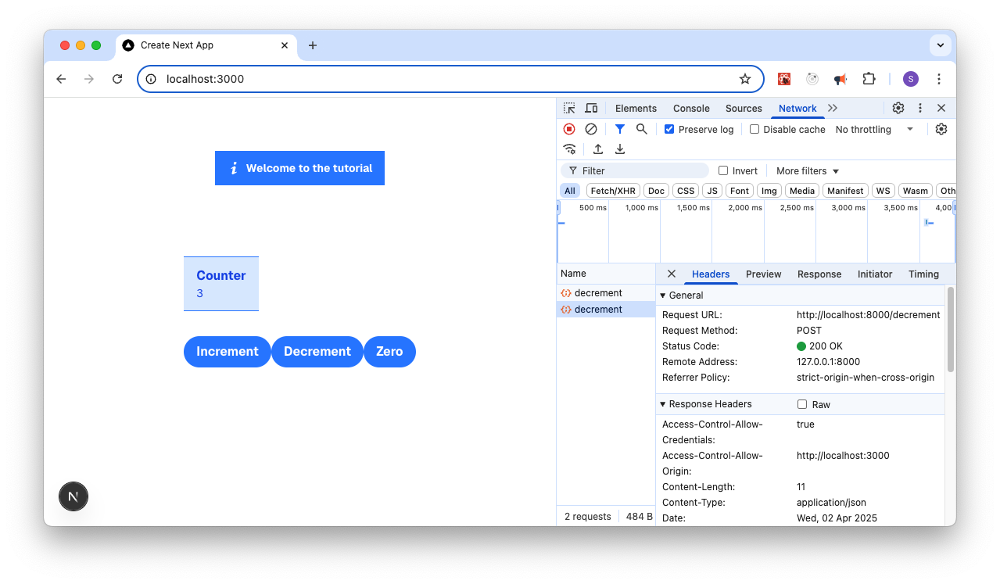

Develop the Tutorial Web UI
================================

Web UI First Steps
-------------------

First we develop a simple Next.js\* application that will interact with the Tutorial Server.
We develop and test it locally first on our own computer and will see how to package it in
to an edge application later.

.. note::
    It is not essential to test the application on your own computer, if you do not have Node JS installed.
    When we are packaging the code at a later stage in the Dockerfile, we will be able to test it then.

The application is developed in a single HTML file, which is a good way to get started with Next.js application.
We will follow the `Docs <https://nextjs.org/docs>`_ page where you can find
much more details.

Ensure `Node.js application <https://nodejs.org>`_ version 18 or later is installed on your computer and install
Next.js using npm (part of NodeJS).

.. code:: bash

    node --version
    npx create-next-app@latest tutorial-web-ui --ts --yes
    cd tutorial-web-ui
    npm add -s axios
    npx next dev --turbopack

This creates all the needed files to run a Client and makes it available on **http://localhost:3000**.
Open your web browser to this address to see the default page.

It is clear that the default page is not what we want, so we will modify the code to our needs.

Customizing the UI
------------------

The default page is a simple page with a link to the Next.js documentation.
We will remove this and only add what we need.

First we will remove the `app/page.tsx` file and create a new file **app/page.tsx** with the following content:

.. code-block::
    :linenos:

    'use client'

    import {useEffect, useState} from 'react';
    import axios from 'axios';

    // Axios Interceptor Instance
    const AxiosInstance = axios.create({
        baseURL: process.env.NODE_ENV === 'development' ? 'http://localhost:8000' : '/api'
    });

    export default function Home() {
        const [count, setCount] = useState(0);
        const [greeting, setGreeting] = useState("not yet set");
        const [error, setError] = useState(null);

        useEffect(() => {
            AxiosInstance.get('/counter')
                .then(response => {
                    setCount(response.data.count);
                })
                .catch(error => {
                    setError(error.message);
                });
        }, []);

        useEffect(() => {
            AxiosInstance.get('/')
                .then(response => {
                    setGreeting(response.data.message);
                })
                .catch(error => {
                    setError(error.message);
                });
        }, []);

        return (
            

                <header className="row-start-1 flex gap-[24px] flex-wrap items-center justify-center">
                    

                        <svg className="fill-current w-4 h-4 mr-2" xmlns="http://www.w3.org/2000/svg" viewBox="0 0 20 20">
                            <path
                                d="M12.432 0c1.34 0 2.01.912 2.01 1.957 0 1.305-1.164 2.512-2.679 2.512-1.269 0-2.009-.75-1.974-1.99C9.789 1.436 10.67 0 12.432 0zM8.309 20c-1.058 0-1.833-.652-1.093-3.524l1.214-5.092c.211-.814.246-1.141 0-1.141-.317 0-1.689.562-2.502 1.117l-.528-.88c2.572-2.186 5.531-3.467 6.801-3.467 1.057 0 1.233 1.273.705 3.23l-1.391 5.352c-.246.945-.141 1.271.106 1.271.317 0 1.357-.392 2.379-1.207l.6.814C12.098 19.02 9.365 20 8.309 20z"/>
                        </svg>
                        
{greeting}

                    

                </header>
                <main className="flex flex-col gap-[32px] row-start-2 items-center sm:items-start">
                    

                        
Counter

                        
{count}

                    

                    

                        <button className="bg-blue-500 hover:bg-blue-700 text-white font-bold py-2 px-4 rounded-full">
                            <input type="button" value="Increment" onClick={() => {
                                AxiosInstance.post('/increment')
                                    .then(response => {
                                        setCount(response.data.count);
                                    })
                                    .catch(error => {
                                        setError(error.message);
                                    });
                            }}/>
                        </button>
                        <button className="bg-blue-500 hover:bg-blue-700 text-white font-bold py-2 px-4 rounded-full">
                            <input type="button" value="Decrement" onClick={() => {
                                AxiosInstance.post('/decrement')
                                    .then(response => {
                                        setCount(response.data.count);
                                    })
                                    .catch(error => {
                                        setError(error.message);
                                    });
                            }}/>
                        </button>
                        <button className="bg-blue-500 hover:bg-blue-700 text-white font-bold py-2 px-4 rounded-full">
                            <input type="button" value="Reinitialize" onClick={() => {
                                AxiosInstance.post('/reinitialize')
                                    .then(response => {
                                        setCount(response.data.count);
                                    })
                                    .catch(error => {
                                        setError(error.message);
                                    });
                            }}/>
                        </button>
                    

                </main>
                <footer className="row-start-3 flex gap-[24px] flex-wrap items-center justify-center">
                    {error && 
Error: {error}
}
                </footer>
            

        );
    }

While you do not need to understand all the details of the code, it is clear that we are using Axios library to make
calls to the Tutorial Server. We are using the `useState` and `useEffect` hooks (from React) to manage the
state of the local variables.

`Tailwind CSS <https://v1.tailwindcss.com/>`_ is used by default with Next.js, therefore, it is easy to style the page.

Verifying the UI
----------------

To verify the UI, keep the Tutorial Server running in one terminal and start the Next.js application in another with:

.. code:: bash

    npx next dev --turbopack

And open your web browser to **http://localhost:3000**.

.. note::
    The browser tools are open in the image above, showing the network requests and the console output.
    This is an essential tool to understand the requests that are going between your browser and
    the Tutorial Server.

While your browser is still open, run the **curl** commands from the Tutorial Server page
to see that requests from the UI are equivalent to those from the command line,
and that the UI is updating the counter as expected when the buttons are clicked.

Next steps
----------

You can now package the Tutorial Web UI and Tutorial Server in to a Container
images so that we can deploy them to the edge.
