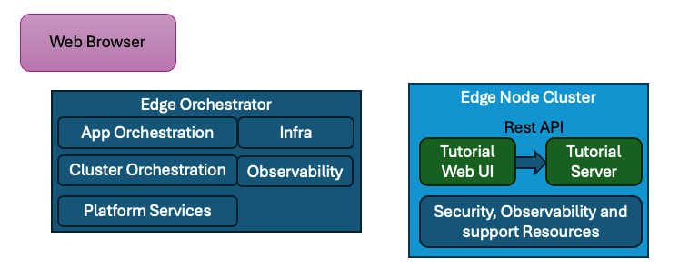

Developing a Sample App
=========================

As outlined in the Developer Workflow :doc:`/developer_guide/application_developer_workflow/developing-applications/index`
the most important first step is to design your application. This tutorial will create a simple application that will
demonstrate the basic concepts of |software_prod_name| Application Orchestration.

Design the application
----------------------

In the example we will create a simple web application that will maintain a counter from a microservice and display the
current count on a web page. The microservice will be have a simple REST API that will allow querying, incrementing,
decrementing and zeroing of the counter.

Choose a framework and language
-------------------------------

Choosing a framework and language is an important step in the development process. For this tutorial we will choose
simple options that are easy to use and have a large community, and may be familiar to many developers.

You should thoroughly research the options available and choose the best framework and language for your application.

Tutorial Server
~~~~~~~~~~~~~~~~

Since this is a simple application, we will use the `FastAPI <https://fastapi.tiangolo.com/>`_ framework to create the
server portion. Fast API is a lightweight web framework written in `Python* <https://www.python.org/>`_ that is easy to
use and has a built-in Swagger UI. This will allow us to easily test the API.

Tutorial Web UI
~~~~~~~~~~~~~~~~

For the web UI we will use `Next.js\* framework <https://nextjs.org/>`_ which is a progressive JavaScript\* framework that is easy to
use and has a large community. It uses the `React <https://react.dev/>`_ framework to create the UI components
and we add use the `Axios <https://axios-http.com/>`_ library to make the API calls.

The development will be done in the `TypeScript <https://www.typescriptlang.org/>`_ language and using the Next.js tools
will be bundled and distributed as "minified" JavaScript language to work with all modern browsers.

Ultimately it is the Web Browser that will run the Tutorial Web UI application - the microservices role is just serving
up the static HTML, CSS, and (minified) JavaScript files. For this we will use the `NGINX* <https://www.nginx.com/>`_ web
server, which has many other functions that help up route the traffic to the Tutorial Server application.

.. note::
  The web UI could be developed using any number of frameworks and languages. The choice of Next.js framework was made because
  it is easy to use and has a large community. Also there are many other Web Servers that could be used to serve the
  pages (including a CDN - Content Delivery Network), but we want to keep it in the microservice and have the same
  method of deployment for both front end code and back end code.

.. toctree::
   :hidden:
   :maxdepth: 1

   developing-tutorial-server
   developing-tutorial-web-ui

