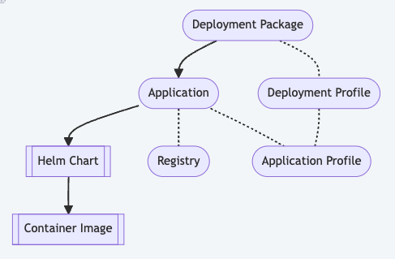

Deployment Packages
===================

Deployment Packages and Applications are a concept introduced in the
|software_prod_name|.

They are used to simplify the deployment of complex applications to the edge.
Deployment Packages are a collection of Applications and Deployment
Profiles. Deployment Profiles are configurations that define how one or more
Applications should be deployed to an Edge Node.

See :doc:`/developer_guide/app_orch/arch/data_model`
for a detailed explanation of the data model. The diagram gives an
overview of the relationships between Deployment Packages, Applications
and their Profiles and Registries.

Creating a Deployment Package
------------------------------

A user may use the |software_prod_name| Web UI to create an Application
and Deployment Package through a series of steps in the web pages **OR**
may choose to create them as YAML files and import these into the Web UI
before deploying them to an Edge Node. A comprehensive guide on how to
create Deployment Packages and Applications in the Web UI can be found
in the :doc:`/user_guide/package_software/index`.

The :doc:`/api/app_catalog` also allows uploading of multiple YAML formatted
files together.

When using the YAML format, the user should use `yamllint
<https://yamllint.readthedocs.io/en/stable/>`_ to check the syntax of the YAML
files and the `YAML schema
<https://github.com/open-edge-platform/cluster-extensions/blob/main/catalog-orchestrator-0.1.schema.yaml>`_
to validate that the file is structured correctly. Many IDEs allow importing a
YAML schema to aid in the editing process. These checks will also be applied by
the API and UI when the files are uploaded.

Deployment Package structure
----------------------------

The layout of Deployment Packages and Applications is designed to
simplify deployments. At its core:

- Applications represent a 1:1 link to a Helm Chart through the
  combination of a Chart Name and Registry.
- The Registry is a reference to a container registry that holds the
  Helm Chart, with the ability to set a password and SSL certificate if
  necessary. The Registry is a global object that can be used by multiple
  Applications.
- A set of Registries are already loaded into the |software_prod_name|
  platform and may be reused.
- Each Application Profile refers to a values file that is used to
  configure the Helm Chart.
- This allows the user to easily group different configurations for the
  same Helm Chart.
- A Deployment Package is a collection of Applications.
- A Deployment Profile is a collection of Applications Profiles.
- This allows the user to easily choose Application Profiles for many
  Applications at deploy time.

.. note:: There always needs to be a Deployment Package, even if it has
  only a reference to one Application (Helm Chart), as this is the
  principal unit of deployment.

Here's a `Reference Deployment Package`_ for the example application
shown in :doc:`/user_guide/package_software/quick_start_guide`.

Deployment Package design strategies
-------------------------------------

If you need to deploy multiple Helm Charts together, there are a few
strategies you can use:

- Create an Application for each Helm Chart and a single Deployment
  Package that contains all the Applications **OR**
- Create an "umbrella" Helm Chart that contains all the Helm Charts and
  create a single Application and Deployment Package **OR**
- Create multiple Deployment Packages, each with one or more Applications
  **OR**
- Any combination of the above

The choice of strategy will depend on the complexity of the deployment
and the need for reusability.

.. note:: It is also possible to reuse some of the "Extensions" Deployment
  Packages that are provided by the |software_prod_name| team. See more on
  Extensions at :doc:`../../app_orch/arch/data_model`

Deployment Packages have a number of features that make it worthwhile
taking the multiple Applications with a single Deployment Package
approach:

- You can have many different Profiles for each Application, allowing you
  to configure each Application differently.
- You can assign Namespaces to each application individually.
- You can assign different Registries to each Application.
- You can mark that one Application is dependent on another being
  installed first.
- You can define namespaces with labels and annotations to be created
  before the Application is installed.

.. note:: Having a single Deployment Package with multiple Applications
  allows you to deploy them in a single step.

Fine tuning Applications
-------------------------

Applications have a number of features that allow you to fine-tune the
deployment:

- **Application Profiles**, which are like value files in Helm Charts,
  allow a variety of scenarios to be catered for at deployment time.
- **Parameter Templates** allow further fine-tuning at deployment time.
  These are used to specify values that are impossible to know at the
  time of creating the values file. They can be marked as required or
  optional, secret or plain text, or given default values.
- **Ignore Resources** allows you to ignore changes to certain Kubernetes
  resources that will be deployed by the Helm Chart. This is useful in the case
  where some Job or Hook in the Helm Chart changes a value in the resource after
  deployment from what was originally specified in the Helm Chart. Because
  |software_prod_name| tracks all changes to Resources by default, this feature
  can provide the flexibility to ignore certain changes, thereby allowing the
  deployment to complete.

Reference Deployment Package
----------------------------

Store the content mentioned here in the specified files in a folder on
your local machine and import the folder into the |software_prod_name| through
Import Deployment Package. See
:doc:`/user_guide/package_software/import_deployment`.

deployment-package.yaml::

   specSchema: DeploymentPackage
   schemaVersion: "0.1"
   $schema: "https://schema.intel.com/catalog.orchestrator/0.1/schema"

   description: "My Hello World Deployment Package"
   name: "hello-world-dp"
   displayName: "hello-world-dp"
   version: "0.1.0"

   applications:
    - name: hello-world-app
      version: "0.1.0"

   defaultNamespaces:
    hello-world-app: hello-world

application.yaml::

   specSchema: Application
   schemaVersion: "0.1"
   $schema: "https://schema.intel.com/catalog.orchestrator/0.1/schema"

   name: hello-world-app
   version: "0.1.0"
   description: "My hello world app"

   imageRegistry: "harbor-docker-oci"
   helmRegistry: "harbor-helm-oci"
   chartName: "hello-world"
   chartVersion: "0.1.0"

   profiles:
    - name: "default"
      valuesFileName: "hello-world-values.yaml"

hello-world-values.yaml::

   ---
   service:
    type: ClusterIP
   replicaCount: 1
   image:
     repository: '%ImageRegistryURL%/hello-world-image'
   imagePullSecrets:
    - name: '%GeneratedDockerCredential%'

.. toctree::
   :hidden:
   :maxdepth: 1

   reference-placeholders
   application-yaml-reference
   deployment-package-yaml-reference
