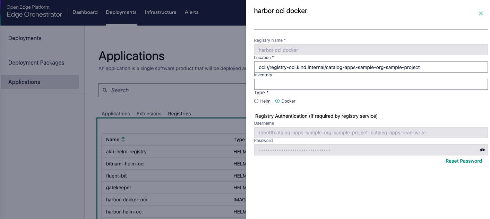

Deployment Package Placeholders Reference
============================================

The placeholders are keywords that are used to bring deployment-time automation
to the deployment of Helm Charts in the |software_prod_name| Application Orchestration.

They are replaced with actual values during the deployment process.

The placeholders should only be applied in the override values files of the
Application Profile. While it is possible to insert the placeholders in to the values
file of the Helm chart, this is not recommended as it is only replaced when the
Application is deployed through Fleet, and has no meaning for Helm on its own.

It is also recommended to wrap the placeholder in quotes so that the delimiter
will not cause parsing errors when trying out the values file with `helm template`.

Placeholder `%ImageRegistryURL%`
--------------------------------

The placeholder `%ImageRegistryURL%` in the values files will be replaced (during
deployment) with the `RootURL` value of the `imageRegistry` object that your
application points to.

If your Application does not specify an `imageRegistry`, the placeholder will
cause an error during deployment.

By default the `Registry` object for the local OCI registry `harbor-docker-oci`
has its RootURL values set in the format `oci://registry-oci.<CLUSTER_FQDN>/catalog-apps-<ORG>-<PROJECT>`,
where `<CLUSTER_FQDN>` is the fully qualified domain name of your |software_prod_name|
orchestrator cluster, `<ORG>` is the multi-tenant organization name, and `<PROJECT>`
is the multi-tenant project name you are working in.
For example it might be `oci://registry-oci.my-cluster.example.com/catalog-apps-my-org-my-project`.

Usage
~~~~~~~

In the values file it usually used to override the `image.repository` value, like:

deployment-package.yaml::

   image:
     repository: '%ImageRegistryURL%/hello-world-image'

.. note::

    Since every Helm chart could be constructed differently, you should check that
    the value you are overriding is the correct. This can be easily verified by
    running helm template on the Helm chart with your override values and checking
    the output.

The main use for the `%ImageRegistryURL%` placeholder is with the `harbor-docker-oci`
imageRegistry, but it can also be used with any Registry objects you add yourself
for your own private registry.

Related links
~~~~~~~~~~~~~~~~

- :doc:`/user_guide/package_software/registry`

Placeholder `%GeneratedDockerCredential%`
-----------------------------------------

The placeholder `%GeneratedDockerCredential%` in the values files will be replaced
(during deployment) with the name of a Kubernetes Secret that contains the
Docker credentials for the OCI registry. The secret is generated by reading the
username and password from the `Registry` object that your application points to.

This is useful for Helm Charts that need to pull images from a **private** registry
that requires authentication.

Usage
~~~~~~

Generally the placeholder is used in the `imagePullSecrets` section of the values
file, like:

.. code:: yaml

    imagePullSecrets:
      - name: "%GeneratedDockerCredential%"

.. note::

    Since every Helm chart could be constructed differently, you should check that
    the value you are overriding is the correct. This can be easily verified by
    running helm template on the Helm chart with your override values and checking
    the output.

As the deployment is performed, the Kubernetes Secret object will be dynamically
created with a random name. The contents in the Secret will be in the form:

.. code:: yaml

   apiVersion: v1
   kind: Secret
   metadata:
     name: <randomly-generated-name>
     namespace: <deployment-namespace>
   type: kubernetes.io/dockerconfigjson
   data:
      - .dockerconfigjson={"auths":{"registry-oci.kind.internal":{"password":"****","username":"robot$catalog-apps-sample-org-sample-project+catalog-apps-read-write"}}}
      - accessKeyId=robot$catalog-apps-sample-org-sample-project+catalog-apps-read-write
      - secretKey=****

Related links
~~~~~~~~~~~~~~~

- :doc:`/user_guide/package_software/image_pull_secret`

Placeholder `%PreHookCredential%`
---------------------------------

The placeholder `%PreHookCredential%` in the values files will be replaced (during
deployment) with the name of a Kubernetes Secret that contains the
Docker credentials for the OCI registry. The secret is generated by reading the
username and password from the `Registry` object that your application points to.

This is useful for Helm\* Charts that have a pre-hook template that needs to pull
an image from a **private** registry that requires authentication.

In contrast to the `%GeneratedDockerCredential%` produced Secret, the Secret produced
by the `%PreHookCredential%` placeholder will be deployed in its own Fleet `bundle`
and the main Fleet `bundle` for the application will be made dependent on it. In this
way the presence of the Secret is guaranteed before the application's Fleet bundle
is deployed.

The actual placeholder will not be replaced with a Secret name, but rather the
`%GeneratedDockerCredential%` will point to the Secret created by the
`%PreHookCredential%` placeholder. Therefore, the `%PreHookCredential%` placeholder
is to trigger the creation of the Secret before the main application is deployed.

Usage
~~~~~~

The placeholder is used together with the in the `%GeneratedDockerCredential%`
placeholder in the `imagePullSecrets` section of the values file, like:

.. code:: yaml

    imagePullSecrets:
      - name: "%GeneratedDockerCredential%"
        prehook: "%PreHookCredential%"

.. note::

It does not matter what Helm Chart value the `%PreHookCredential%` placeholder is
used in, it just has to be present at least once in the values override file. The
placeholder will not be replaced.

Related links
~~~~~~~~~~~~~~~

- :doc:`/user_guide/package_software/image_pull_secret`

Placeholders `%OrgName%` and `%ProjectName%`
--------------------------------------------

The placeholder `%OrgName%` will be replaced (during deployment) with the name of
the multi-tenant Organization of the |software_prod_name| that you are deploying with.

Likewise the placeholder `%ProjectName%` will be replaced with the name of the
multi-tenant Project of the |software_prod_name| that you are deploying with.

The placeholders can be used independently or together.

Usage
~~~~~~

The placeholder may be used in the override values files of the Application Profile,
in any context where the Organization name is needed, such as:

.. code:: yaml

    my-amazing-application:
      deployedWith:
        org: '%OrgName%'
        project: '%ProjectName%'

Related links
~~~~~~~~~~~~~~

- :doc:`/shared/shared_mt_overview`
