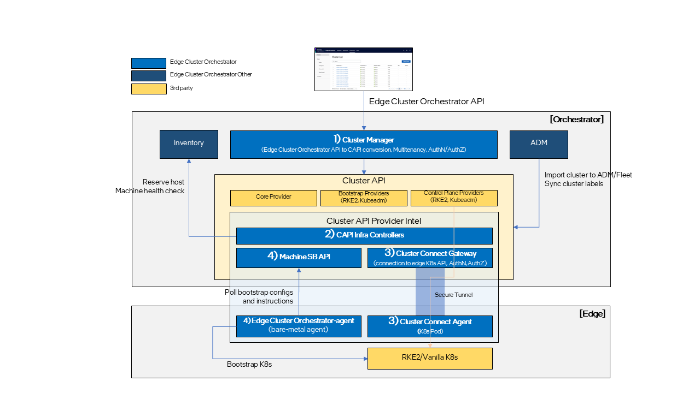
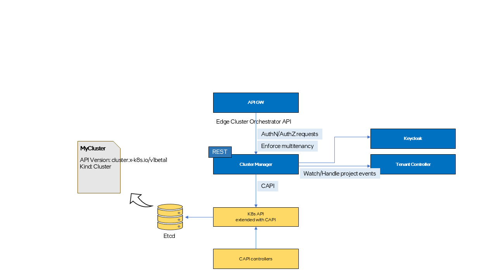
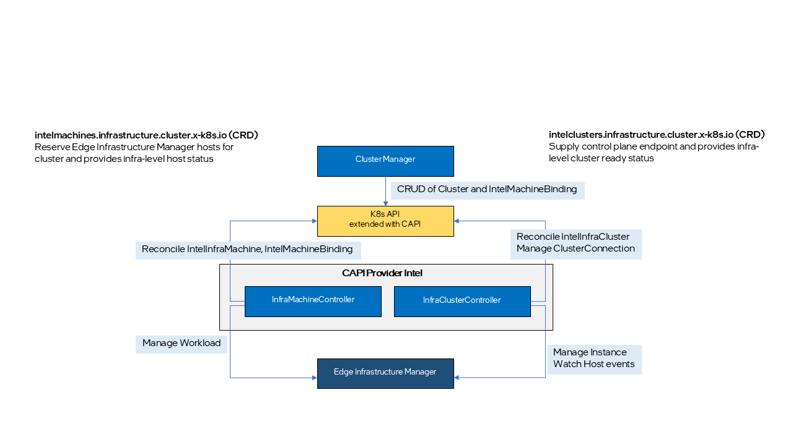
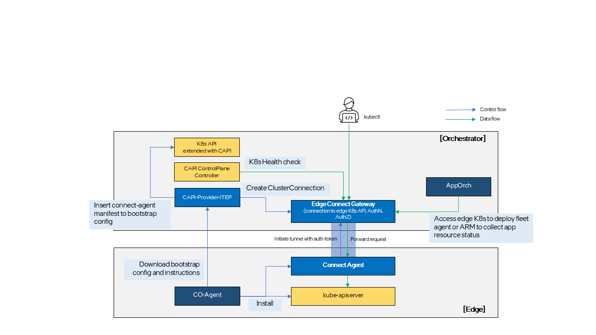

Architecture Overview
=====================

Edge Cluster Orchestrator is designed to manage edge clusters efficiently using
Cluster API (CAPI) and Edge Manageability Framework. This document provides a high level
architecture of Edge Cluster Orchestrator, including its components, modules,
and interactions. Edge Cluster Orchestrator is responsible for the life cycle
management of edge clusters, including creation, deletion, upgrade, scaling,
and monitoring. Edge Cluster Orchestrator is built on top of Cluster API (CAPI)
and hides the complexity of managing Kubernetes\* clusters from the end user by
providing a generic API to manage clusters.

High-Level Architecture
-----------------------

Edge Cluster Orchestrator consists of several key components:

- **Cluster Manager**: Converts Edge Cluster Orchestrator northbound APIs into
  CAPI data models and enforces orchestrator-specific features.

- **Cluster API Provider Intel**: Manages Edge Manageability Framework-specific resources, such
  as Edge Manageability Framework Machine and Edge Manageability Framework Cluster Custom Resources (CRs).

- **Cluster Connect Gateway and Agent**: Manages secure tunnels between Edge
  Orchestrator and edge K8s API for monitoring and access.

Modules
-------

Cluster Manager
~~~~~~~~~~~~~~~

Cluster Manager (CM) serves as an intermediary layer that translates Cluster Orchestration API
calls for cluster and cluster template resources into CAPI compatible formats.
It also bridges the gap between the existing Cluster Orchestration  APIs and CAPI, such as RBAC,
enforcing multi-tenancy, and handling project creation and deletion event,
which are required for Cluster Orchestration services but not natively supported by CAPI.

CM is stateless, with all persistent residing in the Custom Resource (CR)
specifications provided CAPI. Any Edge Cluster Orchestrator specific
information lacking corresponding fields in the CAPI CR is added as annotation
to related CR.

Cluster API Provider Intel
~~~~~~~~~~~~~~~~~~~~~~~~~~

CAPI-Provider-Intel implements CAPI InfraMachine provider and InfraCluster
provider contracts and provides a way to declaratively create and manage
infrastructure on Edge Manageability Framework platform for Kubernetes cluster lifecycle
management.

Within the scope of CAPI-Provider-Intel, five new Kubernetes Custom Resource
Definitions (CRDs) are defined:

- **intelmachines.infrastructure.cluster.x-k8s.io** This CRD defines ProviderID,
  which uniquely identifies host in Edge Infrastructure Manager, and provides
  infra-level status of the host.
- **intelmachinetemplates.infrastructure.cluster.x-k8s.io** This CRD is required
  for all new infra machine CRD.
- **intelclusters.infrastructure.cluster.x-k8s.io** This CRD defines the
  endpoint URL used to communicate with K8s cluster control plane and provides
  the infra-level connection status to the cluster.
- **intelclustertemplates.infrastructure.cluster.x-k8s.io** This CRD is required
  for all new infra cluster CRD.
- **intelmachinebindings.infrastructure.cluster.x-k8s.io** This is Edge Manageability Framework
  specific CRD to supply the mapping of selected Infrastructure node ID,
  IntelMachineTemplate and Cluster.

Also, two new K8s controllers, MachineController and ClusterController, are
added to reconcile the new CRDs.

- **IntelMachineController** is responsible for reserving and releasing Edge Infrastructure Manager
  hosts for cluster creation and removal. Typically, in CAPI, this provider is
  responsible for configuring the node to be bootstrapped as a K8s node with
  help of infra service it works with. However, due to certain limitations in
  Edge Infrastructure Manager, this task is handled by Machine-SB-API and the bare-metal CO-agent, as
  described in the following section.
- **IntelClusterController** is responsible for supplying edge K8s control plane
  endpoint URL and connection status. Typically, in CAPI, workload K8s control
  plane access is provided by external IP, LB and FW services provided by the
  infra, but in Edge Manageability Framework, it is provided by Cluster Connect Gateway and
  Agent, as described in later section.

Cluster Connect Gateway and Agent
~~~~~~~~~~~~~~~~~~~~~~~~~~~~~~~~~

Both Edge Application Orchestrator and Edge Cluster Orchestrator require access
to the edge K8s control plane (kube-apiserver) to manage and monitor clusters
and workloads across multiple edges centrally. However, in most cases, edges
are located behind NAT or FW, making direct communication from the orchestrator
to the edge K8s control plane challenging. This is especially true in cloud
deployment scenarios than on-prem where orchestrator is located in the cloud
and edges on-premises. To address this problem, Edge Connect Gateway and Agent
provide a secure WebSocket based tunnel between the orchestrator and edge K8s
control plane. Because the connection is initiated by Connect Agent, edges do
not need to be exposed to external network, reducing security risks.

Expected consumers of this tunnel provided by Edge Connect Gateway and Agent
include:

- **CAPI ControlPlane provider**: CAPI ControlPlane provider can utilize this
  path to perform health checks and gather additional state information on the
  K8s control plane.
- **Application Orchestrator**: App Deployment Manager (ADM) and App Resource
  Manager (ARM) can also leverage this path to install AO-agent (fleet-agent)
  and query running status of application resources deployed at the edge.
- **Open Edge Platform users**: Access the edge K8s clusters through this secure
  path without the need to physically connect their client devices to the
  private edge network.

Cluster Connect Gateway is a microservice running from the orchestrator cluster
and responsible for watching CAPI Cluster create and delete events and
generates or discards a token to authenticate tunnel request from Connect Agent
running on the cluster. Edge Connect Gateway is also responsible for
authenticating and routing edge K8s access requests to right tunnel.

Cluster Connect Agent is a Pod running on top of edge K8s cluster and
responsible for initiating and maintaining the WebSocket tunnel to Edge Connect
Gateway. Connect Agent Pod and authentication token are automatically installed
when K8s cluster is installed.
