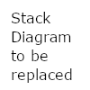

Technology Stack
================

Implementation
--------------

The `Go\* language <https://go.dev/>`_ is the primary development language for the
Edge Application Orchestrator components.

The Cluster Manager component in the Edge Cluster Orchestrator exposes REST API to
lifecycle manage the edge clusters. Cluster Orchestrator leverages the `Cluster API
(CAPI) <https://cluster-api.sigs.k8s.io/>`_ to manage the lifecycle of Kubernetes\*
clusters. CAPI is a Kubernetes project to bring declarative, Kubernetes-style APIs
to cluster creation, configuration, and management.

`Keycloak\* <https://www.keycloak.org/>`_ is the Identity and Access Management (IAM)
system used by |software_prod_name| and the Application Orchestration components
handle JWT bearer tokens from it that are attached to API requests to validate the
call is Authenticated and to drive any Authorization checks.

`Open Policy Agent <https://www.openpolicyagent.org/>`_ is used by some of the
Application Orchestration components to enforce RBAC Authorization policies on the
data presented in an API call.

`Argo\* CD <https://argo-cd.readthedocs.io/en/stable/>`_ is used to deploy the initial
components of the Application.

System Diagram
--------------

Integrations
------------

The principal points of integration between Edge Cluster Orchestrator and other
|software_prod_name| components are:

- CAPI-Core + CAPI-Provider-Intel for managing the lifecycle of Kubernetes clusters
- Keycloak for Identity and Access Management (IAM)
- Argo CD for the initial deployment of the components
- Tenant Manager for the creation and deletion of multi-tenant Projects
- Edge Infrastructure Manager for managing the edge infrastructure
- App Deployment Manager component of Edge Application Orchestration for deploying
  the applications to the edge node clusters
