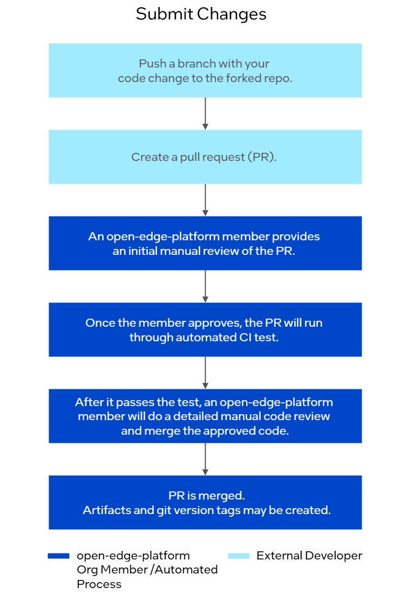

Obtaining Code and Contributing Changes
=======================================

This document describes the steps a developer should take to make a change,
testing that change, then submitting the change for review and integration into
the Edge Orchestrator.

There are two primary types of repositories in the Edge Orchestrator:

* Component Repos, which generally contain the code that makes up a service, an
  edge node agent, or other supplemental configuration like Helm\* charts that
  deploy services.

* Deployment Repos, which are used to deploy the Edge Orchestrator. Currently the
  only repo of this type is the `Edge Manageability Framework
  <https://github.com/open-edge-platform/edge-manageability-framework/>`_

The steps required for making and validating changes to each of these types of
repositories will differ and is described below.

Overview
--------

The following is list of steps required to make a change in a component repo
and integrate the change into the Edge Orchestrator deployment, along with the
approvals required.

1. `Obtaining source code`_ - how to fork and obtain the Edge Orchestrator code
   from GitHub\* repository.

2. `Making changes in a component repo`_ - making changes to a single component
   or service.

3. `Testing deployment changes`_ - How to test the service components by
   deploying them in a local deployment.

4. `Submitting changes to a component repo`_ - Creating a pull request, code
   review, and CI run on the repo

5. `Submitting deployment changes`_ - Similar to #4, submitting a change via
   pull request to the EMF repo.

If you are only making changes to the ``edge-manageability-framework``
deployment repo, you only need to follow steps 1, 3, and 5.

Obtaining Source Code
---------------------

All Edge Orchestrator codebase is stored in the
`https://github.com/open-edge-platform
<https://github.com/open-edge-platform>`_ GitHub Organization.

In this example the following repos will be used:

- `infra-core <https://github.com/open-edge-platform/infra-core>`_ - A
  component repo that contains service source code.

- `infra-charts <https://github.com/open-edge-platform/infra-charts>`_ -
  Another component repo that contains Helm charts that provide deployment
  configuration for services.  Not all components have a separation of service
  code from Helm charts - many integrate into a single repository.

- `edge-manageability-framework
  <https://github.com/open-edge-platform/edge-manageability-framework>`_ -
  Contains the deployment code for the whole Edge Orchestrator, which integrates
  the services.

In this example the GitHub username is ``YOUR-USERNAME``.

1. Create a GitHub fork of the repos - see GitHub repository's `"Fork a repository"
   instructions
   <https://docs.github.com/en/pull-requests/collaborating-with-pull-requests/working-with-forks/fork-a-repo>`_.

2. From your development system, clone the forked repo (replacing
   ``YOUR-USERNAME``):

   .. code:: bash

      git clone git@github.com/YOUR-USERNAME/infra-core
      git clone git@github.com/YOUR-USERNAME/infra-charts
      git clone git@github.com/YOUR-USERNAME/edge-manageability-framework

Making Changes in a Component Repo
----------------------------------

Each repo has instructions on how to build and test changes. Most components
repos follow the process described in :doc:`make_workflow`, and have targets
for ``make lint``, ``make build``, and ``make test``, among others.

See the README in each repo for specific instructions on prerequisite
software, such as compilers and other tooling, and any other required
resources.

You likely will need to increment the version of the component, the
instructions for which can be found in :doc:`versioning`.

When making a commit, follow the `Conventional Commits
<https://www.conventionalcommits.org>`_ specification when making a commit
message, so reviewers can identify if this is a fix, adding a feature, or
something else.

If the service and chart repos are separate you would need to make two pull
requests to integrate a component change.  In the example above, you would need
to make one PR in ``github.com/YOUR-USERNAME/infra-core`` with the service
changes, submit that code and have it merged, then another separate PR in
``github.com/YOUR-USERNAME/infra-charts`` with chart changes

Once you've tested your changes and have incremented the version, you should
create local copies of artifacts - using the ``make docker-build`` or similar
to create a Docker\* container image, which are then used to test in a deployed
orchestrator.

Testing Deployment Changes
--------------------------

To test deployment changes, you need to have a development environment set up
and have already deployed an instance of the Edge Orchestrator, which is detailed in
:doc:`../set_up_dev_env/index`.

Once you have tested your changes, you can make a corresponding change in the
``edge-manageability-framework`` repo - typically you would increment the
versions used in the ``argocd/applications/templates/`` for your change. See
:doc:`../platform/arch/argocd` for additional information.

Testing Docker Container Images
'''''''''''''''''''''''''''''''

In this example, Intel uses a container image of the inventory service
from the ``infra-core`` repo.

1. Determine the names of the container image. Typically this is done with
   ``docker images``, which will list all containers that exist locally. For
   this example, Intel uses:
   ``registry-rs.edgeorchestration.intel.com/edge-orch/infra/inventory:2.4.0`` as
   the image name, and assume that the previous version of the container was
   ``2.3.0``.

2. Export the image with ``docker save``. This creates a tarball file of the
   container image.

   .. code:: bash

      docker save --output=inventory_2.4.0.tar \
        registry-rs.edgeorchestration.intel.com/edge-orch/infra/inventory:2.4.0

3. Copy the tarball to the Edge Orchestrator - in this case to a VM:

   .. code:: bash

      scp inventory_2.4.0.tar  user@orchestrator_vm:/tmp/

4. Load the image into the RKE2 registry:

   .. code:: bash

      sudo /var/lib/rancher/rke2/bin/ctr \
        --address /run/k3s/containerd/containerd.sock --namespace k8s.io \
         ctr images import \
         --index-name registry-rs.edgeorchestration.intel.com/edge-orch/infra/inventory:2.4.0 \
         /tmp/inventory_2.4.0.tar

5. Change the version of inventory deployed in Argo\* CD tool from ``2.3.0`` to
   the new ``2.4.0`` image.

Testing a Helm Chart
''''''''''''''''''''

1. In the ``edge-manageability-framework`` that you deployed the orchestrator,
   find the ``argocd/applications/templates`` for the service you want to
   update. In this example, the ``infra-core`` chart will be updated that is in
   ``infra-charts``, which is located in
   ``argocd/applications/templates/infra-core.yaml``.

2. Change the ``repoUrl`` to point to a git repo where development changes are
   made. This could be your GitHub fork, for example:
   ``https://github.com/YOUR-USERNAME/infra-charts``

3. Replace the ``chart:`` line with ``path:``, and enter in the file path to
   the chart within the repo, in this case ``infra-core``.

4. Set the ``targetRevision`` to the git reference - a branch, tag, or commit
   hash - for the chart change you are testing.

5. Add the repo to the ``localRepos`` list in your ``.mage-local.yaml`` file:

   - if ``.mage-local.yaml`` does not exist, copy the sample from `EMF repo
     .mage-local-sample.yaml
     <https://github.com/open-edge-platform/edge-manageability-framework/blob/main/.mage-local-sample.yaml>`_
     and update it to meet your needs.

   - Run ``mage argo:addLocalRepos`` to add the repo to Argo CD tool.

6. Follow the steps in `Test and Submit Updates to Edge Orchestrator components
<./../platform/arch/argocd.rst#test-and-submit-updates-to-edge-orchestrator-components>`__
to test your changes locally.
 

Testing Changes to the edge-manageability-framework Deployment Repo
'''''''''''''''''''''''''''''''''''''''''''''''''''''''''''''''''''

See
:ref:`developer_guide/set_up_dev_env/index:locally build and test changes`
for instructions on how to locally test a deployment change in an ``onPrem``
orchestrator.

Submitting Changes to a Component Repo
--------------------------------------

In order to submit a component pull request, follow these steps:

1. Push a branch that contains your code change to the repo that you've forked
   on Github repository.

2. `Create a Pull Request
   <https://docs.github.com/en/pull-requests/collaborating-with-pull-requests/proposing-changes-to-your-work-with-pull-requests/creating-a-pull-request>`_.
   You will be prompted to fill out a pull request template which lists the
   requirements for the change.

3. The pull request needs an initial review to approve running CI tests. This
   is done by a member of ``open-edge-platform`` GitHub Organization.

4. The pull request will be run through automated CI tests.  In most repos,
   these are the same lint and test targets available in the Makefile, and some
   additional CI-only checks.

5. If the pull request passes in CI, it will receive a more detailed code
   review by a member of ``open-edge-platform`` GitHub Organization. Once
   approved, the code can be merged.

6. After merge, CI will run
   :ref:`developer_guide/contributor_guide/versioning:post-pr-merge actions`
   and:

   - If a new version is released, git tags will be created on the repo

   - Artifacts such as charts and containers will be published.

   Once created, these tags and artifacts then be referenced by other dependent
   components (in the case of separate container and Helm chart repos), and by
   the deployment repo.

   How to Submit Changes

Submitting Deployment Changes
-----------------------------

This process is functionally similar to submitting code to a component repo,
and follows the same steps, but there are substantial additional checks done
during the CI test procedure, including:

- Running tests with hardware to ensure that edge node onboarding functions
  properly.

- Testing the entire integrated Edge Orchestrator for failures.
