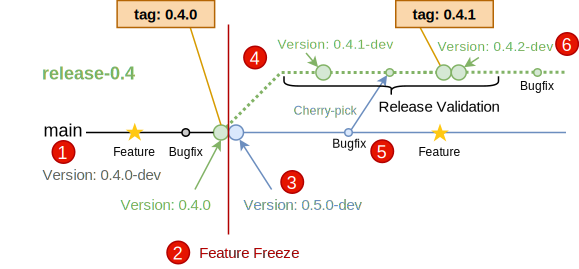

Versioning
==========

Note: The versioning of the Edge Manageability Framework repository aligns with the `YEAR-BASED MAJOR.MONTH.PATCH` format of Open Edge Platform, and that release number appears in the repository's [VERSION file](https://github.com/open-edge-platform/edge-manageability-framework/blob/main/VERSION). The [documentation repository](https://github.com/open-edge-platform/edge-manage-docs/) for Edge Manageability Framework also aligns with the calendar version format of Open Edge Platform, and that release number appears in the documentation repository's [VERSION file](https://github.com/open-edge-platform/edge-manage-docs/blob/main/VERSION). However, the various components of Edge Manageability Framework and their repositories continue to use the versioning model and component branching approach described below. The only exceptions to the following versioning model and component branching process are the `YEAR-BASED MAJOR.MONTH.PATCH` format of the [Edge Manageability Framework repository](https://github.com/open-edge-platform/edge-manageability-framework) and the Edge Manageability Framework main [documentation repository](https://github.com/open-edge-platform/edge-manage-docs).

Versioning is an integral part of the code review and Continuous Integration
(CI) process, and releasing a new version of a component will be an extremely
lightweight and frequent event.

The ``VERSION`` File
--------------------

The versioning model embraced by Edge Orchestrator is automated to optimize for
development velocity, and uses a file named ``VERSION`` in the root of a repo,
which contains a `Semantic Versioning (SemVer) <https://semver.org>`_ version
number. It is manually updated by developers during the development process.

This file as a source of truth around versioning, has the
following benefits:

1. The ``VERSION`` file can be managed through the standard code review
   process, allowing developers to use a single process to create
   releases. When the contents of ``VERSION`` is a *released* version
   (with no suffix), on pull request merge automation creates git tags on
   the repository using the SemVer release specified in the ``VERSION``
   file.

   Developers must decide whether to change the ``MAJOR``, ``MINOR``,
   or ``PATCH`` component based on two factors:

   * The API breakage requirements of SemVer (ie, breaking APIs ==
     increase ``MAJOR``, adding APIs == increase ``MINOR``)

   * Whether space is needed to create a support branch (ie, increase
     ``MINOR`` when creating a support branch used tracking with the
     release manifest.

2. When a new PR is created, the CI checks that a tag has
   not been created with the contents of the ``VERSION`` file so that a
   git tag will only point back to a single commit, allowing problems or
   defects to be tracked back to the corresponding code revisions. This
   eliminates nonsensical and hard-to-answer questions like "Which
   version of 1.0.0 is this?".

3. Automation also allows setting the ``VERSION`` file to have an
   *unreleased* version that has a ``-dev`` or other suffix - this
   allows development between releases, as git tags are not created for
   these unreleased versions. A typical cadence is have the ``VERSION``
   file change between ``dev`` -> ``release`` -> ``dev`` -> ``release``
   during development.

.. note::
   The ``VERSION`` file starts with a number. The go versioning
   specific ``v`` prefix is not used in the ``VERSION`` file - git tags
   with the ``v`` prefix will be created by automation if required.

Component Versioning Example
----------------------------

In this example, Intel has a component that is currently on the released
``0.3.0`` version (which has the contents of the ``VERSION`` file). To
add features and fixes to the component, the following steps are taken:

.. figure:: images/version_bump.drawio.svg
   :alt: Component Version Bump

   Component Version Bump

1. If it has not already happened, a pull request is created to change the
   ``VERSION`` file to increase to the next version and also add the
   ``-dev`` unreleased version suffix:

      Example: ``0.3.1-dev``

   .. note:: Any of the ``MAJOR``, ``MINOR``, or ``PATCH`` versions
      could be changed, depending on SemVer and branching space
      requirements.

2. Finish the feature or fixes. Multiple features may go into this
   cycle. Prior to the release, perform any functional and component
   integration tests to validate functionality.

3. Submit a pull request that removes the ``-dev`` suffix from the
   ``VERSION`` so it becomes a released version:

      Example: ``0.3.1``

   *Optionally*, submit another pull request that increases to the
   next unreleased version in preparation for future development:

      Example: ``0.3.2-dev``

Component Branching Example
---------------------------

When a branch needs to be made for maintenance purposes, the typical
flow used is as follows:

   Component Branching

The general flow is as follows:

1. The main branch starts with an unreleased ``-dev`` version in the
   ``VERSION`` file. Both Features and Bug fixes can go into the main
   branch.

      Example: ``0.4.0-dev``

2. When a Edge Orchestrator-wide release and `Feature
   Freeze <https://en.wikipedia.org/wiki/Freeze_(software_engineering)>`__
   is happening, a branch needs to be created to support this release.
   As branches start with a specific tag, the ``VERSION`` file is
   changed to be a released SemVer version:

      Example: ``0.4.0``

   - At this point, a support branch can be created, starting from the
     tag. You do not necessarily need to create support branches prior
     to when they are required, only when they are needed (this is
     called *Lazy Branching*)

   - Support branches are named ``release-MAJOR.MINOR``, and have branch
     protection rules to prevent accidental pushes. A protected branch
     can be created using these commands:

   .. code:: shell

      git checkout 0.4.0
      git checkout -b release-0.4
      git push origin release-0.4

3. Immediately after creating the tag, a space for the patch branch is
   created on the main branch, by updating the ``VERSION`` file to have
   a new unreleased ``-dev`` version that increments the ``MINOR``
   version:

      Example: ``0.5.0-dev``

4. A release validation cycle starts. As there may be patches created
   during validation while the ``0.4.0`` artifacts are being tested, the
   ``VERSION`` file is updated with the unreleased ``-dev`` version, and
   pushed to the support branch. This allows multiple fixes to be
   incorporated in the next patch release.

      Example: ``0.4.1-dev``

5. There may be bugs discovered during validation, which require patches
   to fix. There are many strategies for creating and applying these
   fixes, but teams should generally pick one strategy and merge
   to a direction so the process is well understood within the team.

   - In this example, the team has chosen to start bug fixes on the main
     branch, and then cherry-pick to the support branches. The
     advantages of this are that testing on main and the support branch
     may result in more complete testing, and also that cherry picking
     from main to a support branch ensures that bug fixes are always
     applied to the main branch.

   - Alternatively, creating patches on the support branch and
     cherry-picking back to the main branch may be more expedient, but
     can require more care to ensure that the main branch is also suitably
     patched.

   - In rare cases, a bug fix may be needed only on the support branch,
     or two different non-cherry-picked patches for the same fix may be
     required (if the main branch is sufficiently different in code or
     workflow than the patch branch). In either cases,
     additional care must be taken so as not to introduce errors.

   - Cherry-picking must be done individually for every patch, as
     trying to cherry-pick from multiple patches or pull requests that have
     been squashed together may unintentionally introduce bugs or new
     features into a maintenance branch.

6. Once the support branch has received enough changes that it is ready
   for release, the ``VERSION`` is updated to drop the ``-dev``
   unreleased suffix, which creates the ``0.4.1`` tag, and then
   immediately after that, a new ``0.4.2-dev`` tag is created for future
   bug fixes.

Post-PR-Merge Actions
~~~~~~~~~~~~~~~~~~~~~

After passing code review and being merged, the post-merge CI job will
run to create the Git tags and artifacts (binaries, container images,
etc.).

.. figure:: images/artifact-build.drawio.svg
   :alt: Artifact Build

   Artifact Build

So that these artifacts can be traced back to the code that they were
created from, the tag and commit information must be embedded in the
artifacts - some examples of how this can be done:

- In the Docker\* instance case, metadata in the `OCI
  Annotations <https://specs.opencontainers.org/image-spec/annotations/>`__
  format must be added.

- You can embed the version and other identifiers into the Go* binary when it
  is being built, by using the `ldflags -X <https://pkg.go.dev/cmd/link>`_ or
  `embed <https://pkg.go.dev/embed>`_ directives.

Artifact generation processes in CI must integrate this information as
a part of the CI process.

Automation Scripts
------------------

Versioning automation scripts are maintained in the `orch-ci
<https://github.com/open-edge-platform/orch-ci>`__ repository.

- `version-check.sh <https://github.com/open-edge-platform/orch-ci/blob/main/scripts/version-check.sh>`__

  The ``version-check`` script enforces versioning requirement and
  prevents submission of pull requests that contain an already-released
  Version. A common development pattern is to immediately create and commit
  another pull request that increments the ``VERSION`` file to contain an
  unreleased version after committing a released Version.

  Rebasing pull requests on top of released versions need changes to the
  version file to avoid being rejected in Jenkins\* CI. Additionally,
  automatic merge or rebase must be disabled on the project repository so
  that the jobs that ensure a changed version file are run on each pull
  request. Reverting a pull request has similar requirements - reverts must
  go to a non-released version to avoid the pre- and post- revert patches
  from having the same released version.

- `version-tag.sh <https://github.com/open-edge-platform/orch-ci/blob/main/scripts/version-tag.sh>`__

  On submission of a pull request, the ``version-tag`` script runs and if
  the version file contains a released version number, a git tag with that
  version is created on the project repository. Git tags are not created
  for unreleased versions.

  CI jobs that run the ``version-tag`` script must be configured to
  run post submit in the ``main`` branch and any release branches in the
  Jenkins file.

  There must be no manual tagging or moving of tags that use SemVer
  versions. Various non-SemVer vanity tagging of jobs may have been
  applied in the past, but future use is discouraged.

Automation Q&A
--------------

1. Why does my commit fail on the next patch after incrementing the VERSION?

   You need to ensure that the sequence of versions followed does not have
   two commits with same VERSION. Here is an example of sequence:
   ``0.1.0-dev -> 1.0.0-dev -> 1.0.0 (Released SemVer)
   -> 1.0.1-dev (Dev patch) -> 1.0.1  (Release patch) or similar``.

2. Can I skip a sequence of version (Ex: 1.0.0 -> 1.0.2)?

   No, one must make sure that the next version is always incremented by
   one, of the previous one. If the version is incremented by two, the
   Version-Check job would fail because the previous parent
   (in the ex: 1.0.1) would not be found.

3. Can I have a patch for a previous release train after a new version is
   released?

   Yes. You can have a patch release for a VERSION that has a different
   release train. Example: - 1.1.0 -> 1.1.1 patch might happen after a
   1.2.0 is released.

4. What are the different type of VERSION files supported?

   As of today, the following type of VERSION files can be used:

   - VERSION
   - package.json (specific to ``Node.js`` projects)
   - pom.xml (specific to Java/Maven projects)

5. Why did the Docker parent check fail?

   The Docker parent check is implemented to ensure the right base image is
   used in the Dockerfile. The check supports using a container where the
   parent image is the ``FROM scratch`` `Docker base image
   <https://docs.docker.com/build/building/base-images/>`_, or a `static
   distroless image with non-root
   <https://github.com/GoogleContainerTools/distroless>`__, or a released
   SemVer / non-released version with a specific SHA-256 hash. The check will
   fail if it’s not using a specific version or when a parent image is not
   found.

6. What are good Docker FROM lines?

   - ``FROM [--platform=<platform>] <image> [AS <name>]``
   - ``FROM [--platform=<platform>] <image>[:<tag>] [AS <name>]``
   - ``FROM [--platform=<platform>] <image>[@<digest>] [AS <name>]``

   Optionally a name can be given to a new build stage by adding AS name
   to the FROM instruction.

   The tag or digest values are optional. If you omit either of them,
   the builder assumes a latest tag by default. The builder returns an
   error if it cannot find the tag value.
