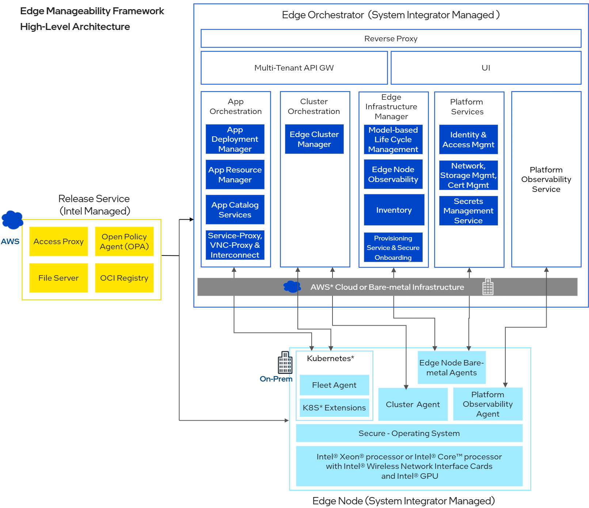

Developer Guide
===============

|software_prod_name|, part of the Open Edge Platform, brings the ease
of cloud-native deployment, orchestration, and management to edge environments,
at scale.

Cloud computing abstracts away details of the underlying computing devices. In
contrast, edge networks often require heterogeneous and specific hosts. You may
need purpose-built equipment for networking, retail, or factory control in your
edge. Alternatively, you may need to run AI models that have been optimized for
performance on a specific class of devices.

Additionally, hosts in an edge network may also have limited memory or compute
power. They may be situated in remote environments that are hard to reach or in
locations with physical security concerns. |software_prod_name| addresses
the challenges of edge computing, streamlining the management of edge
networks at scale.

|software_prod_name| consists of seven main components, deployable on-premises
or in the cloud:

* **Edge Node Agents**: A set of agents that run on the edge nodes as OS-level agents.
  They communicate with the services running in the |software_prod_name| and provide a
  consistent interface for the edge node software. Read more about :doc:`agents/index`.

* **Edge Infrastructure Manager**: Policy-based, secure lifecycle management
  of a fleet of edge nodes/devices at scale, spread across distributed locations
  allowing onboarding, provisioning, inventory management, upgrades and more.
  Read more about :doc:`infra_manager/index`.

* **Edge Cluster Orchestrator**: A lightweight multi-cluster orchestrator based
  on the Cluster API (CAPI) standard, designed to automate the deployment and
  lifecycle management of Kubernetes\* clusters at scale across distributed
  edges, providing centralized monitoring and access control.
  Read more about :doc:`cluster_orch/index`.

* **Edge Application Orchestrator**: Offers customers the ability to easily
  package, deploy and monitor cloud-native applications at scale across
  distributed edges. Read more about :doc:`app_orch/index`.

* **User Interface**: The web user interface for the Edge Orchestrator, allowing
  the user to manage most of the features of the product in an intuitive,
  visual, manner without having to trigger a series of APIs individually.

* **Observability**: A modular observability stack that provides visibility into
  the health and performance of the system, including logging, reporting,
  alerts, and SRE data from Edge Orchestrator components and Edge Nodes.
  Read more about :doc:`observability/index`.

* **Platform Services**: A collection of services that support the deployment
  and management of Edge Orchestrator, including Identity and Access
  management, multitenancy management, ingress route configuration, secrets
  and certificate management, cloud and on-prem infrastructure lifecycle
  management and more. Read more about :doc:`platform/index`.

All of the components are exposed via a seamless, consistent, intuitive, and
delightful user experience.

|software_prod_name| also includes software that gets installed into the Edge
Node called **Edge Node Agents**.

All of the artifacts needed to deploy |software_prod_name| and the Edge Nodes
are published in the Release Service.

This guide also includes an application developer guide to help you create
Helm\*-based applications compatible with |software_prod_name|.

.. toctree::
   :hidden:

   contributor_guide/index
   set_up_dev_env/index
   application_developer_workflow/index
   troubleshooting/index
   agents/index
   infra_manager/index
   cluster_orch/index
   app_orch/index
   observability/index
   platform/index
   virtual_edge_node/index
   trusted_compute/index
