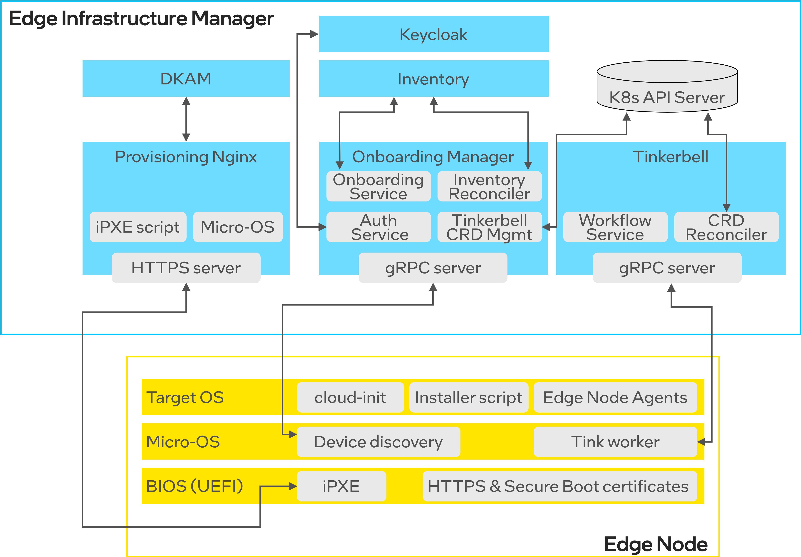

==============================
Onboarding and OS Provisioning
==============================

Edge Infrastructure Manager includes the
`Onboarding and Provisioning <https://github.com/open-edge-platform/infra-onboarding>`_
subsystem that is responsible for initial device discovery as well as the OS
installation and configuration on managed Edge Nodes.

**Features**

- Enables remote Onboarding and Provisioning of Edge Nodes over the Internet.
- Designed with the security-first approach by leveraging HTTPS certificates, secure JWT-based communication channels and Secure Boot.
- Supports full Zero-Touch Provisioning without any user intervention.
- Uses well-adopted, industry standard tools such as iPXE and cloud-init.
- Supports onboarding and provisioning of both mutable (Ubuntu\* OS) and immutable
  (`Edge Microvisor Toolkit <https://github.com/open-edge-platform/edge-microvisor-toolkit>`_) operating systems.
- Supports onboarding of up to 50 Edge Nodes simultaneously.
- Can onboard and provision an Edge Node in ~6-8 minutes.

.. note::

   The notion of **Onboarding** refers to the process of discovering a
   bare metal device (Edge Node) and its basic information
   such as UUID or Serial Number, while **Provisioning** refers to the process
   of OS and Edge Node Agents installation on managed Edge Nodes.

**Table of contents:**

- `Onboarding Manager <#onboarding-manager>`__
- `Dynamic Kit Adaptation Module <#dynamic-kit-adaptation-module-dkam>`__
- `Tinker Actions <#tinker-actions>`__
- `PXE Server <#pxe-server>`__

Onboarding Manager
------------------

`Onboarding Manager <https://github.com/open-edge-platform/infra-onboarding/tree/main/onboarding-manager>`_ -
the main component that is responsible for coordination of the onboarding and
provisioning process. It exposes southbound gRPC interfaces for node onboarding
(device discovery) initiated by Edge Nodes, and communicates with Inventory
to create and/or update information about Edge Node devices. Moreover, it
curates and creates the Tinkerbell CRD objects (Hardware, Template, and
Workflow) to drive the provisioning process (OS installation). It is also
responsible for updating current status of onboarding and
provisioning operations.

**Features:**

- Automated Onboarding: Streamlines the onboarding process for edge nodes,
  from pre-registration to provisioning.
- Interactive and Non Interactive (passwordless) Onboarding support to onboard
- edge node.
- Host and Instance Resource Management: Interfaces with the Inventory Service
  to manage host and instance resources lifecycle.
- Workflow Automation: Generates and executes Tinkerbell workflows for
  provisioning edge nodes.
- Secure Boot, FDE and DMV Support: Supports Secure Boot, Full Disk Encryption
  (FDE) and DM Verity (DMV) settings for enhanced security.
- Integration with Keycloak: Ensures secure authentication and token management
  for edge nodes.
- Status Reporting: Sends onboarding and provisioning status information to the
  User Interface via the Inventory Service.
- Scalability: Designed to scale with approximately 45 edge nodes and
  provisioning tasks, as validated to date.
- API

  - Inventory Interaction: The onboarding manager uses the gRPC APIs exposed by
    the infra Inventory Service to manage host, instance, os resources.
  - Device Discovery: The onboarding manager provides both unay and
    bi-directional stream gRPC-based APIs for device discovery.
  - gRPC Stream Management for Non-Interactive Onboarding: The API establishes
    and manages gRPC stream connections with edge nodes to facilitate
    non-interactive onboarding.

**References:**

- The relevant API definitions can be found in this
  `API directory <https://github.com/open-edge-platform/infra-onboarding/tree/main/onboarding-manager/api/grpc/onboardingmgr>`__
  and this `API package <https://github.com/open-edge-platform/infra-onboarding/tree/main/onboarding-manager/pkg/api>`__.
- Learn how to
  `ensure compatibility with cloud-init <https://github.com/open-edge-platform/infra-onboarding/blob/main/onboarding-manager/docs/cloud-init-os-compatibility.md>`__
- To learn how to set up Onboarding Manager on your machine,
  refer to `the instructions <https://github.com/open-edge-platform/infra-onboarding/tree/main/onboarding-manager#get-started>`__

Dynamic Kit Adaptation Module (DKAM)
------------------------------------

`Dynamic Kit Adaptation Module (DKAM) <https://github.com/open-edge-platform/infra-onboarding/blob/main/dkam/README.md>`_ -
an Edge Orchestrator service that curates, builds and signs the OS installation
artifacts, including iPXE binaries and Micro-OS image.
**DKAM** is only involved during the initial Edge Orchestrator deployment or
when the Edge Orchestrator certificates or Secure Boot keys are refreshed.

The role of **DKAM** is to curate the Micro-OS image and the iPXE script with a
runtime configuration (e.g., orchestrator URLs, certificate) that is specific to
a given Edge Orchestrator instance. Once curated, it builds the installation
artifacts, signs them with Secure Boot keys and orchestrator certificate,
and saves to the K8s Persistent Volume Claim that stores all
OS installation artifacts.

**Features:**

- Secure Boot support: Generate signing keys to enroll inside UEFI BIOS
  Secure Boot Settings
- iPXE build support: Build iPXE binary, inject orchestrator certificate and
  sign the binary for secure boot.
- HookOS Configurations: Download prebuilt HookOS, inject certificates and
  required configurations and sign the image.

**References:**

- To learn how to set up Onboarding Manager on your machine,
  refer to `the instructions <https://github.com/open-edge-platform/infra-onboarding/tree/main/dkam#get-started>`__

Tinker actions
--------------

A suite of reusable `Tinkerbell Actions <https://github.com/open-edge-platform/infra-onboarding/blob/main/tinker-actions/README.md>`__ -
containerized steps that are used to compose `Tinkerbell <https://tinkerbell.org/>`_
Workflows, such as provisioning of a remote operating system, configuring
network settings, or running custom scripts. These actions are executed in
sequence to automate the provisioning and management of bare metal servers.

The **Tinkerbell engine**, shown in the diagram above, reconciles Tinkerbell CRDs
that are used to define the provisioning workflow for each Edge Node.
Edge Nodes download the Tinkerbell workflow from the Tinkerbell server via secure
gRPC channel and execute the workflow locally.

**Features:**

- Designed to be modular and reusable.
- Each action is typically defined as a Docker container, which encapsulates
  the logic and dependencies required to perform the task.
- Automatic Destination Drive Detection: All the actions have logic to
  automatically detect the target disk, based on size, type of the disk.

**References:**

- To learn how to build tinker actions on your machine,
  refer to `the instructions <https://github.com/open-edge-platform/infra-onboarding/tree/main/tinker-actions#get-started>`__

PXE Server
----------

`Provisioning NGINX\* server <https://nginx.org/>`_ - a component that exposes
OS installation artifacts curated by **DKAM** to downstream Edge Nodes via the
HTTPS endpoint. In particular, the BIOS UEFI communicates with the
**Provisioning NGINX server** to download the iPXE script and Micro-OS image
to run on the Edge Node.

**References:**

- To learn how to build the PXE server image,
  refer to `the instructions <https://github.com/open-edge-platform/infra-onboarding/tree/main/pxe-server#get-started>`__

