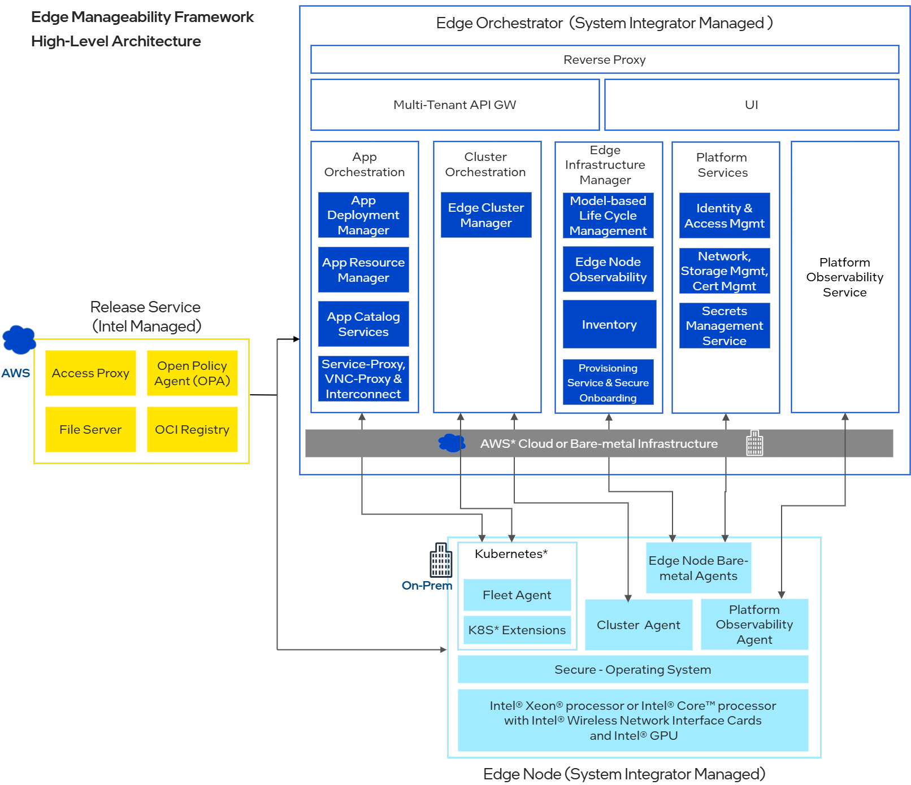

Deployment
==========

Edge Infrastructure Manager is typically deployed as a set of microservices in
a Kubernetes cluster and it is part of the orchestrator services of Open Edge Platform along with Application and Cluster Orchestration. It
leverages the same set of services provided by the Orchestration Platform
Services, UI and Observability framework.

The Kubernetes cluster can be either deployed on a AWS cloud using `Elastic
Kubernetes Service (EKS) <https://aws.amazon.com/eks/>`_  or on a VM using the
Rancher Kubernetes distribution `RKE2 <https://docs.rke2.io/>`_. Following
image shows the deployment of Edge Infrastructure Manager in the context of
Open Edge Platform Edge Manageability framework.

Alternatively, the Edge Infrastructure Manager components can be deployed as
standalone components for development and testing purposes. For more details,
see the READMEs stored in the Edge Infrastructure Manager repositories.
