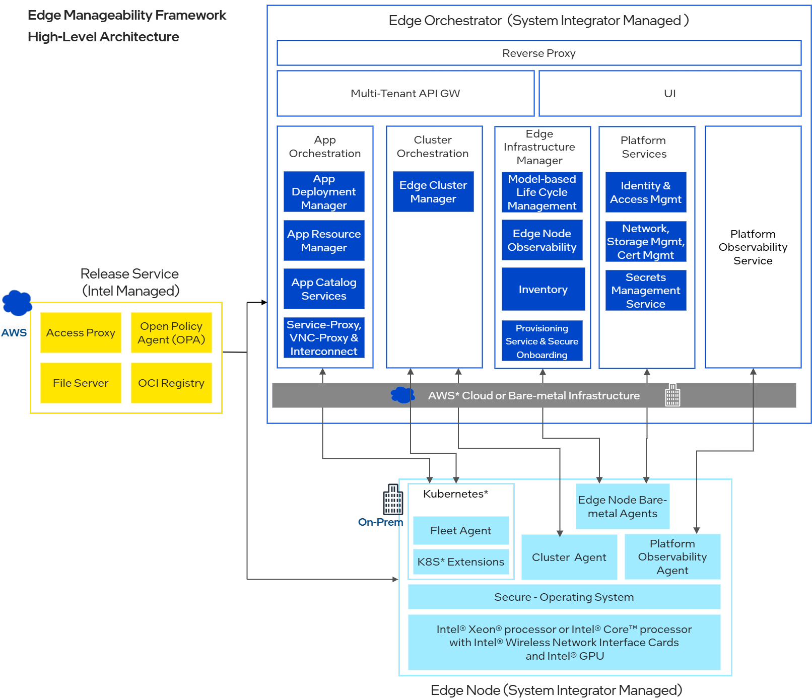

Day 1 Deployment
================

Edge Infrastructure Manager is typically deployed as a set of microservices in
a Kubernetes cluster and it is part of the Edge Orchestrator services of Open Edge Platform along with Application and Cluster Orchestration. It
leverages the same set of services provided by the Orchestration Platform
Services, UI and Observability framework.

The Kubernetes cluster can be either deployed on a AWS cloud using `Elastic
Kubernetes Service (EKS) <https://aws.amazon.com/eks/>`_  or on a VM using the
Rancher Kubernetes distribution `RKE2 <https://docs.rke2.io/>`_. Following
image shows the deployment of Edge Infrastructure Manager in the context of
Open Edge Platform Edge Manageability framework.

Alternatively, the :doc:`Edge Infrastructure Manager components <components>` can be deployed as
standalone components for development and testing purposes. For more details,
see the Edge Infrastructure Manager repositories:

- `Edge Infrastructure Manager Core <https://github.com/open-edge-platform/infra-core/tree/main/inventory>`__:
  Core services for the Edge Infrastructure Manager including inventory, APIs, tenancy and more.

- `Edge Infrastructure Managers <https://github.com/open-edge-platform/infra-managers>`__:
  Provides life-cycle management services for edge infrastructure resources via a collection of resource managers.

- `Edge Infrastructure Manager Onboarding and OS provisioning <https://github.com/open-edge-platform/infra-onboarding>`__:
  A collection of services that enable remote onboarding and provisioning of Edge Nodes.

- `Edge Infrastructure Manager External <https://github.com/open-edge-platform/infra-external>`__:
  Vendor extensions for the Edge Infrastructure Manager allowing integration with 3rd party software.

- `Infrastructure Manager Charts <https://github.com/open-edge-platform/infra-charts>`__:
  Helm charts for deploying Edge Infrastructure Manager services.

