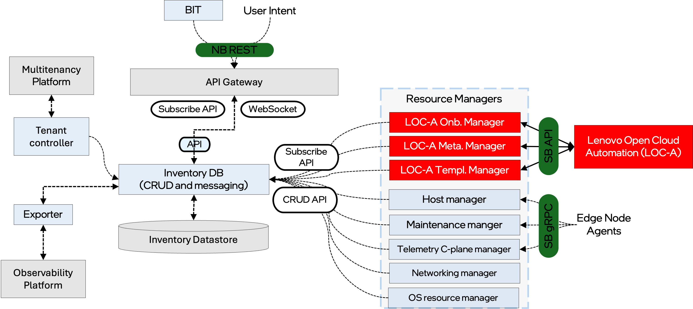

Extensibility
=============

Edge Infrastructure Manager is designed to be extensible and customizable. The
system can be adapted to meet unique requirements, integrate with external
systems, and support new features. This document provides an overview of the
extensibility options available in the Edge Infrastructure Manager.

The typical way to extend the system is by adding new resources in the
Inventory datamodel (see FIXME link to Inventory documentation). Modeling is
done using the `Protocol Buffer <https://protobuf.dev/>`_ serialization format
that is language independent, and then presented to other services using gRPC.
The protobuf format is the canonical format for data in Edge Infrastructure
Manager.

Once new abstractions have been added to Inventory including the Data Access
Layer (DAL) business logic, the next step is to define the REST APIs through
which users and external components can consume those resources. The REST APIs
are defined in the Edge Infrastructure Manager `OpenAPI
<https://www.openapis.org/>`_ specification (see FIXME link to API
documentation).

Edge Infrastructure Manager northbound APIs are designed to be declarative: the
consumer express an Intent that gets translated into a `desired` field in the
affected Inventory resource.

Resource Managers are responsible for reconciling user intents with the actual
state of the infrastructure (reported as `current` field). They can be
customized to support new resources, workflows, or integrations with external
systems.  The system provides modular integration points and plugin options to
support these extensibility scenarios.

Multiple different vendors may each have their own Resource Manager, each
supporting different Provider API types: a bare-metal provider would have a
different Resource Manager than a VM provider, and similarly. As an example see
the following diagram that shows the integration with Lenovo* Open Cloud
Automation and the extensions we introduced in Edge Infrastructure Manager.

Finally, the last integration dimension implies introducing an Edge
Infrastructure Manager Exporter, a Controller or a new set of components which
perform very tailored tasks and act as a bridge between Edge Infrastructure
Manager and other Edge Manageability Framework platform services.
