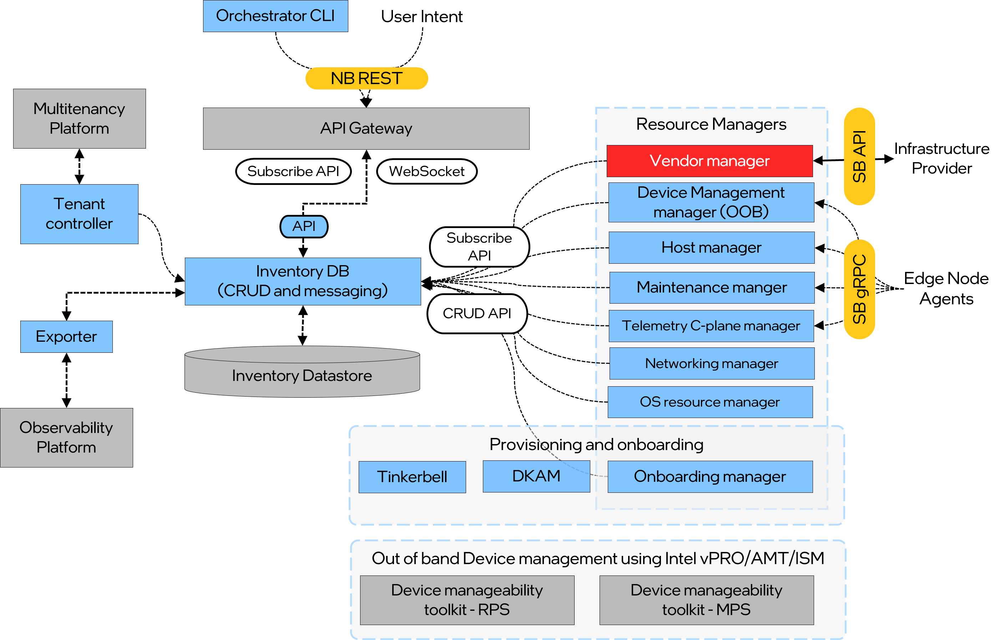

High-Level Architecture
=======================

Architecture Diagram
---------------------

Edge Infrastructure Manager is modular and extensible and it enables the
integration of new components and services. The high-level architecture of the
platform is shown in the following figure:

Key components
---------------

Edge Infrastructure Manager is a framework that provides users with APIs to
manage, monitor, control and perform overall lifecycle management of physical
equipment inventory deployed at the edge locations. It is made up of the
following key components and services:

**API** provides a northbound REST API that can be accessed by users and other
Open Edge Platform services. It is a horizontally scalable stateless
service.

**Inventory** which is the state store and the only component that persists
state in Edge Infrastructure Manager. It works in a declarative manner, by storing for some of the
abstractions not only the current state but also the desired state. Inventory
is a key component of the system, as it is the source of truth for Edge
Infrastructure Manager, and is used by all the Resource Managers to determine
what actions need to be taken.

**Resource Managers** reconcile user intents from desire to reality, and adapt
from the high-level inventory abstractions to actual hardware and
configurations performed in the edge infrastructure. Managers works in tandem
with the Edge Node agents to perform the actual work on the edge
infrastructure. Resource Managers are modular, stateless and, depending on the
varieties of infrastructure required or available, different sets of Resource
Managers will be deployed.

**Provisioning and Onboarding Subsystem** drives Onboarding (device discovery)
and Provisioning (OS installation on Edge Nodes) processes. Internally, it leverages
the `Tinkerbell <https://tinkerbell.org/>`_ engine to perform the initial bootstrapping
and remote provisioning of Edge Nodes with the help of other Edge Infrastructure Manager components,
namely Dynamic Kit Adaptation Module (DKAM) and Onboarding Manager.

**Inventory Exporter** exports, using a `Prometheus\* toolkit
<https://prometheus.io/>`_` compatible interface, Inventory metrics that cannot
be collected directly from the edge node software. Observability services then
scrape those metrics.

**Tenant Controller** orchestrates tenant creation and deletion within the Edge
Infrastructure Manager domain.

**Bulk Import Tools (BIT)** are tools that automate the registration of
multiple edge nodes in Edge Infrastructure Manager.

.. note:: Edge Node Agents are optional software that may be needed under a
   Resource Manager when the infrastructure component does not have an external
   API, or needs a more complicated interaction to be implemented. The
   connection between Agent and Resource Manager is implementation specific,
   and may depend on a variety of factors, but typically the Agent would
   contact the Resource Manager in order to cross network boundaries.

.. note:: Resource managers also work with downstream services (called
   “Providers”) that exposes an API to control and manage the infrastructure
   giving the birth to a layered architecture.
