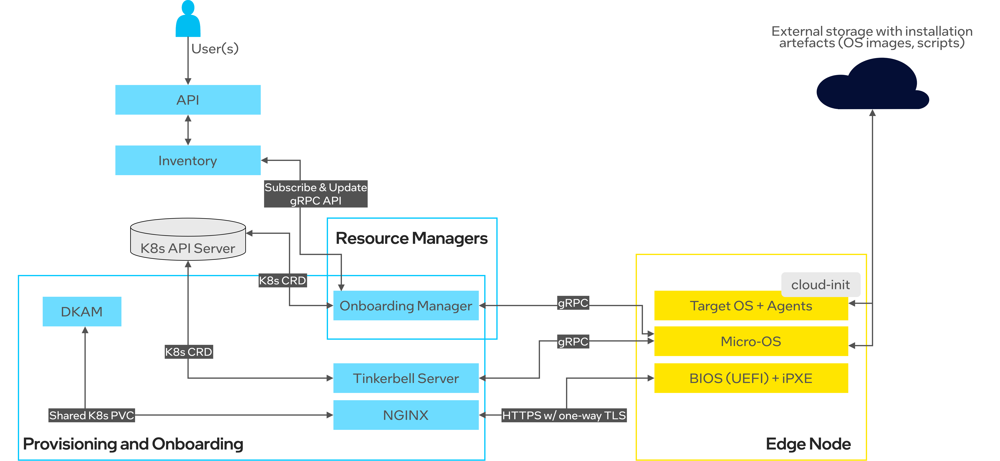
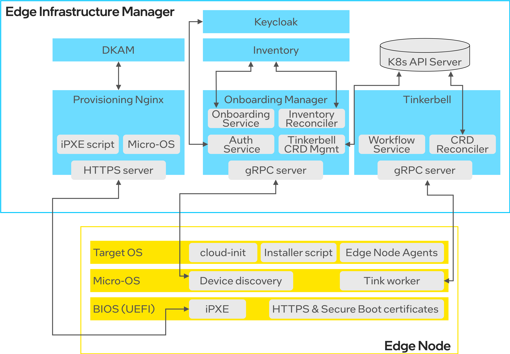
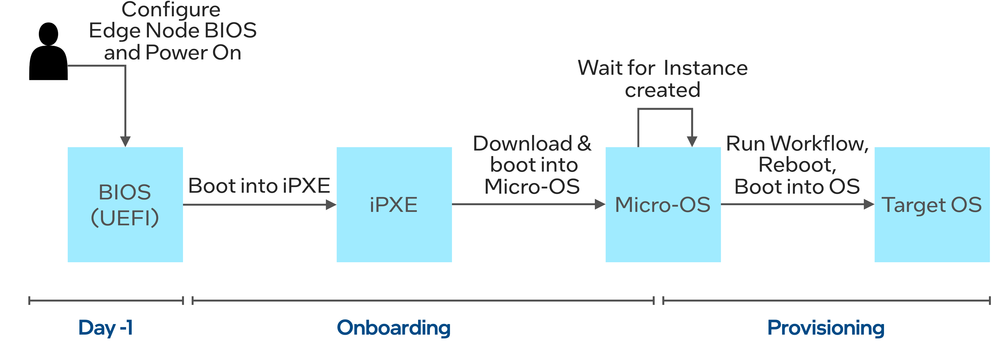

Onboarding and Provisioning
===========================

Overview
--------

Edge Infrastructure Manager includes the `Onboarding and Provisioning <https://github.com/open-edge-platform/infra-onboarding>`_ subsystem that is responsible for initial device discovery as well as the OS installation and configuration on managed Edge Nodes.

.. note:: The notion of **Onboarding** refers to the process of discovering a bare metal device (Edge Node) and its basic information
   such as UUID or Serial Number, while **Provisioning** refers to the process of OS and Edge Node Agents installation on managed Edge Nodes.

The main features of the Edge Infrastructure Manager Onboarding and Provisioning subsystem:

- Enables remote Onboarding and Provisioning of Edge Nodes over the Internet.
- Designed with the security-first approach by leveraging HTTPS certificates, secure JWT-based communication channels and Secure Boot.
- Supports full Zero-Touch Provisioning without any user intervention.
- Uses well-adopted, industry standard tools such as iPXE and cloud-init.
- Supports onboarding and provisioning of both mutable (Ubuntu\* OS) and immutable (`Edge Microvisor Toolkit <https://github.com/open-edge-platform/edge-microvisor-toolkit>`_) operating systems.
- Supports onboarding of up to 50 Edge Nodes simultaneously.
- Can onboard and provision an Edge Node in ~6-8 minutes.

High-level Architecture
-----------------------

The high-level architecture of Edge Infrastructure Manager components involved in the onboarding and provisioning is depicted below:

At high-level, the Edge Infrastructure Manager's Onboarding and Provisioning relies on the following concepts:

- It assumes the **pull-based (call-to-home) communication model** meaning that Edge Nodes should initiate the onboarding and provisioning process.
- The onboarding and provisioning is initiated via **iPXE**, an open-source, scriptable and configurable bootloader capable of booting from many sources
  (e.g., TFTP, USB devices, UEFI binary). It can also chain load other systems and scripts,
  over many protocols including HTTPS. More details about iPXE can be found at `ipxe.org <https://www.ipxe.org/>`_.
- The iPXE script can be either started via **BIOS UEFI (HTTPS boot)**, or from **the USB device (USB boot)**.
- **Micro-OS** - a lightweight, in-memory, Linux\*-based OS - is used during the installation process to run services responsible for downloading and installing the target OS.
  Currently, we use `HookOS from the Tinkerbell project <https://tinkerbell.org/docs/additionalcomponents/hookos/>`_ as the only supported Micro-OS.
- **Tinkerbell**, an open-source provisioning engine, is used to execute the target OS installation process. In particular, the Tinkerbell worker running in Micro-OS
  downloads target OS image, writes it to the disk partition and injects all installation scripts that are executed post-boot.
- Edge Node Agents are distributed as OS packages and run as systemd services on the target OS. They are either baked into the OS image
  (in the case of immutable OSes, like Edge Microvisor Toolkit) or installed once the target OS is booted (mutable OSes, like Ubuntu OS).
- The OS configuration is provided to Edge Nodes via **cloud-init** that is executed at the target OS boot time and provides all necessary
  configuration (JWT credentials, certificates, orchestrator URLs, etc.) for Edge Node Agents to connect to the Edge Orchestrator.

On the Edge Orchestrator side, the following components are involved in the onboarding and provisioning:

- `Onboarding Manager <https://github.com/open-edge-platform/infra-onboarding/tree/main/onboarding-manager>`_ - the main component that is responsible for coordination of the onboarding and provisioning process.
  It exposes southbound gRPC interfaces for node onboarding (device discovery) initiated by Edge Nodes, and communicates with Inventory
  to create and/or update information about Edge Node devices. Moreover, it curates and creates the Tinkerbell CRD objects (Hardware, Template, and Workflow)
  to drive the provisioning process (OS installation). It is also responsible for updating current status of onboarding and provisioning operations.
- `Dynamic Kit Adaptation Module (DKAM) <https://github.com/open-edge-platform/infra-onboarding/tree/main/onboarding-manager>`_ - an Edge Orchestrator service that curates, builds and signs the OS installation artifacts, including iPXE binaries and Micro-OS image.
  **DKAM** is only involved during the initial Edge Orchestrator deployment or when the Edge Orchestrator certificates or Secure Boot keys are refreshed.
  The role of **DKAM** is to curate the Micro-OS image and the iPXE script with a runtime configuration (e.g., orchestrator URLs, certificate)
  that is specific to a given Edge Orchestrator instance. Once curated, it builds the installation artifacts, signs them with Secure Boot keys and orchestrator certificate,
  and saves to the K8s Persistent Volume Claim that stores all OS installation artifacts.
- `Provisioning NGINX\* server <https://nginx.org/>`_ - a component that exposes OS installation artifacts curated by **DKAM** to downstream Edge Nodes via the HTTPS endpoint.
  In particular, the BIOS UEFI communicates with the **Provisioning NGINX server** to download the iPXE script and Micro-OS image to run on the Edge Node.
- **Tinkerbell engine** - a subset of `Tinkerbell <https://tinkerbell.org/>`_ components that the Edge Infrastructure Manager uses to perform remote OS provisioning.
  The Tinkerbell engine reconciles Tinkerbell CRDs that are used to define the provisioning workflow for each Edge Node. Edge Nodes download the Tinkerbell workflow
  from the Tinkerbell server via secure gRPC channel and execute the workflow locally.

Architecture Details
--------------------

The below diagram shows a detailed view on the Edge Infrastructure Manager components involved in the Onboarding and Provisioning process.

Data Modelling
^^^^^^^^^^^^^^

See :doc:`/developer_guide/infra_manager/arch/data_model`.

Each Edge Node is represented in the Inventory data model as a pair of Host and Instance resources (with a 1:1 relationships between them). A Host resource
represents a bare metal machine with its basic device information like UUID or Serial Number. An Instance resource describes the actual OS that is running on the bare metal machine.
Both Host and Instances follow the current and desired state model and the Onboarding Manager is responsible for running these resources to completion, i.e., achieving the desired state.

The split into the Host and Instance resources expresses the split into the Onboarding and Provisioning phases - the Onboarding phase ends when the Host resource enters its desired state ``ONBOARDED``,
while the Provisioning phase ends when the Instance resource achieves the ``RUNNING`` state.

Edge Node Lifecycle
^^^^^^^^^^^^^^^^^^^

Each Edge Node goes through the following lifecycle during Onboarding and Provisioning:

First, a user needs to configure the Edge Node BIOS to boot into the iPXE script from the HTTPS URL or from the USB device, and power on the Edge Node.
The Edge Node BIOS executes the iPXE script that downloads and boots into the in-memory Micro-OS. The Micro-OS runs the device discovery service that onboards the Edge Node to the Edge Orchestrator.
The Edge Node stays in the Micro-OS stage until the OS provisioning is started.
The Onboarding Manager starts the OS provisioning as soon as the Instance resource is created in the Inventory for a given Host resource (representing bare metal Edge Node).
Edge Infrastructure Manager supports two modes of operation - near Zero-Touch Provisioning (nZTP) and non Zero-Touch Provisioning (non-ZTP). In the nZTP mode,
the Instance resource is created automatically along with the Host resource. It means that the Edge Node immediately moves from the Onboarding to the Provisioning phase.
On the other hand, the non-ZTP mode assumes that a user manually creates an Instance resource via UI or API - in that case the Edge Node can stay ready, after the Onboarding phase is completed,
until the Instance resource is created.

See :doc:`/user_guide/concepts/nztp` for more details about provisioning modes.

Edge Node Components
--------------------

**BIOS (UEFI)**

BIOS (UEFI) is the first entry point for users that want to onboard and provision an Edge Node via the HTTPS-based boot.
The BIOS is used to configure required certificates (HTTPS Edge Orchestrator certificate, Secure Boot keys) and configure HTTPS URL to download boot iPXE script from.

**iPXE**

The iPXE script is either taken from the USB device (USB boot) or the HTTPS URL is configured in BIOS and the iPXE script is downloaded from the Provisioning NGINX server.
The iPXE script performs initial network configuration, downloads and chain loads into the Micro-OS.

**Micro-OS**

The Micro-OS image comes with several built-in services that runs onboarding and provisioning. Two key services are Device discovery and Tink worker.

Device discovery is a Docker\* container that runs just after the Micro-OS is booted and is responsible for:

- reads required environment variables that are provided via iPXE script (e.g., HTTP/HTTPS proxy settings, URL of Onboarding Manager gRPC server, Keycloak\* solution URL)
- reads basic device information (e.g., UUID, Serial Number, IP and MAC addresses) that are needed during onboarding
- communicates with Onboarding Manager to perform device discovery and onboard the node.

The Tink Worker is another Docker container that runs in the background and waits for the node onboarding to finish and queries the Tinkerbell gRPC server for any new Tinkerbell Workflows to execute. A Tinkerbell Workflow
defines a set of operations (aka Tinker actions) that should be executed on the Edge Node by the Tink worker. Once the Tinkerbell Workflow is created by the Onboarding Manager,
the Tink worker downloads the Tinkerbell Workflow and executes all the specified Tinker actions.

The last action of the Tinkerbell Workflow performs the OS restart to boot into the target OS.

**Target OS**

During the OS boot, the cloud-init configuration is provisioned.
Also, in the case of mutable OSes (such as Ubuntu\* OS), the additional Installer script is executed as a systemd service.
The Installer script downloads and starts all the Edge Node Agents
that are not baked into the OS image as it is done for the Edge Microvisor Toolkit that does not require any additional installation script except for cloud-init.

Edge Orchestrator Components
----------------------------

On the Edge Orchestrator side, the Onboarding Manager coordinates the entire onboarding and provisioning process. In particular, it provides:

- gRPC server, backed by Onboarding Service and exposed towards downstream Edge Nodes for device discovery. The Onboarding Service handles gRPC requests from Edge Nodes,
  validates provided device information and creates (or updates) Host and Instance resources that represent an Edge Node in the Inventory.
- Inventory Reconciler that periodically checks if there are any new Instance resources that should be provisioned. It also periodically queries active Tinkerbell Workflows
  and reports onboarding and provisioning status of each Edge Node to Inventory.
- When a new Edge Node should be provisioned, the Onboarding Manager creates a JWT client for each Edge Node in the Keycloak\* solution via the Auth Service, generates a dedicated cloud-init
  configuration and creates a Tinkerbell Workflow for a given Edge Node. The Tinkerbell Workflow contains a set of actions that should be performed to install the target OS,
  including erasing the hard disk, streaming the OS image to the hard disk, injecting the Installer script and cloud-init configuration, configuring kernel parameters and
  restarting the OS to boot into the installed OS.

Apart from the Onboarding Manager, the Tinkerbell engine exposes the gRPC server providing the Tinkerbell Workflows to Edge Nodes, and the Keycloak provides the JWT client management and
stores unique JWT clients per each Edge Node. The role of DKAM and the Provisioning NGINX server was already explained in the previous section.

Onboarding Workflow
^^^^^^^^^^^^^^^^^^^

The below sequence diagram shows the onboarding workflow in detail.

.. note::
   Additional BIOS configuration may be required, if users decide to use Secure Boot and Full-Disk Encryption, see:
   :doc:`/shared/shared_secure_boot_opt_in`. However, the high-level onboarding and provisioning workflows remain the same.

.. mermaid::

  sequenceDiagram
  %%{wrap}%%
  autonumber

    box LightYellow Edge Node
      participant bios as BIOS (UEFI)
      participant ipxe as iPXE
      participant uos as Micro-OS
      participant os as OS
    end
    box rgb(235,255,255) Edge Orchestrator
      participant nginx as Provisioning Nginx
      participant om as Onboarding Manager
      participant dkam as DKAM
      participant kc as KeyCloak
      participant inv as Inventory / API
    end
    participant user as User

    rect rgb(191, 223, 255)
    note over nginx,dkam: Day -1, Orchestrator Deployment
    dkam->>dkam: Curate, build and sign iPXE script and Micro-OS image

    dkam->>nginx: Save iPXE script and Micro-OS image
    note over nginx: Expose iPXE script and Micro-OS via HTTPS
    end

    user->inv: Pre-register host(s) with UUID and Serial Number

    note over bios: User access Edge Node BIOS, configures HTTPS boot URL, injects HTTPS certificates

    bios->>bios: Powers on the Edge Node

    bios->>+nginx: Download iPXE script over HTTPS with one-way TLS
    nginx-->>-bios: Return iPXE script and execute

    note over ipxe: Runs signed iPXE binary

    ipxe->ipxe: Discover network configuration via DHCP
    ipxe->>+nginx: Download Micro-OS image
    nginx-->>-ipxe: [Micro-OS image]

    ipxe->>ipxe: Load Micro-OS to the RAM and boot into the Micro-OS

    note over uos: Micro-OS boots up and starts device discovery

    uos->>+om: Onboard node with UUID and Serial Number
    om->>om: Verify UUID and Serial Number to match with pre-registerd info
    om->>+kc: Create and retrieve JWT client credentials for Edge Node
    kc-->>-om: [JWT client credentials]
    om->>inv: Update Host onboarding status and move to ONBOARDED
    om-->>-uos: Return JWT client credentials and tenant information

    note over bios, user: Onboarding completed!

Provisioning Workflow
^^^^^^^^^^^^^^^^^^^^^

The below sequence diagram shows the provisioning workflow in detail.

.. mermaid::

  sequenceDiagram
  %%{wrap}%%
  autonumber

    box LightYellow Edge Node
    participant uos as Micro-OS
    participant os as OS
    end

    box rgb(235,255,255) Edge Orchestrator

    participant tinkerbell as Tinkerbell Server
    participant om as Onboarding Manager
    participant kc as KeyCloak
    participant inv as Inventory / API

    end
    participant user as User
    participant cdn as External storage

    loop Wait for Tinkerbell Workflow
    uos->>+tinkerbell: Query for new Tinkerbell Workflow
    uos->>uos: Wait for next cycle
    end

    inv->>om: Notify Instance created for Host
    om->>+kc: Retrieve JWT client credentials for Edge Node
    kc-->>-om: [JWT client credentials]
    om->>om: Generate cloud-init for Edge Node
    om->>om: Generate Tinkerbell Workflow for Edge Node
    om->>tinkerbell: Create Tinkerbell Workflow CRD

    tinkerbell-->>-uos: Return Tinkerbell Workflow

    uos->>uos: Execute Tinkerbell Workflow
    uos->>+cdn: Download OS image
    cdn-->>-uos: [OS image]

    uos->>os: Inject installation scripts

    uos->>uos: Reboot

    loop
      uos->>tinkerbell: Report Tinkerbell Workflow status
      om->>tinkerbell: Query Tinkerbell Workflow status
      om->>inv: Update Instance provisioning status
    end

    uos->>tinkerbell: Report Tinkerbell Workflow completed
    om->>tinkerbell: Query Tinkerbell Workflow status
    om->>inv: Update Instance provisioning status to completed

    note over uos,os: Edge Node boots into target OS

    os->>os: Execute cloud-init

    opt Ubuntu OS
    os->>os: Run Installer script
    end

    os->>os: Start Edge Node Agents

    note over uos, inv: All Edge Node Agents started, Instance moved to RUNNING state
