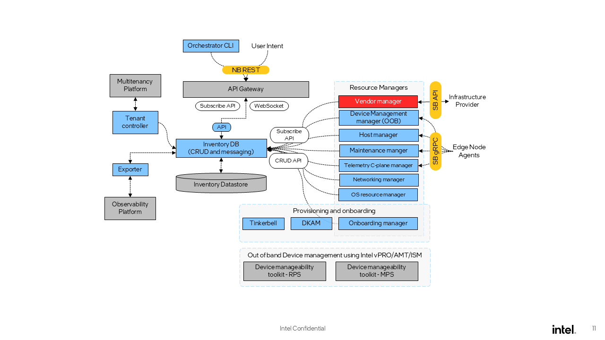

Architecture
============

Edge Infrastructure Manager is a modular and extensible framework that enables
users to manage, monitor, and control physical equipment inventory deployed
at the edge locations. It leverages the integration capabilities of the
following key components and services:

**Inventory**

|hr|

:doc:`Inventory <arch/components/inventory>`
is the state store and the only component that persists
state in Edge Infrastructure Manager. It works in a declarative manner, by storing for some of the
abstractions not only the current state but also the desired state.

Inventory is a key component of Edge Infrastructure Manager, and is used by all
the Resource Managers to determine what actions need to be taken.

**Inventory Exporter**

|hr|

`Inventory Exporter <components/inventory-exporter>`_
exports, using a `Prometheus\* toolkit
<https://prometheus.io/>`_ compatible interface, Inventory metrics that cannot
be collected directly from the edge node software. Observability services then
scrape those metrics.

**Tenant Controller**

|hr|

`Tenant Controller <https://github.com/open-edge-platform/infra-core/tree/main/tenant-controller>`_
orchestrates tenant creation and deletion within the Edge
Infrastructure Manager domain.

**Orch CLI**

|hr|

`Orch CLI <https://docs.openedgeplatform.intel.com/edge-manage-docs/main/user_guide/set_up_edge_infra/orch_cli/orch_cli_guide.html>`_
Tool (Similar to kubectl)
is a binary executable that provides a command-line interface for managing EMF. It allows users to
perform various tasks related to the deployment and
management of edge devices and services.

**Onboarding and Provisioning Subsystem**

|hr|

`Onboarding and OS Provisioning Subsystem <arch/components/onboarding-provisioning>`_
drives Onboarding (device discovery)
and Provisioning (OS installation on Edge Nodes) processes. Internally, it leverages
the `Tinkerbell <https://tinkerbell.org/>`_ engine to perform the initial bootstrapping
and remote provisioning of Edge Nodes with the help of other Edge Infrastructure Manager components,
namely Dynamic Kit Adaptation Module (DKAM) and Onboarding Manager.

**Device Management Toolkit**

|hr|

`Device Management Toolkit <https://github.com/device-management-toolkit/docs>`_
offers open-source microservices, applications
and libraries designed to simplify and accelerate the integration of Intel’s out-of-band management technology (vPro® AMT) into software solutions.

**API**

|hr|

`API <https://github.com/open-edge-platform/infra-core/tree/main/apiv2>`_ provides a northbound REST API that can be accessed by users and other
Open Edge Platform services. It is a horizontally scalable stateless
service.

**Resource Managers**

|hr|

:doc:`Resource Managers <arch/components/resource-managers>`
work in tandem with the :doc:`Edge Node agents </developer_guide/agents/index>`
to perform the actual work on the edge infrastructure. Resource Managers are
modular, stateless and, depending on the varieties of infrastructure required or
available, different sets of Resource Managers will be deployed.

.. note::

   - :doc:`/developer_guide/agents/index` are optional software that may be needed under a
     Resource Manager when the infrastructure component does not have an external
     `API <#api>`__, or needs a more complicated interaction to be implemented. The
     connection between Agent and Resource Manager is implementation specific,
     and may depend on a variety of factors, but typically the Agent would
     contact the Resource Manager in order to cross network boundaries.

   - **“Providers”** are downstream services that communicate with Resource Managers
     and expose an API to control and manage the infrastructure, thus creating a
     layered architecture.

.. |hr| raw:: html

   

.. toctree::
   :hidden:

   ./arch/components

