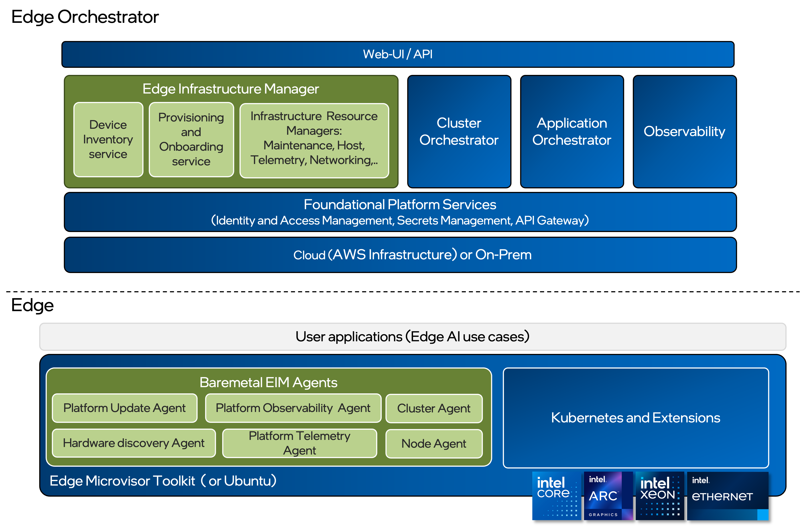

================================================================================
Edge Infrastructure Manager
================================================================================

Edge Infrastructure Manager offers policy-based secure life cycle management
of a fleet of edge nodes/devices at scale, spread across distributed locations
allowing onboarding, provisioning, inventory management, upgrades and
enabling local execution of applications.

In the simplest terms, Edge Infrastructure Manager is responsible for
maintaining operating systems of a target type and version as needed to meet
operational requirements of applications and services while informing higher
level services such as Application and Cluster Orchestration about hardware
capabilities and computing resources available at the edge.

The platform is designed to be modular and extensible, allowing for the
integration of new components and services.

It can also control and manage devices that are not directly connected to the
platform, by leveraging vendor specific extensions to interact with external
facing APIs exposed by the infrastructure.

Features
^^^^^^^^

- Onboarding and OS provisioning of an edge device in under 7 minutes.
- Support concurrent onboarding of up to 50 edge devices.
- Support concurrent OS provisioning of up to 1000 edge devices.
- Support concurrent normal operations of up to 10,000 edge devices.
- Zero-touch Onboarding and OS provisioning edge devices without the need for a
  keyboard and monitor. Local USB and remote HTTPs based OS provisioning
  support.
- Support Atomic Upgrade and Rollback with Edge Microvisor Toolkit Package base Update for
  Ubuntu LTS.
- Trusted Node with Secure Boot and full disk encryption.

- Wide range of Supported hardware based on Intel® Core™, Intel® NPU, and Intel® Xeon®
  platforms with single/multiple storage, Intel® GPU and Ethernet.

Key Benefits
^^^^^^^^^^^^^^^

Developer benefits
------------------

The platform provides the following benefits to developers who want
to integrate Edge Infrastructure Manager into their solutions:

- Model-based design structure and cloud-native principles for scalability,
  maintenance, and extensibility.
- Exposing CRUD based North bound APIs for UI/User for managing resources.
- Exposing APIs to cluster and application orchestrator to manage Kubernetes*
  and applications on a fleet of devices.

Customer benefits
-----------------

End users who want to deploy, manage, and monitor applications on the
edge using Open Edge Platform will take advantage of:

- Organizing edge devices into a hierarchical structure of organizations,
  regions, and sites, and enforce policies with multi-tenancy support.
- Secure device onboarding and operating system provisioning. Supporting
  immutable Edge Microvisor Toolkit Operating System and Ubuntu LTS.
- Support for Fleet level Operating system upgrades.
- Policy based deep observability (Alerts, metrics, logs and telemetry) or
  hardware and software resources at fleet level.
- On-cloud or on-premises deployment.

Target audience
^^^^^^^^^^^^^^^

The target audience for this guide includes developers, architects, and who are
interested in understanding, modifying, extending, or contributing to the
Edge Infrastructure Manager of the Open Edge Platform. Additionally, this guide
is meant to support System Integrator (SI) Installer, System/IT Admin, Field Tech,
and Software Engineer/QA Validation. All these roles may not contribute to the
project but they all need to understand the :doc:`architecture <architecture>` and
:doc:`data flow <arch/data_flow>` of the system.

- **SI Installer** installs for the SI or for the Managed Service Provider
  (MSP) the Edge Infrastructure Manager Backend services (Day 0). May intervene
  on behalf of other users if needed (Day 1 and Day 2) for all sites and all
  tenants.

- **System/IT Admin** manages operation, including provisioning new nodes, new
  sites, (Day 1) applying patches, incident response etc (Day 2), for a tenant
  across all sites/Edge locations.

- **Field Tech** a technician typically contracted, authorized for on-site
  installation (Day 1), maintenance and incident response (Day 2).

- **Software Engineer/QA Validation Engineer** personas that are from SI or
  Cloud Providers who consume Open Edge Platform software and build
  their own Backend service based on in (Day 0). They may also be involved in
  troubleshooting and debugging issues (:doc:`Day 2 <arch/day2_flow>`).

Finally, end users who want to deploy, manage, and monitor applications on the
edge using Open Edge Platform will also find the User Guide and API
Guide useful.

Learn more
^^^^^^^^^^

- For details on key components and services of Edge Infrastructure Manager,
  check :doc:`Architecture <architecture>`.
- Check :doc:`Tutorials <tutorials>` to learn how to extend Edge Infrastructure
  Manager software capabilities.

.. toctree::
   :hidden:

   architecture
   ./arch/data_flow
   ./arch/scalability
   ./arch/provisioning
   ./arch/deployment
   ./arch/day2_flow
   ./arch/multi_tenancy
   ./arch/extensibility
   ./arch/security
   tutorials