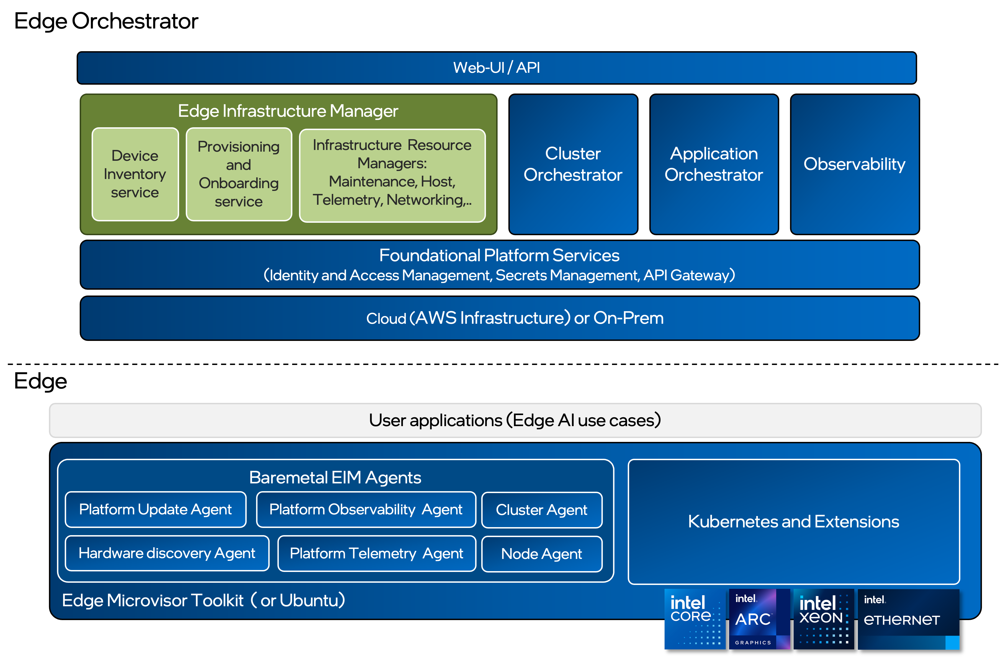

Edge Infrastructure Manager
=============================

Overview
---------------

Edge Infrastructure Manager is a policy based secure life cycle and centralized
control plane of fleet of edge devices spread across distributed locations
enabling local execution of applications.

Edge Infrastructure Manager domain is highlighted in green.

Customers Highlights
^^^^^^^^^^^^^^^^^^^^^^^^^^^

- Organize edge devices into a hierarchical structure of organizations,
  regions, and sites, and enforce policies with multi-tenancy support.

- Secure device onboarding and operating system provisioning. Supporting
  immutable Edge Microvisor Toolkit Operating System and Ubuntu LTS.

- Support for Fleet level Operating system upgrades.

- Policy based deep observability (Alerts, metrics, logs and telemetry) or
  hardware and software resources at fleet level .

- Can be deployed on-cloud or on-premises.

Developers Highlights
^^^^^^^^^^^^^^^^^^^^^^^^^

- Built with model-based design and cloud-native principles for scalability,
  maintenance, and extensibility.

- Expose CRUD based North bound APIs for UI/User for managing resources.

- Expose APIs to cluster and application orchestrator to manage Kubernetes*
  and application on fleet of devices.

Key Performance Indicators
----------------------------------

- Onboard and OS provision edge device in under 7 minutes. Concurrent
  onboarding of up to 50 edge devices.

- Support concurrent 10,000 edge devices for normal operations and 1000 edge
  devices OS provisioning.

- Support Atomic Upgrade and Rollback with Edge Microvisor Toolkit Package base Update for
  Ubuntu LTS.

- Trusted Node with Secure Boot and full disk encryption.

- Zero-touch Onboarding and OS provisioning edge device without need for a
  keyboard and monitor. Local USB and remote HTTPs based OS provisioning
  support.

- Wide range of Supported hardware base on Intel® Core™ and Intel® Xeon®
  platforms with single/multiple storage, Intel® GPU and Ethernet.

.. toctree::
   :hidden:
   :maxdepth: 1

   arch/index
   tutorials/index
