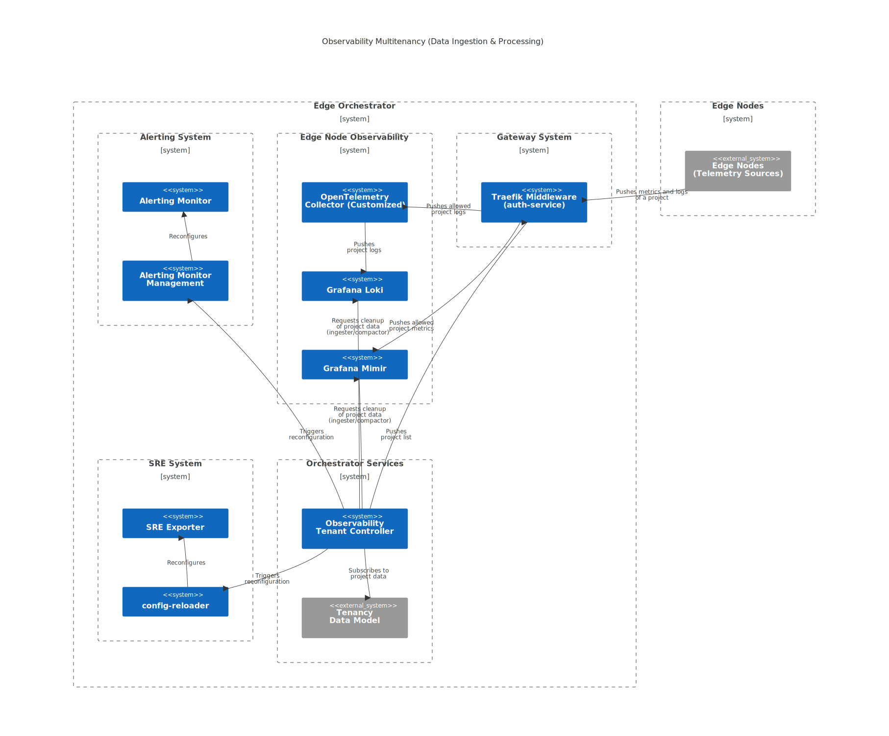
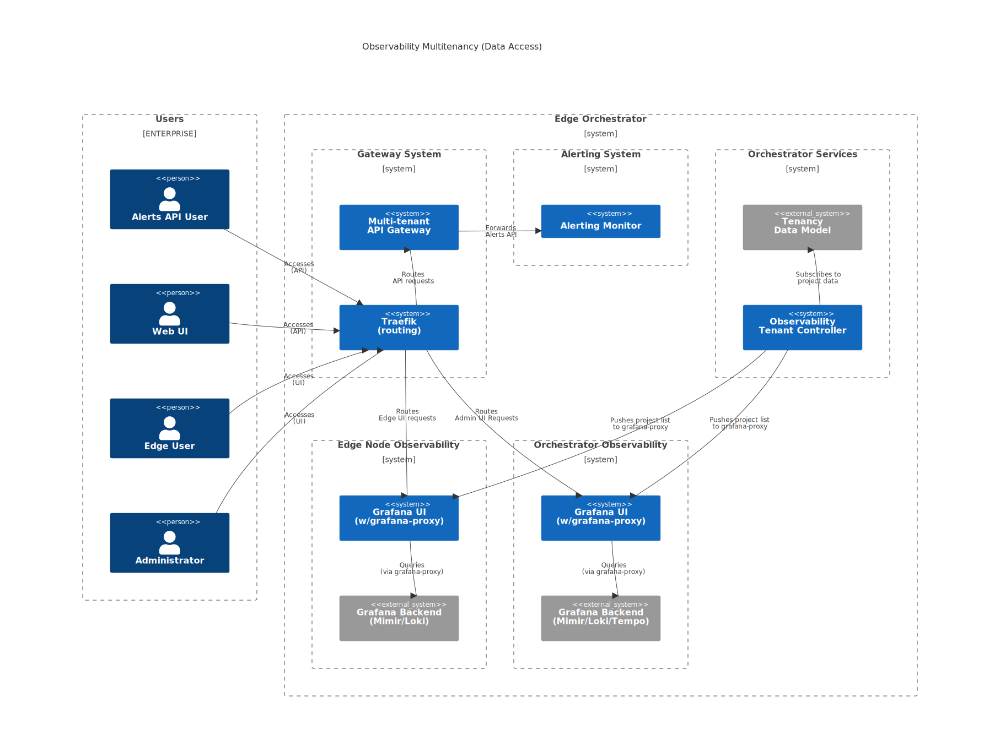

Multitenancy
============

The Observability solution at the Edge Orchestrator level (omitting parts
residing at the Edge Nodes) is at the highest level divided into:

- **Edge Node Observability** which focuses on receiving, processing, and
  querying the data originating at the Edge Node enriched by data from
  Orchestrator services that manage Edge Nodes (Edge Infrastructure Manager)
  and contents deployed there (Application Deployment Manager).

- **Orchestrator Observability** which focuses on receiving, processing, and
  querying the data originating from the Edge Orchestrator itself (including the
  Edge Node Observability stack), and providing an overall administrative view
  of Edge Orchestrator and the Edge Nodes.

Data isolation due to multi-tenancy is critical for **Edge Node Observability**
stack which presents per-project information. **Orchestrator Observability**
stack provides an administrative view of the multi-tenant system so data from
all projects can be reviewed in a single place.

A project uniquely identified by ``projectId`` is a smallest unit of tenant
isolation and represents a logical tenant.

Overview
--------

To support multi-tenancy, the Observability system relies on the platform-wide
**Tenant Manager** service to learn about created/removed tenants via the
**Tenancy Data Model**.

All data ingested and processed by the Observability system operate under
following assumptions:

* A single Edge Node belongs entirely to a single tenant (a single project
  within a single organization).

* To ship data to the Observability system, the Edge Node must present a valid
  IdP token containing the role that identifies the tenant (project) it belongs
  to.

* All metrics and logs contain **projectId** label (matching globally unique
  projectId from the data model) to select and visualize data in the UI and
  properly route generated Alerts.

* All metrics and logs sent from the :doc:`/developer_guide/agents/index` are shipped with
  **X-Scope-OrgID** HTTP header carrying the Edge Node's assigned tenant
  identifier (equal to **projectId**).

* All metrics and logs sent from clusters and apps deployed on the Edge Node
  will be shipped with **X-Scope-OrgID** HTTP header carrying the Edge Node's
  assigned tenant identifier (effectively **projectId**).

All data queried via the Observability system require providing **projectId**
context, which is used:

* to access Alerting API exposed by **Alerting Monitor** via the platform-wide
  **Multi-tenant API Gateway** service.

* to access metrics and logs via Grafana UI that utilizes ``grafana-proxy`` to
  filter data based on the provided IdP token.

.. note::
  Tokens from IdP (Keycloak) carry project identifiers which uniquely point to
  an active project within an active organization or allow cross-project
  administrative access. This information is used to enforce access control to
  observability data related to the project. Refer to **Edge Orchestrator User
  Guide** for more details on groups and roles.

Observability Tenant Controller Service
---------------------------------------

**Observability Tenant Controller** manages other observability services that
handle multi-tenant data and responds to events of adding and removing projects
on the Edge Orchestrator. It is a single, stateless instance that gracefully handles
failures and restarts. It manages tenants using orchestrator-internal APIs.

Additionally, it provides list of active projects (tenants) via gRPC stream
service and exposes project metadata metrics via REST.

Key interactions of **Observability Tenant Controller** include:

- **Tenancy Data Model**

  - Subscribes to project creation and removal events.
  - Notifies completion of project creation/removal.

- ``Alerting Monitor`` (via gRPC to ``alerting-monitor-mgmt``)

  - Executes the initialization procedures for alerting rules.
  - Executes removal/db cleanup of rules and email notification rules.

- ``Grafana Mimir`` **compactor** and **ingester** (via REST APIs)

  - Issues asynchronous request for data removal.
  - Monitors data removal status.

- ``Grafana Loki`` **compactor** and **ingester** (via REST APIs)

  - Issues asynchronous request for data removal.
  - Monitors data removal status.

- ``SRE Exporter`` (via gRPC to ``config-reloader``)

  - Updates set of active projects to enable up-to-date all-tenant queries.

- ``grafana-proxy`` (via gRPC stream)

  - Extends the Grafana UI capabilities.
  - Updates set of active projects for Grafana Datasource tenant filtering.

- ``auth-service`` (via gRPC stream)

  - Runs as custom Traefik middleware.
  - Blocking traffic from tenants that are not active.

.. note::
   Full **projectId** list must be supplied via **X-Scope-OrgID** header to view
   multiple tenants since open-source Grafana services do not support
   wildcard-based queries of tenants - applies to both ``Grafana`` UI
   datasources and ``SRE Exporter``. This functionality is provided by the
   ``grafana-proxy`` service using data provided by ``Observability Tenant
   Controller``.

Architecture Diagrams
---------------------

Security
--------

The Observability system is designed to ensure that data from different tenants
is isolated and that access to the data is controlled. The following security
measures are in place:

* **Data Isolation**: All Edge Node data ingested and processed by the
  Observability system is tagged with a **projectId** label to ensure that data
  from different tenants is isolated. Administrative data about the
  Orchestrator services are kept as a separate tenant.

* **Access Control, Authentication, and Authorization**:

  * Access to the Observability system is controlled via IdP (Keycloak) which
    defines groups and roles for users. Refer to **Edge Orchestrator User
    Guide** for more details on groups and roles.

  * Access is granted via a role-based JWT system with per-project granularity
    that is verified on incoming requests:

    * On write path via the ``auth-service`` service deployed as Traefik
      middleware.

    * On read path via the ``grafana-proxy`` service deployed alongside Grafana
      UI.

  * Grafana UI delegates logging in to Keycloak via OAuth.

* **Encryption**: All data transmitted between the Edge Nodes and the
  Observability system is encrypted to ensure the security and privacy of the
  data.

* **Monitoring and Logging**: The Observability system includes monitoring and
  logging capabilities with per-project granularity to track and audit access
  to the system and detect any security incidents.

Accessing collected telemetry data
~~~~~~~~~~~~~~~~~~~~~~~~~~~~~~~~~~

* Access to **all projects** (unrestricted, admin access)

  * ``Service-Admin-Group``

    * Has resource access via telemetry-client/admin role.
    * Allows accessing **Edge Node Observability** and **Orchestrator
      Observability** Grafana UI endpoints as ``Admin``.

  * ``SRE-Admin-Group``

    * Has resource access via telemetry-client/viewer role.
    * Allows accessing **Edge Node Observability** and **Orchestrator
      Observability** Grafana UI endpoints as ``Viewer``.

* Access **per <project-id>** (restricted access)

  * Has resource access via ``<project-id>_tc-r`` role.

    * Currently present in realm_access as the rest of per-project roles.

  * Applies to users having groups:

    * ``<project-id>_Edge-Operator-Group``
    * ``<project-id>_Edge-Manager-Group``
    * ``<project-id>_Host-Manager-Group``

  * Allows accessing ``observability-ui`` on UI as ``Viewer``.

Using Alerts API
~~~~~~~~~~~~~~~~

* Access to **all projects** (unrestricted, admin access)

  * ``Service-Admin-Group``

    * Has access in UI to alerts (firing) and alert definitions (read and
      configure) via ``alrt-rw`` role.
    * Has access in UI to alert receivers (emails read and configure) via
      ``alrt-rx-rw`` role.

  * ``SRE-Admin-Group``

    * Has access in UI to alerts (firing) via ``alrt-r`` role.

* Access **per <project-id>** (restricted access)

  * ``<project-id>_Edge-Manager-Group``

    * Has access in UI to alerts (firing) and alert definitions (read and
      configure) via ``<project-id>_alrt-rw`` role.

  * ``<project-id>_Edge-Operator-Group``

    * Has access in UI to alerts (firing) and alert definitions (read only) via
      ``<project-id>_alrt-r``.

.. toctree::
   :hidden:
   :maxdepth: 3
