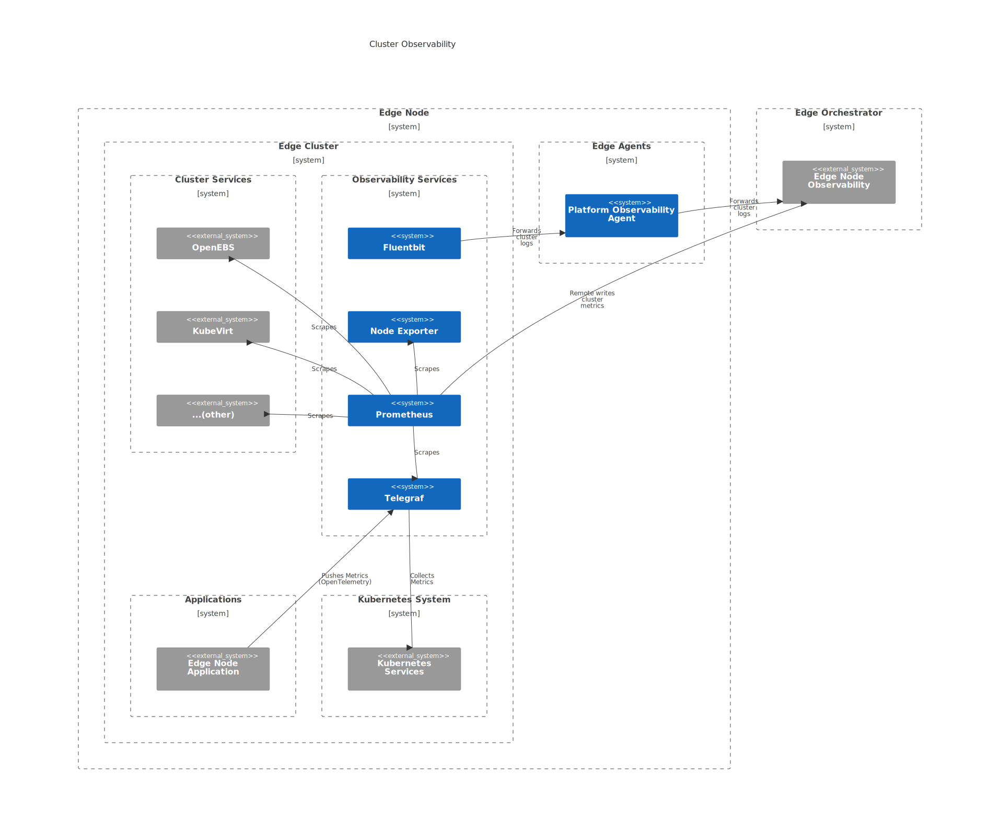

Clusters (Edge Node)
====================

Edge Node observability for **Clusters** provides visibility into the health
and performance of the Kubernetes* cluster deployed on the Edge Node. For
cluster telemetry, the shipping to a centralized location is done via two
separate channels. **Note** observability extensions are not installed by default
on the Edge Node Cluster and must be installed by the user.

* **Logs** are collected via ``Fluentbit`` instance and forwarded to
  :doc:`/developer_guide/agents/arch/platform_observability`,
  which handles shipping logs.

* **Metrics** are collected via ``Prometheus`` instance running in the cluster
  and shipped directly to Edge Orchestrator via RemoteWrite protocol. Metrics
  collection is done via the following components:

   * **Node Exporter** collects essential cluster node metrics.

   * **Telegraf** collects cluster metrics from Kubernetes API and exposes
     OpenTelemetry endpoint for applications to push workload metrics.

   * **Prometheus** collects metrics via ``ServiceMonitor`` CRs provided by
     **Edge Node Cluster Services** (for example, OpenEBS, KubeVirt).

.. note::
   Refer to :doc:`clusters` and
   :doc:`/developer_guide/app_orch/arch/data_model`
   section for more details on deploying clusters on the Edge Node, which
   installs the base set of cluster extensions that include observability
   services.

.. note::
    All data originating from a single Edge Node Cluster is associated with a
    single project (tenant). Refer to :doc:`../concepts/multitenancy` section
    for more details on how multitenancy in observability is handled.

