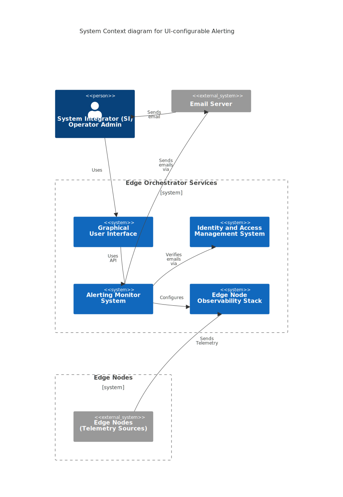
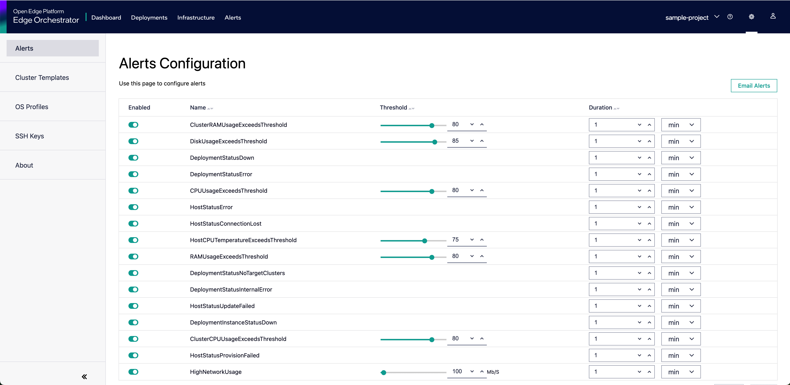
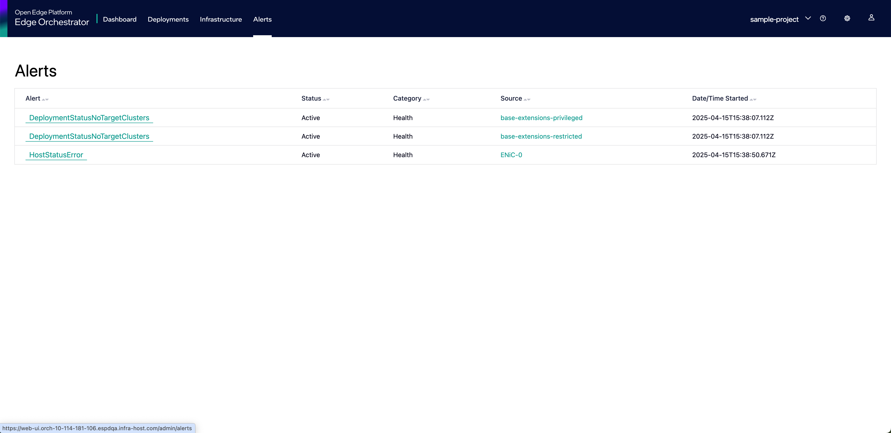

Alerting Monitor
================

The Alerting functionality:

* Introduces additional components (``Alerting Monitor System`` consisting of
  ``Alerting Monitor`` and ``Prometheus Alertmanager``).

* Adds extensions to existing components (``Grafana Mimir Ruler`` in ``Edge
  Node Observability Stack``).

* Integrates with other ``Edge Orchestrator Services`` (``Identity and Access
  Management System``, ``Infrastructure Management`` or ``Graphical User
  Interface``).

It depends on established flow of telemetry data from ``Edge Nodes`` to the
``Edge Node Observability Stack`` and the presence of external ``Email Server``
for delivering emails.

Overview
--------

To expose configurable Alerting capability, ``Alerting Monitor`` service
introduces a REST API that:

- is backed by its own configuration database
- allows reconfiguration of stored alert definitions
- relays alert and storage to dependent component (``Prometheus Alertmanager``)
- aggregates, transforms, and filters alert data obtained via proxying requests
  to ``Prometheus Alertmanager``

The ``Alerting Monitor`` service's responsibility is also maintenance of
coherent alerting configuration of dependent components via a set of internal
controllers referred to as ``External Services Controller``:

- ``Grafana Mimir Ruler``: part of ``Edge Node Observability Stack`` that is
  the main generator of rules-based alerts from ``Edge Nodes`` telemetry.

- ``Prometheus Alertmanager``: standalone component of ``Alerting Monitor
  System`` that is responsible for grouping, routing, and sending alerts
  through email channel.

Deployment
----------

``Alerting Monitor`` is deployed in HA mode and supports operation of multiple
replicas, but with just only one instance at a time actively controlling
(modifying) the configuration of dependent components. Coordination of tasks
between replicas is done via service's transactional database. A
reconfiguration task executed by a replica implements a timeout, so if this
replica fails, the task can be picked up by another replica. Alerting Monitor
uses Horizontal Pod Autoscaler (HPA) to dynamically scale the number of its
replicas.

The service exposes both ``liveness`` and ``readiness`` Kubernetes probes. The
service is considered alive and ready to accept API requests when:

- Service startup from supplied configuration is completed.
- Database initialization/migration procedures are complete.
- Connectivity to dependent services is verified.

The ``Prometheus Alertmanager`` dependent component is deployed in cluster mode
(all replicas are receiving alerts from ``Grafana Mimir Ruler``) and is
responsible for deduplication and grouping of all received alerts.

Internally, the service is composed of the following sub-components:

* ``alerting-monitor`` core service that exposes REST API for alert
  configuration management and reconfiguration of dependent services.

* ``open-policy-agent`` (OPA) policy engine for API access control.

* ``management`` exposes gRPC API to reload configuration for handling
  Multitenancy.

Refer to :doc:`../concepts/multitenancy` section for more details on how
multitenancy in observability is handled.

Configuration
-------------

The service is supplied with a ``YAML`` based configuration containing default
alert definitions that conform to `Prometheus alerting rules schema
<https://prometheus.io/docs/prometheus/latest/configuration/alerting_rules/>`_.
This configuration is additionally templated via Helm Chart to support
different evaluation and aggregation intervals.

This default alerts configuration is used to populate the database with initial
definitions to be applied and can be used to restore default actions.

The service is supplied with a ``YAML`` based configuration containing
configuration required for alert delivery channel. The only supported
``Receiver`` type is ``email`` and it needs to conform to `Prometheus
Alertmanager email_config schema
<https://prometheus.io/docs/alerting/latest/configuration/#email_config>`_.

This default alert delivery channel configuration is applied to all alerts
managed by the service.

The service supports graceful shutdown since configuration reloading may
require restart.

Refer to :doc:`../../tutorials/development/email-notifications` section for
detailed information on configuring the Alerting Monitor Email Notifications.

REST API (Northbound)
---------------------

The exposed Northbound API is proxied through Multi Tenancy API Gateway. Refer
to **API Guide** for detailed Alerts API reference.

REST API requests originating are handled:

- *Asynchronously* if they translate to requests that require changing the
  configuration of other services.

- *Synchronously* if they translate to only read requests on dependent
  services.

Asynchronous API call example
~~~~~~~~~~~~~~~~~~~~~~~~~~~~~

.. image:: ./images/asynchronous_api_call_example_diagram.svg
   :alt: Asynchronous API call handling example
   :align: center
   :width: 100%

Synchronous API Call Example
~~~~~~~~~~~~~~~~~~~~~~~~~~~~~

.. image:: ./images/synchronous_api_call_example_diagram.svg
   :alt: Asynchronous API call handling example
   :align: center
   :width: 100%

User Interface (UI)
~~~~~~~~~~~~~~~~~~~~~~~~~~~~~

The User Interface (UI) provides support for configuring alerts under the Settings tab (gear icon in the top right corner of the UI).
The UI allows users to configure thresholds and durations for alerts, as well as the email addresses to which alerts should be sent.

It also provides a view of the alerts that have been reported by the system.

