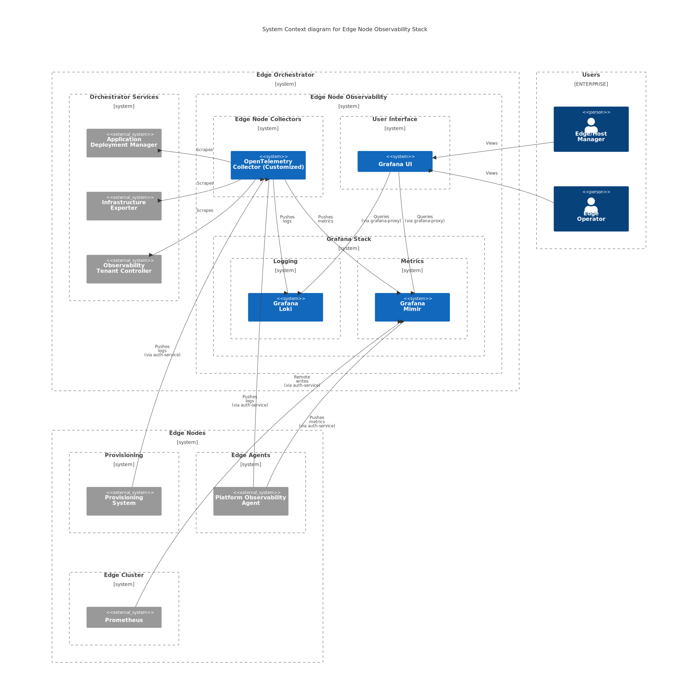

Edge Node Observability Stack
=============================

The Edge Node Observability stack is intended for Edge & Host Managers and Host
Operators to monitor the following aspects of Edge Nodes:

* :doc:`../edgenode/hosts` - telemetry from the hosts of the Edge Node
  (including provisioning).

* :doc:`../edgenode/clusters` - telemetry from the cluster running on the Edge
  Node.

* :doc:`../edgenode/apps` - telemetry from the applications running on the Edge
  Node.

Key components of observability stack that allow collection, storage, and
consumption of metrics, logs, and traces are:

* ``Grafana UI`` - provides the frontend for visualization.

* ``OpenTelemetry Collector`` (Customized):

  * Provides logs collection pipelines with log transformation.

  * Collects supplementary metrics from orchestrator services.

  * Routes logs and metrics to appropriate tenants based on metadata.

* ``Grafana Mimir`` - used as metrics backend.

* ``Grafana Loki`` - used as logs backend.

.. note::
   To restrict access to data associated with individual tenants, a
   ``grafana-proxy`` custom extension is used while accessing datasources.
   Refer to :doc:`../concepts/multitenancy` for more details on how
   multitenancy in observability is handled.

Deployment
----------

The stack is separated into following ArgoCD applications:

* ``edgenode-observability`` - provides core services of the observability
  stack (for example, Grafana UI, Grafana Mimir, Grafana Loki, OpenTelemetry
  Collector).

* ``edgenode-dashboards`` - provides Grafana UI dashboards for Edge Node Hosts,
  Clusters, and Applications.

Storage
-------

``Grafana Mimir`` and ``Grafana Loki`` are configured to use:

* **AWS S3** for cloud-based deployments
* S3-compatible storage (**MinIO**) for on-prem deployments

.. toctree::
   :maxdepth: 3
