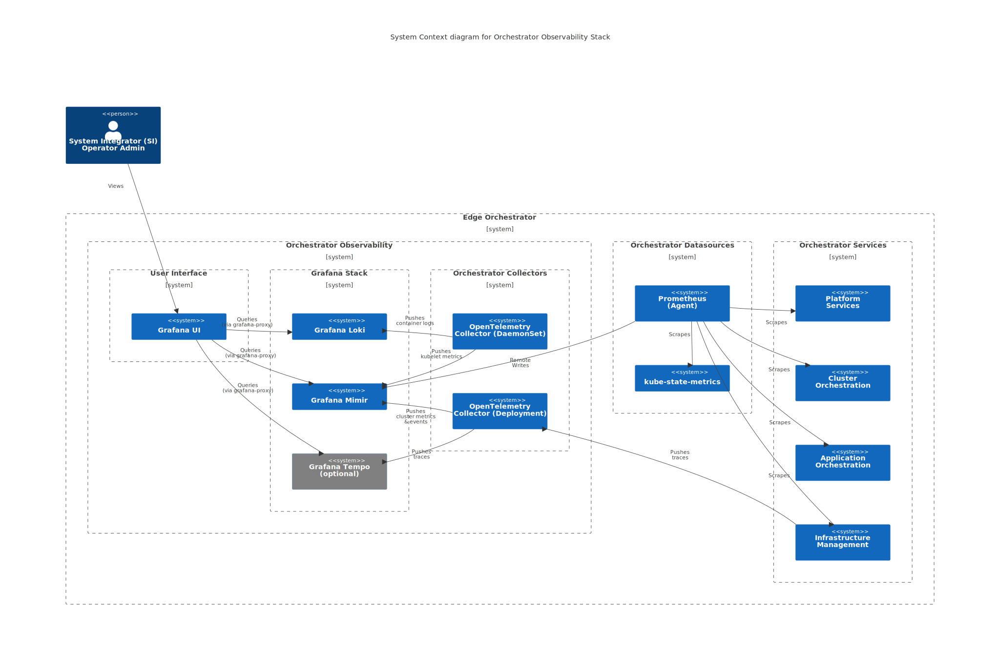

Edge Orchestrator Observability Stack
=====================================

The Edge Orchestrator Observability stack is intended for System Administrators to
monitor the |software_prod_name| core services that include:

* **Platform Services**
* **Edge Infrastructure Manager**
* **Cluster Orchestration**
* **Application Orchestration**

Key components of observability stack that allow collection, storage, and
consumption of metrics, logs, and traces are:

* ``Grafana UI`` - provides the frontend for visualization.

  * As an administrative interface, it also has access to all the data sources
    from Edge Node Observability stack - refer to :doc:`edgenode-observability`
    for more details.

* ``Grafana Mimir`` - used as metrics backend.

* ``Grafana Loki`` - used as logs backend.

* ``Grafana Tempo`` - used as traces backend.

* ``OpenTelemetry Collector`` (DaemonSet & Deployment):

  * Provides telemetry collection pipelines.
  * Collects cluster logs and subset of cluster metrics and events.

* ``Prometheus`` / ``Prometheus Operator`` - collecting metrics from Edge
  Orchestrator services via Service Monitors.

* ``kube-state-metrics`` - collecting metrics from Kubernetes* Cluster
  resources.

.. note::
   To access data across multiple tenants, a ``grafana-proxy`` custom extension
   is used while accessing datasources. Refer to :doc:`../concepts/multitenancy`
   section for more details on how multitenancy in observability is handled.

.. note::
   Tracing is an optional feature and needs to be explicitly enabled. Currently,
   only the **Infrastructure Management** services are instrumented for tracing.

Deployment
----------

The stack is separated into following ArgoCD applications:

* ``prometheus-crd`` - provides CRD in early syncWave for other applications to
  set up Service Monitors.

* ``orchestrator-prometheus-agent`` - provides collection of cluster metrics
  (e.g.: kube-state-metrics).

* ``orchestrator-observability`` - provides core services of the observability
  stack (for example, Grafana UI, Grafana Mimir, Grafana Loki, Grafana Tempo,
  OpenTelemetry Collector).

* ``orchestrator-dashboards`` - provides Grafana UI dashboards for Edge
  Orchestrator services.

Storage
-------

``Grafana Mimir``, ``Grafana Loki``, and ``Grafana Tempo`` are configured to
use:

* **AWS S3** for cloud-based deployments
* S3-compatible storage (**MinIO**) for on-prem deployments

.. toctree::
   :maxdepth: 3
