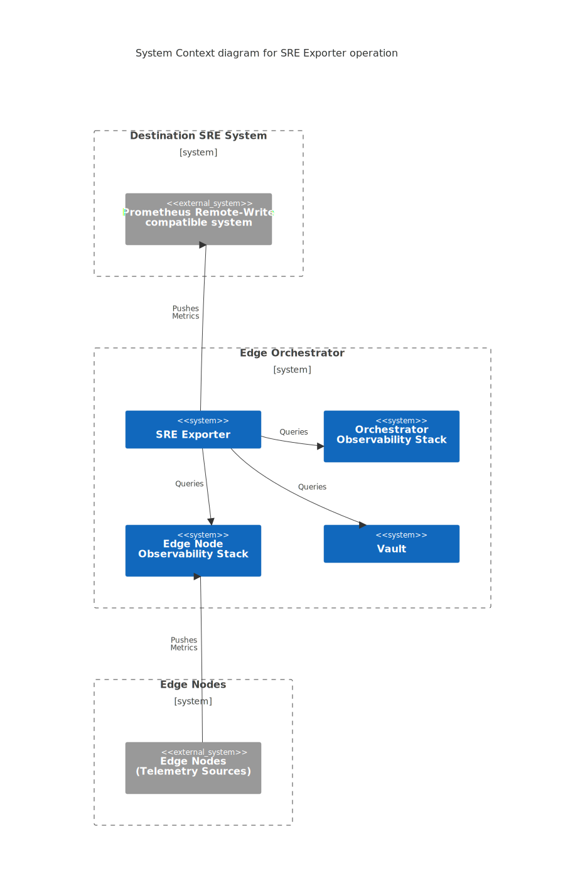

Site Reliability Engineering (SRE) Exporter
===========================================

Overview
--------

The SRE Exporter is a service running in Edge Orchestrator that perpetually
collects a subset of metrics from both Edge Orchestrator services and the Edge
Nodes, and exports them to a configured external destination server using the
`Prometheus Remote-Write Protocol
<https://prometheus.io/docs/specs/remote_write_spec/>`_.

The SRE Exporter is intended to enhance the reliability of Edge Orchestrator by
allowing it to store and monitor its essential metrics within an independent
Site Reliability Engineering (SRE) system. Such an SRE system may implement its
data retention policy and provide SRE functions like performance monitoring,
incident management, on-call management, and so on. The SRE Exporter allows for
monitoring the following metrics:

* Edge Orchestrator API success rate and latency.

* Edge Orchestrator cluster nodes saturation metrics (CPU and memory).

* Edge Orchestrator Vault status.

* Edge Nodes metrics (CPU, memory, disk, temperature) across all organizations
  and projects.

Architecture Diagram
--------------------

Key Components
--------------

SRE Exporter consists of the following sub-components:

#. ``metrics-exporter`` collects metrics from Orchestrator Observability, Edge
   Node Observability, and Vault instances.
#. ``otel-collector`` scrapes ``metrics-exporter`` and exports data to the
   external destination.
#. ``config-reloader`` exposes gRPC API to reload configuration for handling
   Multitenancy.

Refer to :doc:`../concepts/multitenancy` section for more details on how
multitenancy in observability is handled.

Data Flow
---------

The telemetry data is collected and exported to the Destination SRE System in the following parallel processes:

- Collecting metrics from Orchestrator Observability and exporting them to the Destination SRE System by the SRE Exporter service.
- Pushing Edge Node metrics to Edge Node Observability by Observability Agents running on Edge Nodes.
- Collecting metrics from Edge Node Observability and exporting them to the Destination SRE System by the SRE Exporter service.
- Collecting metrics from Vault and exporting them to the Destination SRE System by the SRE Exporter service.

The diagram below illustrates the data flow for the SRE Exporter operation:

.. image:: ./images/sre_exporter_data_flow.svg
   :width: 100%
   :alt: Data Flow diagram for SRE Exporter operation
   :align: center

Configuration
-------------

The SRE Exporter allows configuring the following settings at deployment time via Edge Orchestrator cluster definition values:

* Export time interval.
* Edge Orchestrator instance-specific label (added to each exported metric).
* TLS for the connection with the destination server:

  - Enable
  - InsecureSkipVerify option
  - Usage of private CA root certificate.

The SRE Exporter allows configuring the following settings at deployment time via installation scripts and/or environment variables:

* Destination server URL.
* Destination server basic authentication credentials.
* Optionally, the server's private TLS CA root certificate.

Additionally, the static configuration of the destination, connection method, and exported metrics is divided across the following files:

* ``otel.yaml`` - configuration of OpenTelemetry Collector focuses on export
  destination and authentication settings.

* ``sre-exporter-edge-node.json`` - configuration of metrics collector focused
  on data from **Edge Node Observability**.

* ``sre-exporter-orch.json`` - configuration of metrics collector focused on
  data from **Orchestrator Observability**.

Refer to **User Guide** for detailed information on configuring the SRE
Exporter.

Appendix: Exported Metrics
---------------------------

.. list-table:: Exported Orchestrator Metrics
   :header-rows: 1

   * - Name
     - Type
     - Description
   * - orch_IstioCollector_istio_requests
     - Counter
     - The total count of HTTP/GRPC requests processed by Istio Proxies
   * - orch_NodeCollector_cpu_total_cores
     - Gauge
     - Total CPU cores per node
   * - orch_NodeCollector_cpu_used_cores
     - Gauge
     - Used CPU cores per node
   * - orch_NodeCollector_memory_total_bytes
     - Gauge
     - Total memory per node in Bytes
   * - orch_NodeCollector_memory_available_bytes
     - Gauge
     - Current available memory per node in Bytes
   * - orch_api_requests_all
     - Counter
     - The total count of HTTP requests processed
   * - orch_api_request_latency_seconds_all
     - Counter
     - Histogram of HTTP request latencies

.. list-table:: Exported Edge Node Metrics
   :header-rows: 1

   * - Name
     - Type
     - Description
   * - orch_edgenode_env_temp
     - Gauge
     - Temperature of a sensor on Edge Node host [Celsius]
   * - orch_edgenode_mem_used_percent
     - Gauge
     - Percentage of used memory vs total memory on Edge Node host
   * - orch_edgenode_disk_used_percent
     - Gauge
     - Percentage of used vs total available space on a disk of Edge Node host
   * - orch_edgenode_cpu_idle_percent
     - Gauge
     - Percentage of idle vs total CPU cycles on Edge Node host

.. list-table:: Exported Vault Metrics
   :header-rows: 1

   * - Name
     - Type
     - Description
   * - orch_vault_monitor_vault_status
     - Gauge
     - The current status of vault instance ready:0, sealed:1, standby:2

.. toctree::
   :maxdepth: 3
