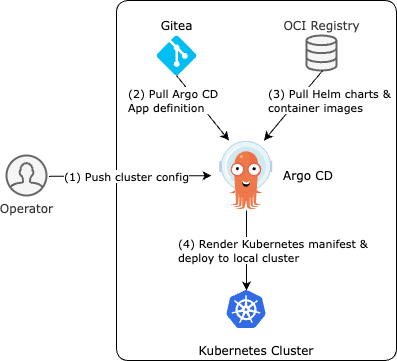
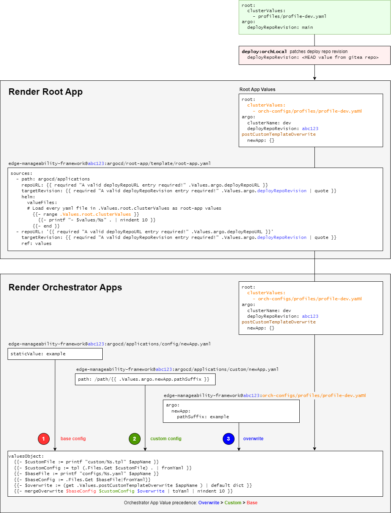

Argo\* CD Architecture
======================

Background
----------

`Argo\* CD <https://argoproj.github.io/cd/>`_ is a declarative, GitOps
continuous delivery tool for Kubernetes\*. It is a CNCF graduated project used
by hundreds of large enterprises to manage their Kubernetes\* applications.
Argo CD automates the deployment of the desired application states in the
specified target environments. By using Git as the source of truth for
application definitions, configurations, and environments, Argo CD ensures that
the state of applications is always consistent and reproducible.

* Open Edge Platform chooses Argo CD as the continuous delivery tool
  for Edge Orchestrator deployments*.

Target Audience
~~~~~~~~~~~~~~~

- Solution Architect who would like to understand software lifecycle management
  of Edge Orchestrator.

- Operator who would like to deploy Edge Orchestrator.

Concepts
~~~~~~~~

For detailed concepts and terminologies, refer to the `official Argo CD
documentation <https://argo-cd.readthedocs.io/en/stable/>`_ .

Overview
--------

Both cloud and on-premises Edge Orchestrator deployments follow the same GitOps
workflow as follows:

   edge-manageability-framework

- There is one Argo CD instance and one Gitea instance deployed in each Edge
  Orchestrator cluster.

- During initial deployment, the cloud or on-premises installer

  - instantiates ``edge-manageability-framework`` repository in Gitea with a
    snapshot captured from upstream as the initial commit.

  - prompts user to input cluster-specific configurations (such as domain
    name), generate a cluster configuration in the ``orch-configs/clusters``
    subdirectory, and deploy the Edge Orchestrator applications using Argo CD
    referencing the cluster configuration for deployment settings.

- Argo CD is set to track the ``main`` branch of the Gitea
  ``edge-manageability-framework`` repository by default. (can be changed if
  desired)

In the following sections, we will explain how we design our GitOps repo to
minimize configuration duplication and inconsistency across Edge Orchestrator
instances. We will also go over the development workflow and provide a few
troubleshooting tips.

Architecture Diagram
--------------------

  Figure 1: Argo CD in Edge Orchestrator

1. Operator defines cluster-specific parameters and pushes the information to
   Argo CD.
2. Argo CD fetches the Application definition from the GitOps repository,
   combining it with the cluster-specific parameters from step 1, and renders
   the Argo CD Application CR.
3. Argo CD pulls Helm charts and container images from the OCI registry
   according to the Application CR.
4. Argo CD renders the final Kubernetes manifest of each application, and
   applies it to the cluster.

Key Components
--------------

The Edge Orchestrator deployment only requires the
``edge-manageability-framework`` repository.

``edge-manageability-framework`` repository
~~~~~~~~~~~~~~~~~~~~~~~~~~~~~~~~~~~~~~~~~~~

`https://github.com/open-edge-platform/edge-manageability-framework
<https://github.com/open-edge-platform/edge-manageability-framework>`_

- Root App definition

  - Root App is a special Argo CD Application that is used to bootstrap a
    cluster. It loads cluster-specific configuration and renders the rest of
    the Argo CD Applications.

- Argo CD Applications

  - Definition for each Edge Orchestrator service. For example, chart URL,
    chart version.

- Helm\* template for cluster-specific values

  - for example, cluster name, domain name.

- Installers

  - Cloud installer (including Terraform scripts) and on-premises installer

- Virtual Integration Pipeline (VIP) tests

The repo structure is outlined as follows, last updated on Apr 16, 2025. It is
subject to minor adjustments and omits less important files.

.. code:: text

  .
  ├── argocd
  │   ├── applications
  │   │   ├── configs                # General Orchestrator application settings
  │   │   ├── custom                 # Templates used to provide cluster specific
  │   │   ├                          # settings.
  │   │   ├── templates              # Orchestrator application definitions
  │   └── root-app
  │       ├── templates
  │       │   └── root-app.yaml      # Root app used to bootstrap deployment
  ├── argocd-internal                # Virtual edge node (development/testing)
  ├── bootstrap                      # Configuration required to bootstrap the deployment
  ├── e2e-tests                      # CI/CD Tests
  ├── installer                      # Cloud installer container
  ├── mage                           # Development deployment and test ops implementation
  ├── node                           # Virtual edge node (development/testing)
  ├── on-prem-installers             # On-prem installer implementation
  ├── orch-configs
  │   ├── clusters                   # Cluster configurations
  │   ├── profiles                   # Profiles referenced by Cluster configurations to
  │   ├                              # provide blocks of configuration based on target
  │   ├                              # cluster environment and major component options.
  │   └── templates                  # Templates for generating cluster and platform
  │   └                              # service configuration
  ├── pod-configs                    # Cloud infrastructure Terraform definitions
  ├── tools                          # Miscellaneous tools used to support development
  |                                  # and CI/CD workflows
  └── README.md                      # Something you should always read first :)

``orch-utils`` repository
~~~~~~~~~~~~~~~~~~~~~~~~~

`https://github.com/open-edge-platform/orch-utils
<https://github.com/open-edge-platform/orch-utils>`_

This repo hosts *utility charts* that facilitate the deployment. For example,
*pre-install and post-install hooks* are packaged as small Helm charts that
launch Kubernetes jobs. Deployment order is enforced using Argo CD **sync wave**.

This repo also hosts *Go code and Dockerfile of various deployment tools* such
as ``secrets-config`` used to bootstrap the Edge Orchestrator Vault instance.

These utility charts are generally used by the Edge Orchestrator deployment using
published production versions available from the Edge Orchestrator OCI server. It is
possible to use local development versions of these charts for testing
purposes.

The repo structure is outlined as follows, last updated on Apr 16, 2025. It is
subject to minor adjustments and omits less important files.

IAM incoming.

.. code:: text

  .
  ├── charts                         # Pre/post-install tasks, implemented as K8s jobs
  ├── keycloak-tenant-controller     # Multi-tenancy Keycloak integration
  ├── mage                           # Development deployment and test ops implementation
  ├── Makefile                       # Makefile for standardized build wrappers for Mage targets
  ├── nexus                          # Multi-tenancy library
  ├── nexus-api-gw                   # Multi-tenancy API gateway
  ├── README.md                      # Something you should always read first :)
  ├── squid-proxy                    # Squid Proxy for EN connection forwarding
  ├── tenancy-api-mapping            # Multi-tenancy API
  ├── tenancy-datamodel              # Multi-tenancy data model
  ├── tenancy-manager                # Multi-tenancy manager
  ├── tools                          # Miscellaneous tools such as YAML lint config
  ├── traefik-plugins                # Plugins for Traefik ingress

Data Flow
---------

Our Argo CD repo structure is designed in a way to *minimize config duplication
and inconsistency across multiple environments*. We can see the following
configs in any template in ``edge-manageability-framework:argocd/applications/templates``:

.. code:: yaml

  spec:
    sources:
      - helm:
        valueFiles:
          - '$values/argocd/configs/{{$appName}}.yaml'
        valuesObject:
          {{- $customFile := printf "custom/%s.tpl" $appName }}
          {{- $customConfig := tpl (.Files.Get $customFile) . | fromYaml }}
          {{- $baseFile := printf "configs/%s.yaml" $appName }}
          {{- $baseConfig := .Files.Get $baseFile|fromYaml}}
          {{- $overwrite := (get .Values.postCustomTemplateOverwrite $appName )
          | default dict }}
          {{- mergeOverwrite $baseConfig $customConfig $overwrite | toYaml |
          nindent 10 }}

There are 3 types of Helm values defined here:

- (1) Base values -
  ``edge-manageability-framework:argocd/applications/configs/{appName}.yaml``

  - This is the common, static values shared across clusters/environments.
  - No template. Just static values.
  - Covers ~80% of the values.

- (2) Custom values -
  ``edge-manageability-framework:/argocd/applications/custom/{appName}.tpl``

  - This is cluster/environment-specific values generated from a Helm template.
  - We leverage Helm template such that we can minimize the footprint.

    - Helm value comes from cluster config provided by operator during
      deployment.

  - Covers ~20% of the values.

- (3) Overwrite values - cluster config, in the ``postCustomTemplateOverwrite``
  section

  - This is an arbitrary, raw YAML value.
  - Only use it as a last resort when we need to overwrite something that
    has not been defined in the ``custom`` template yet.
  - It is intended for hotfix and troubleshooting, not for long-term use.

The guideline is to *put as much as possible in (1) and (2), and only use (3)
for short-term, troubleshooting purposes*.

  Figure 2: Argo CD configuration flow

Note that the Helm values passed to the root app during deployment only apply
to the root app.

- The root app can then decide whether it wants to further pass these values
  down to Edge Orchestrator Argo CD applications or not.
- We implemented a Helm value in the root app to support both behaviors.

  - The root app will pass these values to the child app when
    ``.Values.root.useLocalValues`` is set to true.
  - Otherwise, the child app will use the version of values defined in the
    remote orch-configs repo.

Workflow Stages
~~~~~~~~~~~~~~~

Refer to the description in the `Architecture Diagram`_ section.

Extensibility
-------------

This section explains the workflow of modifying existing or introducing new
Argo CD applications for Edge Orchestrator. This is typically done after you
have developed your change in one of the Edge Orchestrator components. Refer to
Edge Orchestrator component development guide at:

Make changes
~~~~~~~~~~~~

Application Definition
^^^^^^^^^^^^^^^^^^^^^^

This is located at
``edge-manageability-framework:argocd/applications/templates/{appName}.yaml``.

Base Value
^^^^^^^^^^

This is located at ``/argocd/applications/configs/{appName}.yaml``.

These values generally come from the default ``values.yaml`` file associated
with the application Helm chart.

Custom Template
^^^^^^^^^^^^^^^

This is located at ``/argocd/applications/custom/{appName}.tpl``

These are values that will need to be specified based on some deployment target
specific value such as the domain name of the target cluster. This usually
requires some effort in taking the specific values and creating a template that
will render those values based on settings that will be defined by the cluster
definition for each deployment target.

Custom Value and feature flag
^^^^^^^^^^^^^^^^^^^^^^^^^^^^^

This is located at ``/orch-configs/clusters/{env}.yaml`` and
``/orch-configs/profiles/*.yaml``

- We need to make sure the values for the aforementioned custom template are
  listed in either:

  - For cluster-specific values, list them directly in
    ``orch-configs:clusters/{env}.yaml``

  - For values shared among multiple clusters with similar characteristics,
    list them in ``/orch-configs/profiles/*.yaml`` and refer to the profile in
    the ``.Values.root.clusterValues`` section of the
    ``/orch-configs/clusters/{env}.yaml``

- Regardless of whether a value is cluster-specific or referred to as a profile

  - Common values shared across multiple applications should be defined under
    ``.Values.argo``.

    - For example, ``.Values.argo.clusterDomain``

  - Values specific to one or a small set of applications should be defined
    under ``.Values.argo.{appName}``.

    - For example, ``.Values.argo.database.type``

- We also need to implement the feature flag that allows us to toggle
  individual components.

  - This should go into the ``.Values.argo.enabled.{appName}`` section in the
    corresponding ``/orch-configs/profiles/enable-*.yaml``

  - For example, ``.Values.argo.enabled.infra-core`` in
    ``orch-configs:profiles/enable-edgeinfra.yaml``

Overwrite Value (optional)
^^^^^^^^^^^^^^^^^^^^^^^^^^

It is totally optional and should only be applied for short-term use. We allow
passing arbitrary YAML to overwrite both base and custom values. This can be
done by creating a file under ``/orch-configs/clusters/{env}.yaml``. The
content of the value should be put under
``postCustomTemplateOverwrite.{appName}``. For example:

.. code:: yaml

  postCustomTemplateOverwrite:
    infra-onboarding:
      # Anything here will be applied without template expansion

Contribution & Review Guidelines
~~~~~~~~~~~~~~~~~~~~~~~~~~~~~~~~

.. note::

  Please read this section thoroughly so we can ensure a delightful and
  efficient review process for both contributors and reviewers.

Common guidelines
^^^^^^^^^^^^^^^^^

Refer to :doc:`/developer_guide/contributor_guide/index` for common
development guidelines.

edge-manageability-framework guidelines
^^^^^^^^^^^^^^^^^^^^^^^^^^^^^^^^^^^^^^^

- Keep application definition (``argocd/applications/templates``) as consistent
  as possible.

  - Need to have strong justification for any difference, such as when adding
    an ``ignoreDifference`` block.

- Minimize config duplication.

  - No need to specify values in base config if it is already defined in custom
    template.

- Make sure any development or local test related changes to ``repoURL`` and
  ``targetRevision`` are reverted before submitting a PR.

orch-utils guidelines
^^^^^^^^^^^^^^^^^^^^^

- Use official images for the pre/post-installation job as much as possible.

Test and submit updates to Edge Orchestrator components
~~~~~~~~~~~~~~~~~~~~~~~~~~~~~~~~~~~~~~~~~~~~~~~~~~~~~~~

- Make desired changes to the to the Orchestrator component application file in
  ``edge-manageability-framework:argocd/applications/templates/{appName}.yaml``.

- Any required changes to component settings in the
  ``edge-manageability-framework:argocd/applications/configs/{appName}.yaml``
  or ``edge-manageability-framework:argocd/applications/custom/{appName}.tpl``
  should also be applied locally.

Use the following commands to test your changes locally:

.. code:: bash

  mage deploy:orchLocal [targetEnv]

- This will push local changes to the ``gitea`` repo hosted in the local Kind
  cluster.

- Call Argo CD to update the Orchestrator deployment in the local Kind cluster.

- The ``targetEnv`` value is the name of the cluster configuration file
  (``orch-configs/clusters/{targetEnv}.yaml``).

Deployment
----------

Please refer to the following pages:

- :doc:`/deployment_guide/cloud_deployment/index`
- :doc:`/deployment_guide/on_prem_deployment/index`

Technology Stack
----------------

Edge Orchestrator leverages open source Argo CD without modification. Please
refer to the `official Argo CD documentation
<https://argo-cd.readthedocs.io/en/stable/>`_ for detailed explanation of its
technology stack.

Security
--------

Please refer to `Argo CD Security
<https://argo-cd.readthedocs.io/en/stable/operator-manual/security/>`_ for
detailed security information.

Authentication
~~~~~~~~~~~~~~

We generate a random admin password when Argo CD is first deployed. The admin
username is ``admin``, and its credential can be retrieved from the Argo CD
secret as follows:

.. code-block:: shell

  kubectl -n argocd get secret argocd-initial-admin-secret -o yaml | yq .data.password | base64 -d

Access Control
~~~~~~~~~~~~~~

Argo CD uses a role-based access control (RBAC) system to manage user access.

Note that we only create a local account for Argo CD. It is not connected to
Keycloak\*, which is the identity provider used for most of the Edge
Orchestrator. There is only one "admin" account by default, and should only be
accessible by the operator of Edge Orchestrator. Additional local accounts can
be created on-demand.

For detailed access control configurations, refer to `RBAC configuration
<https://argo-cd.readthedocs.io/en/stable/operator-manual/rbac/>`_ .

Auditing
~~~~~~~~

For detailed auditing information, refer to `Auditing
<https://argo-cd.readthedocs.io/en/stable/operator-manual/security/#auditing>`_.

Scalability
-----------

For detailed scalability information, refer to `High Availability
<https://argo-cd.readthedocs.io/en/stable/operator-manual/high_availability/>`_
and `Reconcile Optimization
<https://argo-cd.readthedocs.io/en/stable/operator-manual/reconcile/>`_.

Supporting Resources
--------------------

- `Argo CD official website <https://argoproj.github.io/cd/>`_
- `Argo CD official documentation <https://argo-cd.readthedocs.io/en/stable/>`_
- `Argo CD source code <https://github.com/argoproj/argo-cd>`_
- `Argo CD Helm chart
  <https://github.com/argoproj/argo-helm/tree/main/charts/argo-cd>`_
- `Argo CD Application CRD
  <https://github.com/argoproj/argo-cd/blob/master/manifests/crds/application-crd.yaml>`_
