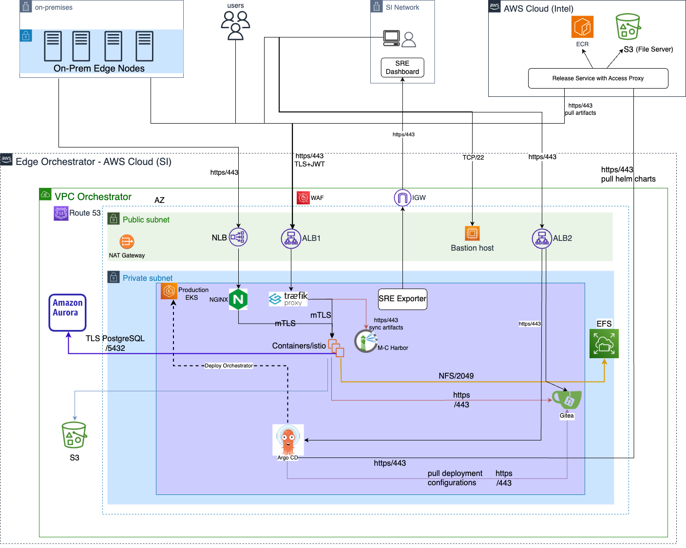

Cloud Architecture
==================

Background
----------

Open Edge Platform can be deployed and provisioned in various environments such
as on-premise and cloud.  For cloud environments, the platform supports Amazon
Web Services\*. This guide provides an overview of the architecture, key
components, and considerations for Edge Orchestrator cloud deployment.

Target Audience
----------------

The target audience for this guide includes developers, architects, and system
administrators who are responsible for deploying and managing Edge
Orchestrator.

End users can refer to the User Guide for further information on how to deploy
and use Edge Orchestrator in the cloud.

Overview
--------

Edge Orchestrator cloud deployment can be provisioned on AWS\* to manage edge
devices and applications.  Edge Orchestrator services are deployed in a
Kubernetes\* cluster. The deployment leverages various AWS services to ensure
scalability, security, and high availability.

Key components include:

- **Amazon EKS**: Hosts the Edge Orchestrator services in a Kubernetes cluster.

- **Application Load Balancer (ALB) and Network Load Balancer (NLB)**: Manage
  incoming traffic and distribute it to the appropriate Edge Orchestrator
  services.

- **AWS Aurora DB, EFS, and S3**: Provide database, file storage, and object
  storage services.

- **AWS Route-53**: Handles DNS resolution.  - **EC2 Host**: Allows secure
  access to the private network for troubleshooting.

- **AWS WAF and Shield**: Provides web application firewall protection to
  monitor and control incoming traffic.

The architecture is designed to support scaling, secure communication, and high
availability across multiple availability zones.

Architecture Diagram
--------------------

   Figure 1: High-level deployment architecture

- The design consists of a two-subnet approach. There is a set of private
  subnets where most of the Edge Orchestrator services run.  There are also
  another set of public subnets where public facing services are hosted.

- The default route of the public subnet is the AWS internet gateway, through
  which the VPC can connect to the Internet

- The default route of the private subnet is the NAT gateway. Outgoing traffic
  will first be NATted to the public network before hitting the above-mentioned
  internet gateway.

- Application Load Balancer (ALB) and Network Load Balancer (NLB) are setup for
  incoming traffic such as GUI, API calls and Edge Node connections.

  IP type of load balancer target group is provisioned. The ALB and NLB are
  deployed in the public subnet.

  - The ALB is used for all HTTP/HTTPS traffic targeting API calls to
    Edge Orchestrator and Argo CD.

  - The NLB is used for TCP traffic and supports mTLS. Its used for API calls
    made to Tinkerbell, a service involved during edge node onboarding.

- A bastion host set up in public subnet for operations team to connect to the
  private network for troubleshooting. Bastion host is not in use during normal
  operation.

- Edge Orchestrator EKS cluster is the one where all the Edge Orchestrator services
  run on. It uses the default AWS CNI, assuming a flat network architecture.

  That is, the K8s pods use the same IP CIDR as the K8s nodes. After passing
  the LBs, the incoming traffic will first hit Traefik/Nginx ingress gateway,
  where TLS is terminated and the JWT is validated before the traffic is routed
  to the service mesh. Path rewrite also happens here if applicable.

  Service mesh ensures secure connectivity (mTLS) between pods and provides
  extra observability features. Finally, the incoming traffic hit the K8s pod
  where the service is running.

- The Argo CD and Gitea services used for Continuous Deployment are also
  deployed on the above EKS cluster and are accessible via the ALB.

- There are also a few AWS services that Edge Orchestrator leverages, such as Aurora
  DB, EFS and S3.

  - For Aurora and EFS, the instances listen on a private subnet IP and
    therefore is only accessible within the VPC.

  - S3, on the other hand, listens on AWS public IPs. We have security measures
    in place to make sure S3 are not accessible by anyone on the internet.

- The EKS nodes and other AWS services are deployed across 3 Availability Zones
  to support high availability and fault tolerance.

- AWS Route-53 is used for DNS resolution. The domain is hosted on AWS and the
  DNS records are managed by Route-53.

- AWS S3 (backend for File server) and AWS ECR (hosts OCI artifacts) are hosted
  on a dedicated VPC along with Release Service which acts as a access-proxy.

The component CI pipelines are configured to publish build artifacts to AWS ECR
and S3. The release service supports both auth and no-auth connections.

Concepts
--------

For detailed concepts and terminologies, refer to the `official AWS
documentation <https://docs.aws.amazon.com/>`_ .

Key Components
--------------

There are three essential components of the Edge Orchestrator cloud deployment:

1. **Infrastructure as Code (IaC) configs**

   Terraform is leveraged to provision the AWS infrastructure. The Terraform
   modules are designed to be reusable and modular, allowing for easy
   customization and scaling. The configs are stored in
   `edge-manageability-framework repository pod-configs
   <https://github.com/open-edge-platform/edge-manageability-framework/tree/main/pod-configs>`_.

   A wrapper script is used to automate the infrastructure provisioning
   process, which internally invokes and applies Terraform functions.

2. **GitOps and Edge Orchestrator deployment configs**

   The Argo\* CD configs and Edge Orchestrator deployment source is maintained in
   `edge-manageability-framework repository argocd
   <https://github.com/open-edge-platform/edge-manageability-framework/tree/main/argocd>`_.

   For more information, see :doc:`/developer_guide/platform/arch/argocd`.

3. **Cloud Orchestrator Installer**

   The installer is the primary binary that enables Edge Orchestrator
   deployment on AWS and is designed to be run in a containerized environment.
   It consists of IaC, GitOps and Edge Orchestrator deployment configs and other
   configuration scripts bundled into a Docker\* container.  It is published as
   a release artifact and follows Edge Orchestrator versioning. Users can fetch the
   installer binary from the release service to initialize the deployment
   process. For more information, refer to
   :doc:`/deployment_guide/cloud_deployment/index`.

Data Flow
---------

The data flow involved in Edge Orchestrator cloud deployment can be broken down
as below:

- **Obtain Installer Artifact**

  To initialize the deployment process, the installer artifact
  `registry-rs.edgeorchestration.intel.com/common/files/cloud-orchestrator-installer`
  is fetched from the release service. The release service supports no-auth
  connections and users can obtain the artifact for desired Edge Orchestrator
  version. Once the installer docker container is initiated, proceed with
  defining the AWS infrastructure configuration.

- **Define Infrastructure Configuration**

  The infrastructure configuration must be defined to initialize Terraform
  variables that are specific to the Edge Orchestrator environment.

  The configuration includes the following components:

  - AWS Account and Region: Define the AWS account and region where the
    infrastructure will be provisioned.

  - VPC and Subnets: Define the VPC and subnets CIDR ranges to setup
    networking.

  - Orchestrator Domain: Define the domain name for the Edge Orchestrator services.

  - Terraform Backend: Define the Terraform backend (AWS S3) to store the
    Terraform state file.

  - TLS Certificates: Define the TLS certificates for the Edge Orchestrator domain.

  - Route 53 Configuration: Define the Edge Orchestrator FQDN for DNS resolution.

  - Orchestrator Scale Profile: Define the scale profile to set the size of EKS
    cluster, capacity of RDS Database and performance settings for Edge Orchestrator
    services based on the target number of edge nodes.

Next, Infrastructure can be provisioned using the above defined values.

- **Provision Infrastructure**

  The infrastructure provisioning process is automated using Terraform. The
  provisioning process includes the following steps:

  - Initialize Terraform: Initialize the Terraform working directory and
    download the required provider plugins.

  - Plan Infrastructure: Generate an execution plan to create the
    infrastructure resources.

  - Apply Infrastructure: Apply the execution plan to create the infrastructure
    resources in AWS.

  A wrapper script `provision.sh
  <https://github.com/open-edge-platform/edge-manageability-framework/blob/main/pod-configs/utils/provision.sh>`_
  is used to automate the above steps and desired Terraform modules are
  executed in a pre-defined order. The state of AWS resources is captured in
  the Terraform state file, which is stored in the S3 bucket defined in the
  Terraform backend configuration.

- **Define Edge Orchestrator Configuration**

  Next, the Edge Orchestrator service configurations must be defined before
  deploying Argo CD.

  The configuration includes:

  - Toggle Edge Orchestrator services from a pre-defined set of `profiles
    <https://github.com/open-edge-platform/edge-manageability-framework/tree/main/orch-configs/profiles>`_

  - Set/Override Traefik rate limits as necessary

  - Set AWS resource ARNs to allow Edge Orchestrator services to access the
    resources

  - Set ArgoCD service configuration like Git repository endpoint, Proxy
    endpoints, Default password for admin user, etc.

- **Argo CD and Application Rollout**

  Finally, the above defined configuration is used to deploy Argo CD server
  which deploys all the enabled Edge Orchestrator services using the
  GitOps principle.

Security
--------

Security is a critical aspect of the Edge Orchestrator cloud deployment. The
architecture incorporates several security measures to protect sensitive data
and ensure secure communication between components.

Key security features include:

- **VPC and Subnet Configuration**: The architecture uses a Virtual Private
  Cloud (VPC) with public and private subnets.  The public subnet hosts the
  load balancers, while the private subnet hosts the Edge Orchestrator services and
  databases.

- **IAM Roles and Policies**: AWS IAM roles and policies are used to control
  access to AWS resources. Each component of the architecture has specific IAM
  roles with the least privilege principle applied.

- **Network Security**: Security groups and Firewall rules are configured to
  restrict access to the private subnets. The bastion host is used for secure
  access to the private network.

- **Encryption**: Data at rest and in transit is encrypted using AWS KMS and
  TLS. Aurora DB and EFS are configured to use encryption.

- **Web Application Firewall (WAF)**: AWS WAF is used to protect the
  application from common web exploits and attacks.  It monitors and controls
  incoming traffic to the ALB and NLB.

- **Monitoring and Logging**: AWS CloudTrail and CloudWatch are used for
  monitoring and logging AWS resources and activities.  This helps in detecting
  and responding to security incidents.

- **Service Mesh**: The service mesh provides secure communication (mTLS)
  between microservices and enhances observability features.

- **Backup and Disaster Recovery**: Regular backups of the Aurora DB and EFS
  are configured to ensure data durability and availability in case of
  failures.

Extensibility
--------------

Edge Orchestrator cloud deployment is designed to be extensible and
customizable. You can add additional components as needed.  This includes
additional AWS services, custom microservices or third-party applications. To
include additional components, you can modify the Terraform and Argo CD
configurations. You can also customize the deployment process by modifying the
installer and configuration scripts.

The architecture is designed to support the addition of new components without
significant changes to the existing infrastructure.

Scalability
-----------

The Cloud Edge Orchestrator is designed to be scalable to support large scale
deployments.  We leverage most of the AWS and Kubernetes scalability features
to support scalability, and have validated scaling up to 10,000 edge nodes.

- The architecture supports horizontal scaling, allowing you to add more
  instances of the Edge Orchestrator services as needed.

- AWS `EC2 auto scaling
  <https://docs.aws.amazon.com/autoscaling/ec2/userguide/what-is-amazon-ec2-auto-scaling.html>`_
  is enabled by default.

- The EKS cluster can be scaled up or down based on the workload.

- The Aurora DB and EFS can also be scaled based on the storage and
  performance requirements.

- The architecture is designed to support high availability and fault
  tolerance across multiple Availability Zones.

- The load balancers (ALB and NLB) can handle large volumes of incoming
  traffic and distribute it across multiple instances of the Edge Orchestrator
  services.

In addition, the cloud installer supports a pre-defined set of infrastructure
profiles to support different scale configurations based on number of Edge
Nodes.

For more information, refer to
:doc:`/deployment_guide/cloud_deployment/cloud_how_to/cloud_scale_orch`.

Technology Stack
----------------

Edge Orchestrator cloud deployment leverages the following technologies:

- `Terraform <https://www.terraform.io/>`_
- `Kubernetes <https://kubernetes.io/>`_
- `Amazon Web Services <https://aws.amazon.com/>`_
- `Argo CD <https://argoproj.github.io/cd/>`_
- `Docker <https://www.docker.com/>`_
- `Helm <https://helm.sh/>`_

Supporting Resources
--------------------

- `AWS Official website <https://aws.amazon.com/>`_
- `AWS Official documentation <https://docs.aws.amazon.com/>`_
- `Terraform Official website <https://www.terraform.io/>`_
