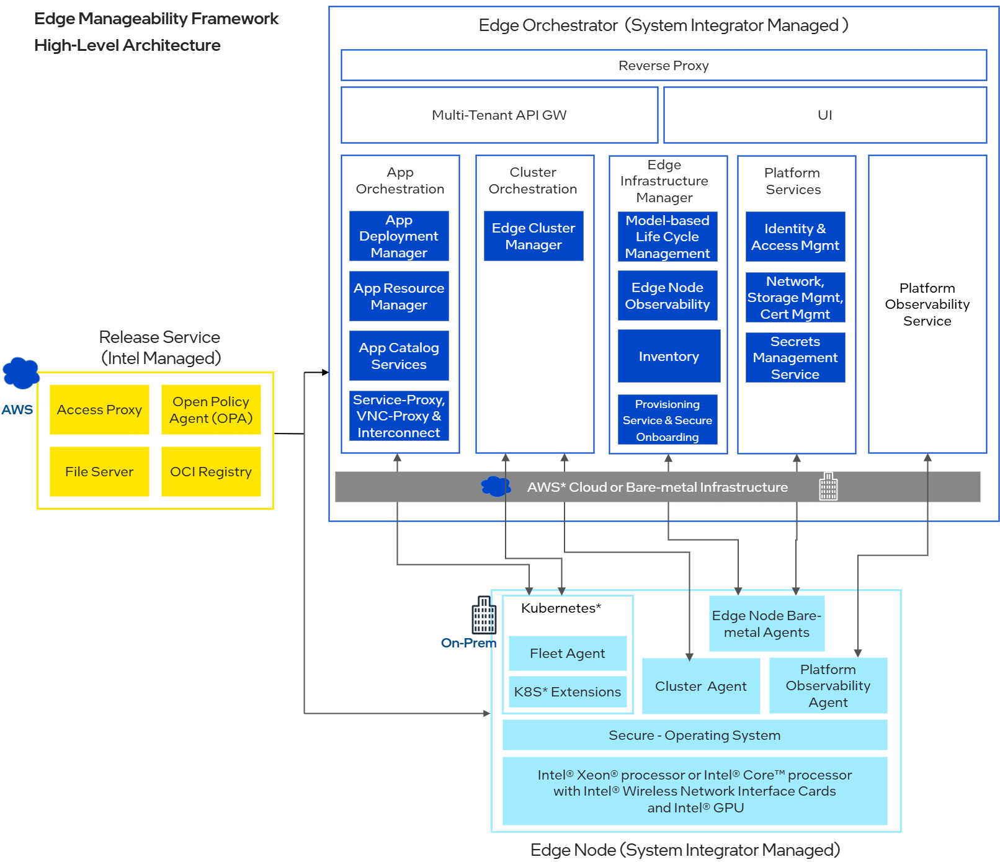

On-Premise Architecture
=======================

Target Audience
~~~~~~~~~~~~~~~

The target audience for this guide includes developers, architects, and system administrators who are responsible for deploying and managing the On-Premise Orchestrator.

End users can refer to the User Guide for further information on how to deploy and use On-Premise Orchestrator.

Overview
--------

On-Premise Orchestrator is one of the methods of deployment for Edge Orchestrator.

Architecture Diagram
--------------------

   Figure 1: High-level architecture of On-Premise Orchestrator

.. toctree::
   :hidden:
   :maxdepth: 3

   data_flow
   deployment
   extensibility
   key_components
   scalability
   security
   technology_stack
