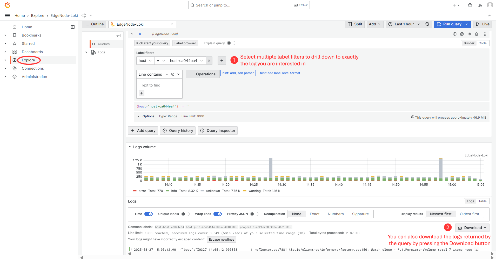

Capturing Logs
==============

Orchestrator Logs
-----------------

Orchestrator Logs are available in the *observability-admin* dashboards. To
access these logs the user needs to be a member of either *SRE-Admin-Group* or
*Service-Admin-Group* group.

From the *Orchestrator Cluster* dashboard, the logs can be accessed by clicking
the **Audit Logs** button in the top right.

Audit Logs
''''''''''

On *Audit Logs* dashboard you can filter service logs by ``namespace``,
``pod``,  and ``search`` strings to narrow down the search.

.. image:: images/audit_logs.png
   :alt: audit_logs
   :width: 50%

Orchestrator Pod Log Search
'''''''''''''''''''''''''''

To access the *Orchestrator Pod Log Search* dashboard, go to the main menu and
select ``Dashboards``, then navigate to ``orchestrator``, and choose
``Orchestrator Pod Log Search``.

On this dashboard you can filter logs by ``namespace``, ``pod``, ``container``,
and ``search`` string to drill down to the particular service logs of interest.

Edge Node Logs
--------------

To view the Edge Node Host Performance metrics, you have two navigation
options:

- From the Web UI: Click on "View Metrics" to access the relevant dashboard.

- From the Main Grafana Page: Navigate to the main Grafana page available at
  ``https://observability-ui.<fqdn>``. From there, you can access the dashboard
  by selecting ``Dashboards`` > ``orchestrator`` > ``Edge Node Host
  Performance``.

From the *Edge Node Host Performance* dashboard, you can click the Logs button
to choose a log type: **Edge Node Agent Log Search**, **HealthCheck**,
**Provisioning Logs**, or **System Logs**.

Pod Logs
''''''''

After selecting filters from the dropdowns above, the results will be displayed
in the panels below. The **number of logs** panel indicates the frequency of
the logs in the time period selected in the top right of the dashboard.

- The **logs panel** shows the log lines found in the selected time period.

  .. image:: images/pod-logs.png
     :alt: pod-logs
     :width: 50%

- Each log entry can be expanded to reveal more details.

  .. image:: images/specific-en-logs.png
     :alt: specific-en-logs
     :width: 50%

Agent Logs
''''''''''

Agent logs are generated from the bare-metal agents running on the edge node.

The available agents are:

- Cluster Agent
- Hardware Agent
- License Agent
- Node Agent
- OpenTelemetry Collector
- Platform Update Agent
- Platform Telemetry Agent
- RKE Server
- RKE System Agent
- Caddy
- Telegraf
- Installer
- APt Install History Logs
- INBM
- INBM Dispatcher
- INBM Configuration
- INBM Diagnostic
- INBM Telemetry
- INBM Update Status

System Logs
'''''''''''

System logs contain system-level logs of the edge node There 3 types:

- UFW
- SysLog
- Kernel

Explore Feature
---------------

The **Explore** tab allows for more in-depth searches.

In the explore window, you can select multiple label filters to drill down to
exactly the log you are interested in.

For example, in the screenshot below, I am searching for the **Host** logs.

From the explore window, you can also download the logs returned by the query
by pressing the **Download** button.

